# Home Keeper

[![Integration Usage][usage-shield]][usage]
[![GitHub Downloads][downloads-shield]][releases]
[![GitHub Release][release-shield]][releases]
[![GitHub Release Date][release-date-shield]][releases]
[![GitHub Activity][commits-shield]][commits]
[![License][license-shield]](LICENSE)
[![hacs][hacs-shield]][hacs]
![Project Maintenance][maintenance-shield]
[![HACS Validation][hacs-validation-shield]][hacs-validation]
[![HA Version][ha-version-shield]][ha-version]
[![Docs][docs-shield]][docs]

Track home **maintenance** and **chores** in Home Assistant — fridge/furnace filter
changes, water filters, taking medicine, and anything else that recurs.

> 📖 **Full documentation** — a browsable User Guide and Developer Guide — lives at
> **<https://prestomation.github.io/ha-home-keeper/>**. The site is generated from this
> README and `docs/`, so they never drift.


## Features at a glance

- **Tasks, five ways** — **floating** (every N units after last done), **fixed**
  (anchored calendar schedule), **one-off** (do-once, on a chosen due date),
  **triggered** (condition-driven, no schedule — armed/cleared by another integration),
  and **sensor-based** (driven by a numeric sensor — usage meters or thresholds).
- **Used through native HA entities** — a `todo` list, an upcoming-tasks `calendar`,
  and per-device **button / next-due sensor / overdue binary_sensor** on a task's
  device page.
- **Dashboard task card** — a bundled, auto-registered `custom:home-keeper-card` with
  one-tap **Done**, inline add/edit, and rich filtering/grouping.
- **Appliances & virtual devices** — give "dumb" appliances a real device page,
  structured metadata (with optional tracked-date sensors), **parts & wear items**,
  **spare-part inventory**, **offline manuals & documents** (link or upload a PDF), and a
  CSV **home-inventory export** for insurance.
- **Events & automation triggers** — a bus event for every meaningful change, plus
  visual-editor **device triggers** like *"Task became overdue."*
- **Services for everything** — every data action is a `home_keeper.*` service for
  automations, scripts, and voice.
- **Localized in 16 languages**, following your Home Assistant language.
- **Open to other integrations** — they can contribute their own recurring tasks and
  stay in sync with completions.

## Installation

Home Keeper is a custom integration installed via [HACS](https://hacs.xyz/):

1. In HACS, add this repository as a **custom repository** (category *Integration*):
   `https://github.com/prestomation/ha-home-keeper`.
2. Install **Home Keeper**, then restart Home Assistant.
3. Add the integration from **Settings → Devices & Services → Add Integration →
   Home Keeper**.

A **Home Keeper** panel then appears in the sidebar. Tasks and appliances are stored
locally in a single JSON document (`.storage/home_keeper`).

## Concepts

A **task** has a name, notes, an optional device it's attached to, and a recurrence:

- **Floating** (form: *Repeats after each completion*) — measured from the last
  completion: *"replace the fridge filter every 1 month after I last did it."*
  Completing the task resets the clock; a missed task stays overdue rather than
  silently rolling forward.
- **Fixed** (form: *Repeats on a fixed schedule*) — an anchored calendar schedule:
  *"take medicine every day at 8am"*, independent of when you actually complete it.
- **One-off** (form: *Just once*) — *do-once* (see
  [One-off tasks](#one-off-do-once-tasks) below).
- **Triggered** — *monitored, no schedule* (see below).
- **Sensor-based** (form: *Based on a sensor*) — driven by a numeric sensor instead of
  the clock: *"service the generator every 500 running hours"* or *"replace the filter
  when airflow drops below 60%"* (see
  [Sensor-based tasks](#sensor-based-tasks-usage-meters--thresholds) below).

An **appliance** (asset) is the physical thing a task is about — a fridge, furnace,
water heater (see [Appliances & virtual devices](#appliances--virtual-devices)).

## One-off (do-once) tasks

Not everything repeats. **One-off** tasks are for things you do exactly once —
*renew the passport*, *register the car*, *replace a single broken blind*. Pick
**Just once** on the task form and choose a **due date** (it defaults to today, so a
quick "remind me to do this" needs only a name).

A one-off behaves like any other task until it's done — it appears on the to-do
list, the upcoming-tasks calendar, and the overdue/next-due sensors, and you can log
the usual completion details (note, cost, who, photo). The difference is what happens
**after**: instead of rescheduling, it goes dormant and drops out of every active
surface, landing in a collapsed **Completed** section in the panel that keeps its
completion record. Undoing the completion brings it right back to its due date.


**Tidy up automatically.** If you'd rather not let finished one-offs pile up, set
**One-off retention (days)** in the panel's **Settings** tab (or via the
`home_keeper.set_options` service): a completed one-off is deleted that many days
after it's done. The default — `0` — keeps them forever.

## Logging completions (note, cost, photo, who)

By default marking a task **Done** is one tap. But for the chores you want a record
of — *"what did this service cost, who did it, what did I notice?"* — a task can
capture **per-completion detail**: a free-form **note**, a **cost**, a **photo**, and
**who** did it (a Home Assistant person).

**Use case.** Turn the completion history into a real maintenance log: track what you
spend on filters over the years, attach a photo of the part you fitted, or note which
family member last walked the dog — all queryable later from the task's history.

**How it's used.** Each task chooses its capture mode when you create or edit it
(*On completion*):

- **One-tap done** — the default; no dialog, nothing changes.
- **Ask for details (optional)** — Done opens a dialog with note / cost / photo / who,
  all optional (a *Skip details* button still completes instantly).
- **Require details** — the dialog appears and the required field(s) must be filled
  before the task can be marked done.

The dialog uploads photos through Home Assistant's native image store and picks *who*
from your `person` entities. Every recorded completion shows its note, cost, photo
thumbnail and who in the task's history, where you can **edit** a past entry (fix a
note, add a forgotten receipt) without disturbing the schedule. The most recent
completion's details are also exposed on the task's *next due* sensor attributes, and
the `home_keeper.complete_task` / `home_keeper.update_completion` services carry the
same fields for automations.

> The set of *required* fields is stored per task, so a future release can let you
> require specific fields (e.g. always a cost) without any migration.

> **Where "require details" applies.** The capture dialog — and the *required*
> gate — live in the **panel**. Completing a task from a surface that has no dialog
> (the native **to-do** checkbox, the mobile app, the device **mark-done** button, or
> a bare `home_keeper.complete_task` service call) just records the completion
> immediately, with whatever metadata was passed (none from a checkbox). This is
> deliberate: those surfaces can't prompt, and hard-blocking them would make a
> *required* task impossible to complete from the to-do list or an automation. So
> *required* is a capture prompt in the panel, not a global constraint — the dashboard
> card honours it by sending you to the panel instead of quick-completing. Automations
> that want to record detail can pass `note` / `cost` / `photo` / `who` to the service.


Every completion's note and cost (and who/photo) then show in the task's history,
where each entry can be edited or removed:


Administration and usage are intentionally **separated**: you **manage** tasks and
appliances from the **Home Keeper** sidebar panel, and **use** them through native HA
entities and the dashboard card. The panel list view can group/filter tasks, and
tapping any row opens a detail page with the full schedule, notes, and completion
history.

## Condition-driven (triggered) tasks

Some upkeep isn't periodic — it's a **reaction to a condition**: a battery dropping
low, a water sensor going wet, a filter past its pressure threshold. A **triggered**
task models exactly that. It has no schedule; an owning integration (for batteries,
the companion [Battery Notes glue](https://github.com/prestomation/ha-home-keeper-battery-notes))
**arms** it when the condition becomes true and **clears** it when resolved.

- While **armed**, it reads as **due now** everywhere — the to-do list, the device's
  overdue sensor, the panel — with a *"Managed by …"* chip showing who owns it.
- When you replace/fix the thing (from either side), the task records the event and
  goes **dormant**: it leaves the to-do list and calendar and tucks into a collapsed
  **"Monitored"** section until it's next needed.
- Because the task persists across cycles, its **completion history accumulates** — so
  you learn the real cadence ("you replace this smoke-detector battery every ~13
  months") instead of losing it on every replacement.


### Integration-provided metadata chips (`task_chips`)

Integrations that push tasks into Home Keeper can attach **metadata chips** —
compact labels with an optional icon and link — to communicate task-specific
context at a glance. A battery integration, for example, attaches a chip like
**"2× AAA"** to each replace-battery task so you know exactly what to buy
before you open a drawer.

- **What it solves:** surface structured, integration-owned facts (battery
  type, filter model, part number, reorder link) directly on the task row and
  detail page, without cluttering the task notes or requiring the user to look
  elsewhere.
- **How it works:** the owning integration sets `task_chips` when calling
  `home_keeper.add_task` or `home_keeper.update_task`. Chips are shown in both
  the sidebar panel task list and the dashboard card. Users can't edit them —
  the integration owns them.
- **Schema:** each chip is `{label, icon?, url?}`. The icon must be an
  `mdi:` name; the URL must be `http(s)://`. An empty label is silently
  dropped.

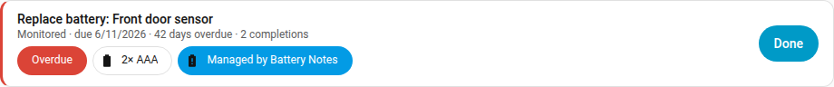

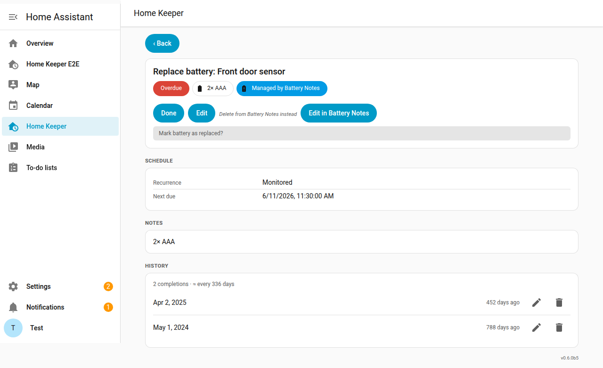

### Sync `problem` binary sensors as tasks

Lots of integrations already expose a `binary_sensor` with the **`problem`** device
class — a leak detector, an appliance fault, a UPS on battery, a printer error. Turn on
**Sync problem sensors** (*Settings → Devices & services → Home Keeper → Configure*) and
Home Keeper automatically mirrors every one of them as a triggered task, so a real-world
problem becomes a visible, trackable to-do without writing an automation.

- **What it solves:** one place that surfaces *"something is wrong"* across every
  integration — on the to-do list, the calendar, and the offending device's own page —
  instead of a problem sensor quietly flipping `on` where nobody looks.
- **How it works:** the task is **armed** while the sensor reports a problem and
  **clears itself** the moment the originating integration resolves it (the sensor goes
  back to OK). Because of that, these tasks **can't be completed in Home Keeper** — the
  problem has to be fixed for real — so the *Done* button is shown **disabled**, and
  tapping it pops up the reason (the detail page also explains how it clears). Each
  task inherits the sensor's **device and area**.
- **Scope it:** syncing is **off by default**; once on, exclude specific **entities,
  devices, areas, or labels** — from the panel's **Settings** tab (below) or the options
  flow. Excluding a device leaves out every problem sensor that belongs to it.


Tapping the disabled **Done** explains why it can't be completed here:


## Sensor-based tasks (usage meters & thresholds)

Some maintenance isn't measured in *time* but in *use*: oil every **15,000 km**, a
service every **500 running hours**, descale after **50 cycles** — or it's a reaction
to a **reading crossing a limit**: replace the filter when airflow drops **below 60 %**,
check coolant when temperature climbs **above 90 °C**. A **sensor-based** task binds a
task to an existing numeric Home Assistant entity and lets Home Keeper arm it for you —
no automation to wire up.

Pick **Based on a sensor** on the task form, choose the **sensor**, and pick a **mode**:

- **Usage / meter** — set a **target**. Home Keeper records the reading when you create
  the task (and again each time you complete it), and the task becomes **due** once the
  meter has advanced by *target* units since then. Completing it "resets the counter"
  just like a floating task resets its clock; if the meter is reset or the part is
  replaced (the reading drops), Home Keeper re-anchors automatically so it never gets
  stuck. Great for odometers, runtime-hours, and cycle counters.
- **Threshold** — set a **comparison** (`≥ ≤ > < = ≠`) and a **value**, with an optional
  **hold** (the reading must stay across the line that many seconds, to debounce noise)
  and an optional **attribute** (read e.g. a climate entity's `current_temperature`
  instead of its state). The task arms on the crossing and stays due until you complete
  it — a filter you need to replace doesn't un-need replacing if airflow briefly
  recovers — then re-arms only on a fresh crossing.

A sensor task behaves like any other once **armed**: it shows on the to-do list and
calendar, lights the device's overdue sensor, and fires the `home_keeper_task_overdue`
event. While waiting it reads as **Monitored**, and the task detail shows live progress
(*"12,300 of 15,000 used"* for a meter, or the current reading vs. the limit). You can
also create one from automations/scripts with the `home_keeper.add_task` service by
passing a `sensor` mapping.

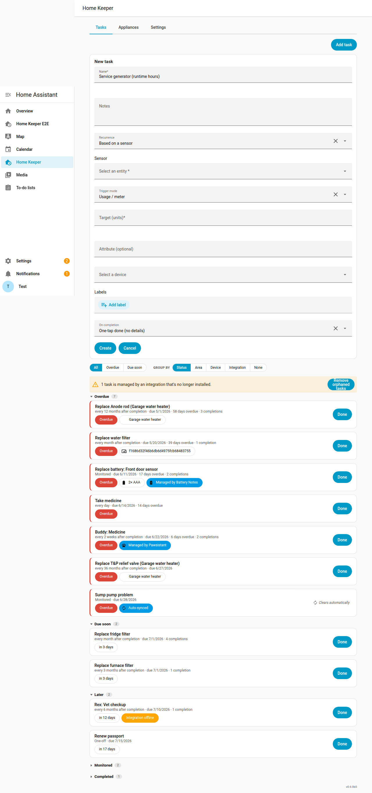

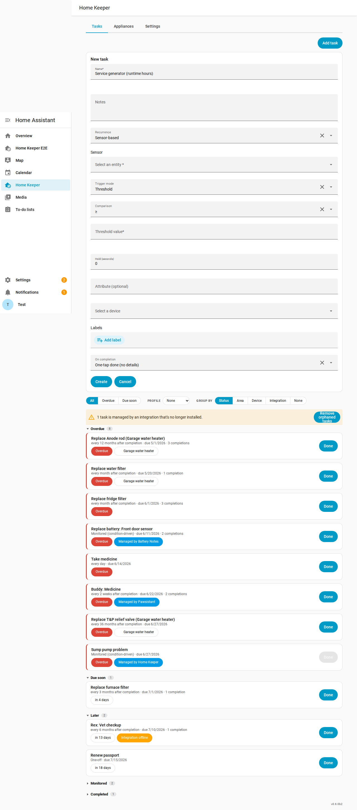

### Link a task to a consumable (auto-reorder)

A maintenance task often **uses up a spare you keep on hand** — a fridge water filter,
an HVAC filter, a brita cartridge. Home Keeper lets you **link any task to an appliance
consumable** so that marking the task done **draws down one spare** from that part's
[stock](#parts--wear-items), and — when stock crosses the **reorder-at** threshold —
fires a `home_keeper_part_low_stock` event so an automation can add it to your shopping
list. The link is independent of the auto-generated wear-part tasks, so the task stays a
normal, fully-editable task.

This is what makes the *"there's no schedule — my fridge tells me when the filter is
spent"* case work end to end: create a **[sensor-based](#sensor-based-tasks-usage-meters--thresholds)**
task bound to the fridge's filter-life (or water-usage) entity, then **link it to the
filter consumable**. The fridge arms the task; when you swap the filter and mark it done,
Home Keeper subtracts a spare and tells you to **buy more** once you're low.

Pick the consumable from the **Linked consumable** dropdown on the task form. It's
**scoped to the appliance the task is attached to** (via *Attach to device*) — so you
only see that appliance's spares, not every consumable in the house. (Attach the task to
the appliance first; if the appliance has no consumables, the picker doesn't appear.) Or
use the `home_keeper.set_task_consumable` service (omit the ids to unlink). The task
detail then shows the linked part and its current stock.

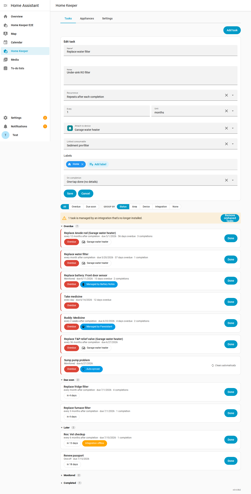

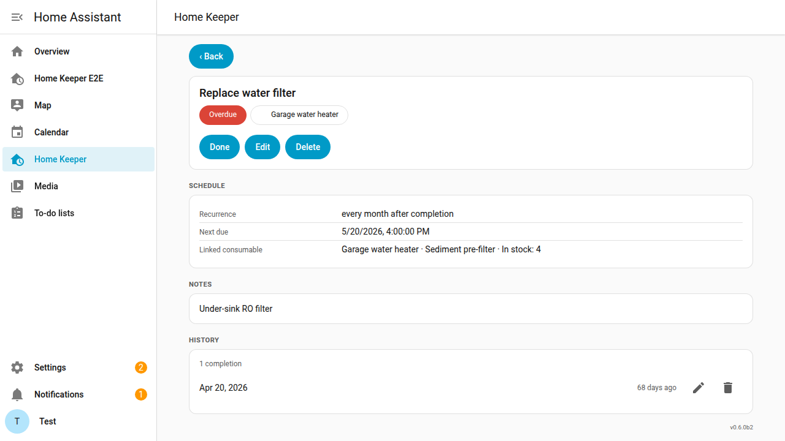

## Settings

Home Keeper's integration options are editable right in the panel — a **Settings**
tab alongside Tasks and Appliances — so you never have to dig through *Settings →
Devices & services → Configure*. It's a plain form that mirrors the options flow
(currently the **problem-sensor sync** toggle plus entity / area / label exclusions)
and **saves as you change it**. The same options remain available through the HA
options flow and the `home_keeper.set_options` service (for automations).


### Companions — discover integrations that work with Home Keeper

You shouldn't have to *already know* that another integration pairs with Home Keeper to
benefit from it. The **Companions** section at the bottom of the Settings tab surfaces
that ecosystem for you:

- **Connected** — integrations that work with Home Keeper and have announced themselves
  (e.g. [Pawsistant](https://github.com/prestomation/pawsistant), or the
  [Battery Notes bridge](https://github.com/prestomation/ha-home-keeper-battery-notes)).
  Each row has a **Configure** button that takes you to that integration's own page —
  so the pet-care schedules or the battery-task options live where they belong, one
  click away.
- **Suggested** — Home Keeper also recognises a few *popular* integrations that aren't
  Home-Keeper-aware themselves. If you have one installed (e.g. **Battery Notes**) but
  not the small "glue" that bridges it, Home Keeper points you at it with an **Install**
  link. Not interested? **Dismiss** silences that suggestion.

This works in two directions: a Home-Keeper-aware integration *registers itself* (so
Home Keeper never has to hard-code it), while a popular upstream is *detected* from a
curated catalog. Either way you find out — from inside Home Keeper — that the pieces fit
together.

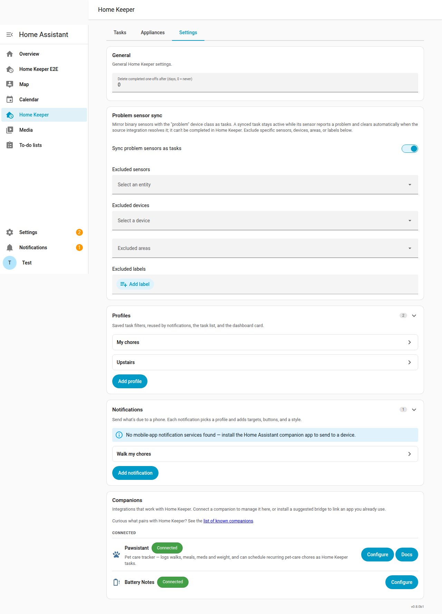

## Profiles — saved filters you reuse everywhere

A **Profile** is a named, saved filter — a status (*overdue* / *due soon* / *all*) plus
optional **label / area / device** filters — that you define once and reuse across Home
Keeper. Create and manage them in **Settings → Profiles**.

**Use cases.** *"'The dog', 'upstairs', 'my chores' — define each chore-set once and
point every list at it."* *"My partner and I each save a Profile filtered to our own
label, and reuse it on our phones and our dashboards."*

The same Profile drives filtering in three places:

- **Notifications** — a notification points at a Profile to decide which tasks it pushes
  (see below). Two profiles with different labels = two people's lists.
- **The admin task list** — the **Profile** dropdown on the **Tasks** tab narrows the
  panel list to a saved Profile's tasks.
- **The dashboard card** — the card editor's **Filter by profile** picker points a card
  at a Profile instead of re-specifying the same filter inline.

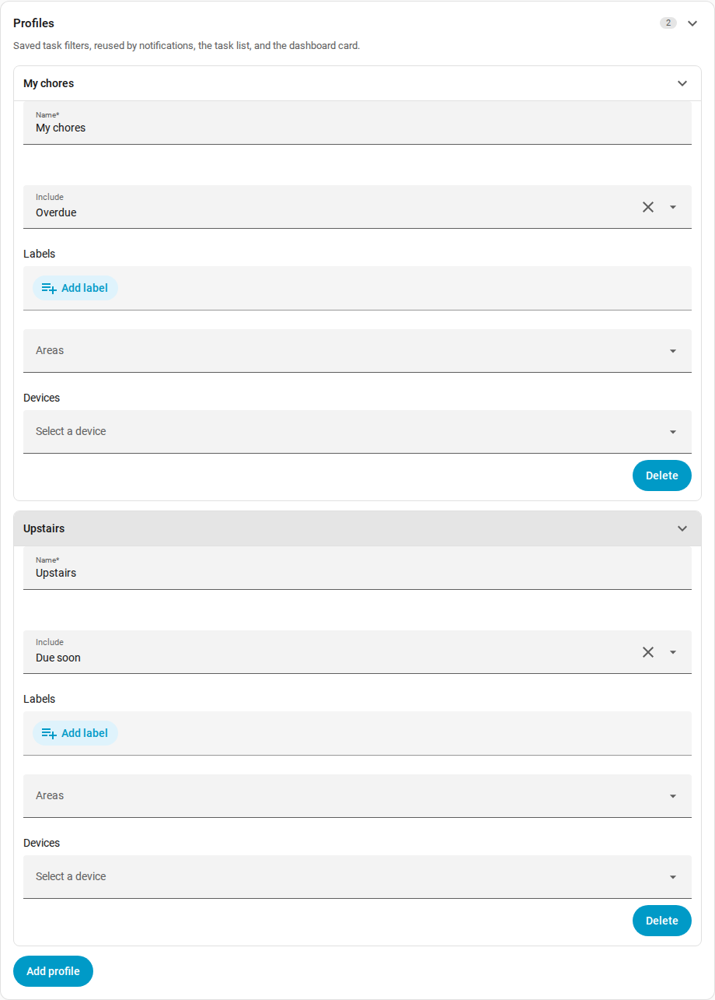

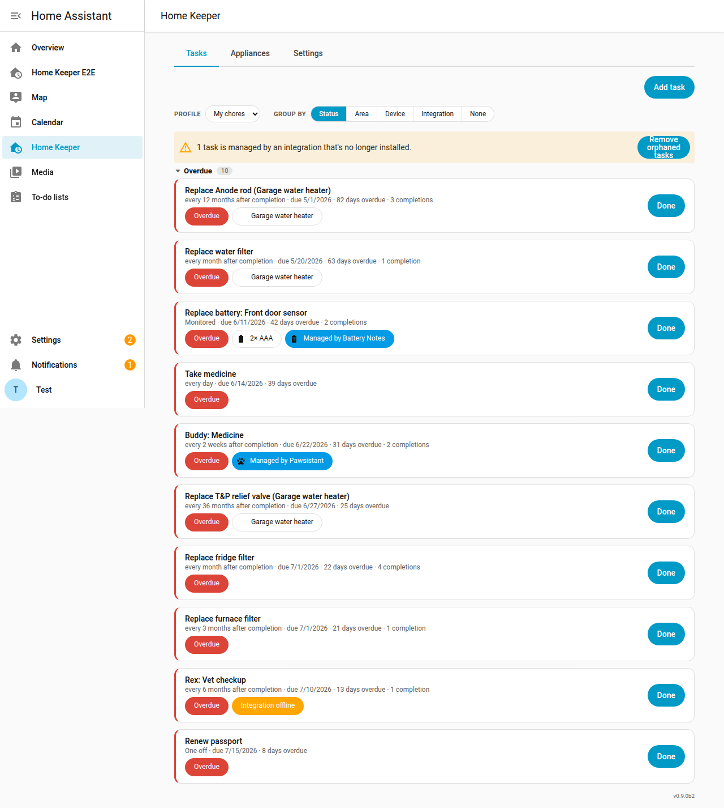

## Notifications — actionable reminders on your phone

Home Keeper can push a **mobile-app notification** for what's due, with tappable
buttons — **Mark done**, **Snooze**, **Skip**, **Open** — that route straight back into
Home Keeper. Because the action lands inside the integration, it **recalculates the
schedule correctly**: completing advances the recurrence, snoozing defers the due date
and re-arms a fresh reminder, skipping moves to the next occurrence — none of which a
generic reminder automation can do, because it doesn't know your intervals.

**Use cases.** *"Nudge me the moment a chore goes overdue, and let me clear it from the
lock screen."* *"Every evening my **Chores** calendar event fires an automation that asks
Home Keeper what's on my list — it sends the first task, and as I tap **Done** the next
one arrives."* *"My partner and I each get our **own** filtered chore list on our own
phones."*

**How it's used.** Configure **notifications** in **Settings → Notifications**. Each
notification is a named delivery config with:

- **Profile** — the saved [Profile](#profiles--saved-filters-you-reuse-everywhere) whose
  filter decides which tasks this notification covers (leave it unset to cover every due
  task).
- **Send to** — one or more `mobile_app_*` companion-app devices (picked from a live
  list).
- **Buttons** — which of *Mark done / Snooze / Skip / Open* appear, and the snooze
  duration.
- **Style** — a **walk** (sends the first due task, then the next each time you action
  one) or a single **digest** summary.
- **Auto-send** — fire automatically when a matching task becomes overdue / due-soon.

Trigger a notification on demand from any automation with the **`home_keeper.notify`**
service (`notification:` a saved notification, or `profile:` a saved Profile, optionally
with a `target:` override); it returns how many tasks matched and which was sent. The
button taps and the standalone
`home_keeper.snooze_task` / `home_keeper.skip_task` services all emit events
(`home_keeper_task_completed` / `_snoozed` / `_skipped`) carrying
`origin: home_keeper_notification_action`, so other automations can react.

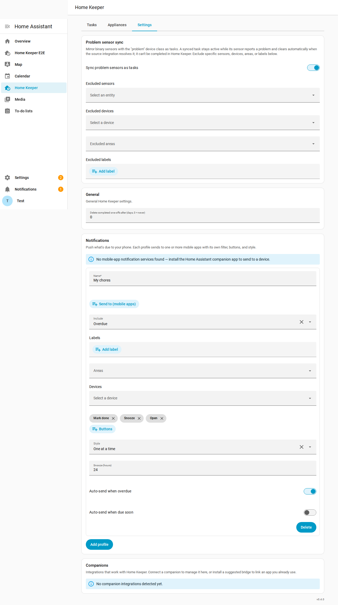

## Dashboard task card

The bundled **Home Keeper Tasks** card (`custom:home-keeper-card`) is a resizable list
of your tasks with a one-tap **Done** button on each row. It's a focused
do-and-glance surface: mark tasks done, add a new one from the header **+**, and open
any documentation links a task shows (see below) — while **editing and deleting a task
live in the sidebar panel**, so a stray tap on the dashboard can't open a form or
accidentally delete a task. It's auto-registered (no resource setup) and
appears in the dashboard **"Add card"** picker. Its GUI editor lets you filter (by
status, area, device, **label**, recurrence type, a "due within N days" horizon, or a
saved [Profile](#profiles--saved-filters-you-reuse-everywhere)), sort, group, cap rows,
and toggle what each row shows. It's built from HA's own components and theme and
reflects completions made anywhere else in real time.


### Show a task's appliance documents on the card

When a task is attached to an [appliance](#appliances--virtual-devices), you can pin any
of that appliance's documents — its **document links**, **uploaded files** (a PDF
manual, a photo), and free-form **metadata links** (a reorder page, a warranty page, a
how-to video) — to the task's row, so the manual or parts page is one tap away while
you're actually doing the job. Nothing shows by default; you choose per task.

How to use it:

- **Pick the documents**: open the task in the panel's editor and use **Links to show on
  card** — a multi-select that lists every document (link or uploaded file) and metadata
  link on the task's appliance. (The picker only appears once the attached appliance has
  at least one document.) You can also set them via the `home_keeper.add_task` /
  `home_keeper.update_task` services (`card_links`).
- **On the card**: each chosen document renders as a compact chip on the task's row and
  opens in a new tab — an uploaded file via a short-lived signed URL. They resolve
  **live** — rename or remove one on the appliance and the card follows; a deleted one
  simply drops off.

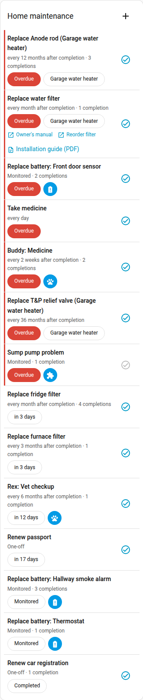

### Filter by label — one card per subject

Most homes have natural "buckets" of upkeep that don't map onto a room or a single
device: **the dog, the car, home maintenance, each kid's chores**. Tag tasks with
Home Assistant **labels** and point a card at one (or more) of them to get a focused
list per subject — a card for the dog, one for the car, one per kid.

A task matches a label filter if **the task itself** carries the label **or** its
**attached device or area** does. So labelling a Home Keeper *virtual appliance*
(which is a real device under *Settings → Devices*) — or any device a task is attached
to — automatically pulls its tasks into the matching card, and a subject never has to
be modelled as an HA area or device.

How to use it:

- **Tag tasks**: open a task's form (in the panel or the card) and pick one or more
  labels in the **Labels** field. You can also set labels via the
  `home_keeper.add_task` / `home_keeper.update_task` services.
- **Tag devices** (optional): apply the same labels to devices/appliances in
  *Settings → Devices* to sweep all their tasks into a card without tagging each one.
- **Point a card at a label**: in the card editor set **Limit to labels** (with an
  **Any/All** match mode when you list several), and optionally enable **Show labels**
  to render each task's label chips.


## Appliances & virtual devices

Most appliances you actually maintain — a "dumb" fridge, furnace, or water heater —
aren't Home Assistant devices, so there's nowhere to hang their maintenance tasks or
record their warranty. Home Keeper fills that gap with **appliances**, managed from the
**Appliances** tab in the panel. Two ways to use it:

- **New appliance** — Home Keeper registers a real **virtual device** for it, so
  multiple tasks share *one* device page and other integrations can attach to it too.
- **Existing device** — point Home Keeper at a device another integration already
  provides and enrich it with the same metadata, without owning it.

Either way you record **asset metadata**. A few structured fields wire into Home
Assistant — manufacturer/model, **serial number**, an mdi icon, a manual link,
replacement cost — and beyond that you add free-form **custom fields**, each a label
with a value typed as **text**, **link**, or **date** (seeded with common ones like
warranty expiry, purchase/install dates). Tick **track** on a date and it becomes a real
`date` **sensor** on the device page, so it's automatable natively (e.g. *"warranty
expiring in 30 days → notify me"*). Untracked dates stay display-only.

Tapping an appliance opens a **detail page** gathering its metadata, parts, related
tasks, subdevices, and full maintenance history (including retained history of tasks
deleted while still assigned to it). The tab also has an **Export inventory** button
that downloads a CSV **home inventory** — make/model, replacement cost, value of spares
on hand (with a grand total), and a Details column flattening each appliance's custom
fields. It's the grab-and-go record you want for an insurance claim.


### What you see on the device page

A virtual appliance's Home Assistant **device page** (Settings → Devices & Services →
Devices → *your appliance*) becomes a real maintenance summary. Home Keeper fills its
**device-info block** with make/model and the **serial number**, and points the page's
**Visit** link straight at that appliance's panel page — one click from the device page
to its manuals, full parts inventory, and history (links and lists that can't render on
the device page itself).

Grouped under the device you get, automatically:

- **Spare-stock controls** — each part you track stock for shows an editable *spares*
  number you can adjust right on the page (it draws down/refills the same count
  automations use), plus a **low-stock** problem sensor that turns on when on-hand
  spares hit the reorder threshold (here the *Anode rod*, with 1 left and a reorder-at
  of 2).
- The per-task **next-due** sensor, **overdue** problem sensor, and **mark-done** button
  for every maintenance task on the appliance, and the **tracked-date** sensors
  (purchase/install/warranty).

This is the appliance side of the picture; a task attached to a *foreign* device (one
another integration owns) still gets its next-due/overdue/mark-done entities there, but
Home Keeper leaves that device's info block and Visit link to its owner.

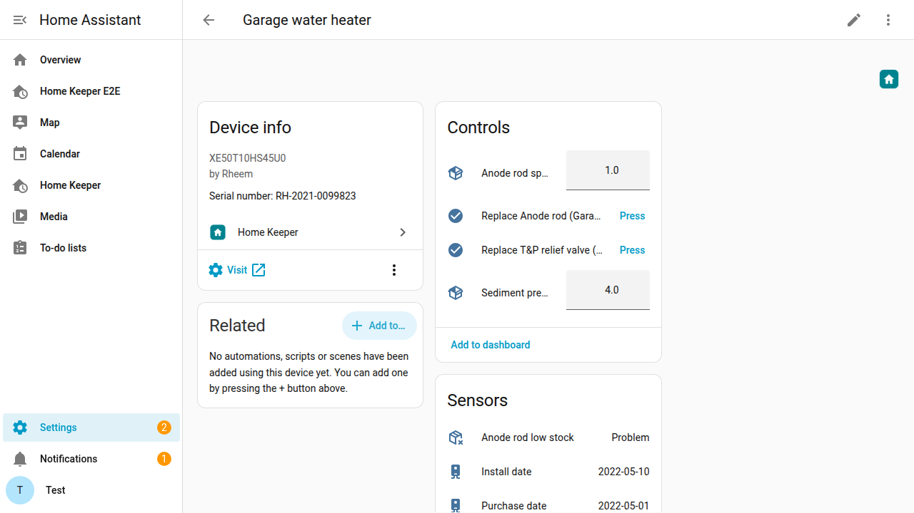

### Parts & wear items

Each appliance has a structured **parts** list — name, part number, vendor, cost, and a
type of *consumable* (a stocked spare) or *wear item*. Give a wear item a **replacement
interval** and Home Keeper automatically creates a maintenance **task** for it, attached
to the appliance's device — so it shows up in your to-do list and calendar, gets a
mark-done button and next-due sensor, and stamps the part's *last replaced* date when
completed. You can also backdate **when a wear item was last replaced** so the schedule
starts from the real date.

Any part can also track **spare inventory** — a *stock* count and a *reorder-at*
threshold. Completing a wear-item replacement consumes one spare, and when stock drops
to (or below) the threshold Home Keeper fires a `home_keeper_part_low_stock` event you
can automate on (add to a shopping list, notify, reorder). A *consumable* part isn't
limited to its own wear cadence: you can **[link any task to it](#link-a-task-to-a-consumable-auto-reorder)**
— including a sensor-driven one — so completing that task draws down the same stock.

### Offline manuals & documents

Every appliance keeps a list of **documents** — manuals, warranties, receipts. Each is
either an external **link** (a URL) or an **uploaded file** (a PDF or image) stored
**locally on your Home Assistant instance**, so the manual is still there when the
manufacturer's website isn't (or has moved on to the next model). Open the appliance's
**Manuals & documents** editor to paste a link or **Upload file**; uploaded files are
written under your config directory and served back through an authenticated endpoint,
opened via a short-lived signed URL. Removing a document (or deleting the appliance)
deletes the stored file too.

Each existing document shows as a card with its name and details — a link's URL, or an
uploaded file's filename, size and type — and **Open**, **Edit** and **Remove** actions
right there in the editor. **Open** previews the document in a new tab; **Edit** renames a
document (and, for a link, changes its URL — uploaded files are rename-only, since the
stored file itself is immutable). You can add link documents while first creating an
appliance; uploading a file waits until the appliance is saved (the file is keyed to it).

Every data action is also a service — `home_keeper.add_asset_document`,
`home_keeper.update_asset_document` and `home_keeper.remove_asset_document` (links; files
upload from the panel) — so automations can attach, rename or detach a receipt or manual
link too.

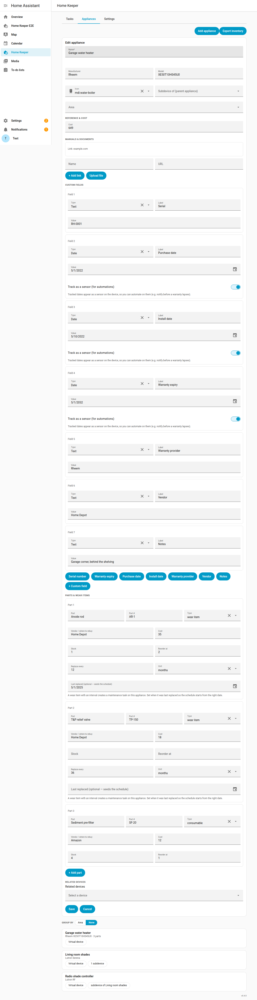

#### Large uploads (413)

Home Keeper accepts uploads up to **25 MB**. If an upload fails with **HTTP 413** —
especially the panel showing *"Upload too large…"* — the file was almost certainly
rejected by a **reverse proxy in front of Home Assistant**, before it ever reached the
integration. The usual cause is the proxy's request-body limit (nginx defaults
`client_max_body_size` to just **1 MB**). Raise it above your largest manual:

- **nginx** (manual config): add `client_max_body_size 30M;` to the `server` (or
  `location /`) block, then `nginx -t && nginx -s reload`.
- **Nginx Proxy Manager**: Proxy Host → **Advanced** → *Custom Nginx Configuration* →
  add `client_max_body_size 30M;` → Save.
- **"NGINX Home Assistant SSL proxy" add-on**: create `/share/nginx_proxy_default.conf`
  containing `client_max_body_size 30M;`, set `customize.active: true` in the add-on
  options, and restart the add-on.
- **Caddy**: `request_body { max_size 30MB }`. **Traefik**: a `buffering` middleware with
  `maxRequestBodyBytes`.
- **Nabu Casa / HA Cloud Remote UI** has its own limit — if you hit it, upload from your
  **local network** instead.

A quick way to confirm it's the proxy: upload once via the direct LAN URL
(`http://<ha-ip>:8123`), bypassing the proxy — it'll succeed there.

### Relationships: subdevices & related devices

Real things nest. An appliance can be a **subdevice of** another appliance (wired
through HA's native `via_device` hierarchy, so it nests under its parent on the device
page). You can also tag arbitrary **related devices** — including ones from other
integrations HA won't let us reparent — which show up alongside the appliance.

> **Example.** Add the *Garage water heater* as a new appliance with its warranty
> expiry and an *Anode rod* **wear item** set to "replace every 12 months." The water
> heater now has its own device page with a warranty-expiry sensor, plus an automatic
> *"Replace Anode rod"* to-do that's due 12 months after each completion.

## Services

Every data action is a Home Assistant service, so it's usable from automations,
scripts, and voice:

- **Tasks** — `home_keeper.add_task`, `update_task`, `delete_task`, `complete_task`
  (with optional `note`/`cost`/`photo`/`who`), `update_completion` (amend a recorded
  completion's metadata), `trigger_task` (arm a condition-driven task), `snooze_task`
  (defer the due date by `hours` without completing), `skip_task` (advance to the next
  occurrence without completing), `set_task_consumable` (link a task to an appliance
  consumable so completing it draws down stock — omit the ids to unlink), and
  `list_tasks` (returns a response).
- **Notifications** — `home_keeper.notify` sends an actionable notification for what's
  due from a saved notification or profile (returns `{matched, sent}`). See
  [Notifications](#notifications--actionable-reminders-on-your-phone).
- **Appliances** — `home_keeper.add_asset`, `update_asset`, `delete_asset`,
  `adjust_part_stock`, `add_asset_document` / `update_asset_document` /
  `remove_asset_document` (attach, rename or detach a manual/warranty/receipt — links
  here, files upload from the panel), `list_assets`, and `export_inventory` (the last two
  return a response).

## Events & automations

Home Keeper fires a Home Assistant **bus event** for every meaningful change so you can
automate on it — tasks (created, updated, completed, uncompleted, completion-edited,
deleted, armed, and the time-based **overdue** / **due-soon** transitions), spare parts (**low stock**,
**out of stock**, **restocked**), and appliances (created, updated, deleted).

You can trigger on these two ways: pick a **device trigger** in the visual automation
editor (e.g. *"Task became overdue"*, *"Spare part out of stock"* — no event names to
memorise), or use a plain `platform: event` trigger. For example, *spare part out of
stock → add it to the shopping list*:

```yaml
automation:
  - alias: "Spare out of stock → shopping list"
    trigger:
      - platform: event
        event_type: home_keeper_part_out_of_stock
    action:
      - service: todo.add_item
        target: { entity_id: todo.shopping_list }
        data:
          item: "{{ trigger.event.data.part_name }} ({{ trigger.event.data.vendor }})"
```

Events are **edge-triggered** (one event per crossing, never repeated each cycle) and
silently baselined on restart (no "overdue" storm after a reboot). The full catalog —
every event, its payload, and more examples — is in [docs/EVENTS.md](docs/EVENTS.md).

## Integrations

Home Keeper is **open to other integrations**: they can contribute their own recurring
tasks and stay in sync with completions, without Home Keeper knowing anything about them.
Installing a compatible integration can populate and maintain your task list
automatically — for example a battery integration that schedules *"replace battery"* or a
pet tracker that schedules *"give medicine"*.

### Known integrations

| Integration | Description | How it integrates |
|---|---|---|
| [Home Keeper — Battery Notes](https://github.com/prestomation/ha-home-keeper-battery-notes) | Glue between [Battery Notes](https://github.com/andrew-codechimp/HA-Battery-Notes) and Home Keeper | Uses Home Keeper's **triggered** task type — arms a *"Replace battery"* task when a battery goes low and clears it when replaced, keeping both sides in sync so completion from either side is recorded in both. |
| [Pawsistant](https://github.com/prestomation/pawsistant) | Pet-care logger for tracking recurring pet activities | Attaches Home Keeper floating-recurrence tasks to pet care schedules (e.g. *"medicine every 2 weeks"*), so completing the task in Home Keeper logs the event in Pawsistant, and logging it in Pawsistant marks the task done — with no loop. |

Installed companions show up automatically in the panel's **[Companions](#companions--discover-integrations-that-work-with-home-keeper)**
section (Settings tab), where you can jump to each one's settings — and Home Keeper will
*suggest* the Battery Notes bridge if it sees you have Battery Notes but not the glue.

> **Author an integration?** If you build a Home Assistant integration and want it to push
> tasks into Home Keeper, see the developer guide,
> [docs/INTEGRATING.md](docs/INTEGRATING.md), for the contract (the `source` field, the
> `home_keeper_task_completed` event, two-way completion sync, and announcing yourself via
> `home_keeper.register_companion` so you appear under **Companions**) — and
> [docs/GLUE_INTEGRATIONS.md](docs/GLUE_INTEGRATIONS.md) for the thin "glue" pattern that
> bridges an existing integration (like Battery Notes) to Home Keeper.

## Localization

The integration and the sidebar panel are localized into **16 languages** and follow
your Home Assistant language, falling back to English for anything untranslated.
Translations live in `custom_components/home_keeper/translations/`.

## Quality scale

Home Keeper targets Home Assistant's
[**Platinum** integration quality scale](https://developers.home-assistant.io/docs/core/integration-quality-scale/).
The per-rule self-assessment lives in
[`custom_components/home_keeper/quality_scale.yaml`](custom_components/home_keeper/quality_scale.yaml).
As a local, deviceless service integration (no network, no external dependency),
the networking/discovery/authentication rules are *exempt*; the rest are met,
including **strict typing** (the integration ships `py.typed` and CI runs `mypy`
against it with Home Assistant installed) and an **async, single-coordinator**
core.

> **One known caveat — localized exceptions:** error messages raised by services
> and entities now use Home Assistant translation keys (`strings.json` →
> `exceptions`), but their text is currently **English-first in every locale** and
> is being translated incrementally. A unit drift-guard
> (`tests/unit/test_exception_translations.py`) ensures every new raise stays
> localizable.

## Development

- Backend: `custom_components/home_keeper/` (recurrence engine in `recurrence.py`).
- Panel frontend: `custom_components/home_keeper/frontend/` (TypeScript + Rollup).
- Tests: `pytest` unit (`tests/unit`), Docker integration (`tests/integration`),
  Playwright e2e (`tests/e2e`), and vitest frontend tests.
- Typing: `mypy custom_components/home_keeper` (config in `pyproject.toml`,
  enforced by `lint.yml`). Requires Home Assistant installed so its types resolve.

See [AGENTS.md](AGENTS.md) for workflow and [RELEASE.md](RELEASE.md) for releases.

[usage-shield]: https://img.shields.io/badge/dynamic/json?color=41BDF5&logo=home-assistant&label=integration%20usage&suffix=%20installs&cacheSeconds=15600&url=https%3A%2F%2Fanalytics.home-assistant.io%2Fcustom_integrations.json&query=%24.home_keeper.total&style=for-the-badge
[usage]: https://analytics.home-assistant.io/
[downloads-shield]: https://img.shields.io/github/downloads/prestomation/ha-home-keeper/total.svg?style=for-the-badge
[releases]: https://github.com/prestomation/ha-home-keeper/releases
[release-shield]: https://img.shields.io/github/release/prestomation/ha-home-keeper.svg?style=for-the-badge
[release-date-shield]: https://img.shields.io/github/release-date/prestomation/ha-home-keeper?style=for-the-badge
[commits-shield]: https://img.shields.io/github/last-commit/prestomation/ha-home-keeper?style=for-the-badge
[commits]: https://github.com/prestomation/ha-home-keeper/commits/main
[license-shield]: https://img.shields.io/github/license/prestomation/ha-home-keeper.svg?style=for-the-badge
[hacs-shield]: https://img.shields.io/badge/HACS-Custom-41BDF5.svg?style=for-the-badge
[hacs]: https://github.com/hacs/integration
[maintenance-shield]: https://img.shields.io/badge/maintainer-%40prestomation-blue.svg?style=for-the-badge
[hacs-validation-shield]: https://github.com/prestomation/ha-home-keeper/actions/workflows/hacs.yml/badge.svg
[hacs-validation]: https://github.com/prestomation/ha-home-keeper/actions/workflows/hacs.yml
[ha-version-shield]: https://img.shields.io/badge/Home%20Assistant-2024.1%2B-blue.svg?style=for-the-badge
[ha-version]: https://www.home-assistant.io/
[docs-shield]: https://img.shields.io/badge/docs-website-03a9f4.svg?style=for-the-badge
[docs]: https://prestomation.github.io/ha-home-keeper/
