# Home Keeper

[](https://github.com/hacs/integration)
[](https://github.com/prestomation/ha-home-keeper/actions/workflows/hacs.yml)
[](LICENSE)
[](https://prestomation.github.io/ha-home-keeper/)

Track home **maintenance** and **chores** in Home Assistant — fridge/furnace filter
changes, water filters, taking medicine, and anything else that recurs.

> 📖 **Full documentation** — a browsable User Guide and Developer Guide — lives at
> **<https://prestomation.github.io/ha-home-keeper/>**. The site is generated from this
> README and `docs/`, so they never drift.

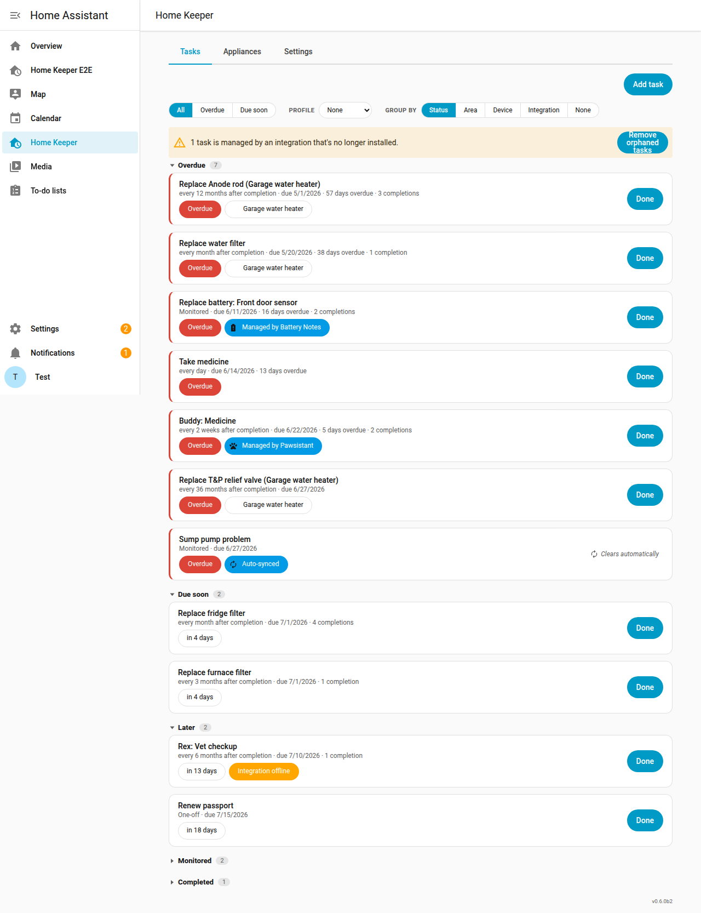

## Features at a glance

- **Tasks, four ways** — **floating** (every N units after last done), **fixed**
  (anchored calendar schedule), **one-off** (do-once, on a chosen due date), and
  **triggered** (condition-driven, no schedule — armed/cleared by another integration).
- **Used through native HA entities** — a `todo` list, an upcoming-tasks `calendar`,
  and per-device **button / next-due sensor / overdue binary_sensor** on a task's
  device page.
- **Dashboard task card** — a bundled, auto-registered `custom:home-keeper-card` with
  one-tap **Done**, inline add/edit, and rich filtering/grouping.
- **Appliances & virtual devices** — give "dumb" appliances a real device page,
  structured metadata (with optional tracked-date sensors), **parts & wear items**,
  **spare-part inventory**, and a CSV **home-inventory export** for insurance.
- **Events & automation triggers** — a bus event for every meaningful change, plus
  visual-editor **device triggers** like *"Task became overdue."*
- **Services for everything** — every data action is a `home_keeper.*` service for
  automations, scripts, and voice.
- **Localized in 16 languages**, following your Home Assistant language.
- **Open to other integrations** — they can contribute their own recurring tasks and
  stay in sync with completions.

## Installation

Home Keeper is a custom integration installed via [HACS](https://hacs.xyz/):

1. In HACS, add this repository as a **custom repository** (category *Integration*):
   `https://github.com/prestomation/ha-home-keeper`.
2. Install **Home Keeper**, then restart Home Assistant.
3. Add the integration from **Settings → Devices & Services → Add Integration →
   Home Keeper**.

A **Home Keeper** panel then appears in the sidebar. Tasks and appliances are stored
locally in a single JSON document (`.storage/home_keeper`).

## Concepts

A **task** has a name, notes, an optional device it's attached to, and a recurrence:

- **Floating** — measured from the last completion: *"replace the fridge filter every
  1 month after I last did it."* Completing the task resets the clock; a missed task
  stays overdue rather than silently rolling forward.
- **Fixed** — an anchored calendar schedule: *"take medicine every day at 8am"*,
  independent of when you actually complete it.
- **One-off** — *do-once* (see [One-off tasks](#one-off-do-once-tasks) below).
- **Triggered** — *condition-driven, no schedule* (see below).

An **appliance** (asset) is the physical thing a task is about — a fridge, furnace,
water heater (see [Appliances & virtual devices](#appliances--virtual-devices)).

## One-off (do-once) tasks

Not everything repeats. **One-off** tasks are for things you do exactly once —
*renew the passport*, *register the car*, *replace a single broken blind*. Pick
**One-off** on the task form and choose a **due date** (it defaults to today, so a
quick "remind me to do this" needs only a name).

A one-off behaves like any other task until it's done — it appears on the to-do
list, the upcoming-tasks calendar, and the overdue/next-due sensors, and you can log
the usual completion details (note, cost, who, photo). The difference is what happens
**after**: instead of rescheduling, it goes dormant and drops out of every active
surface, landing in a collapsed **Completed** section in the panel that keeps its
completion record. Undoing the completion brings it right back to its due date.

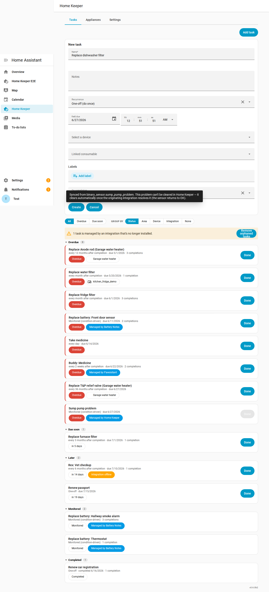

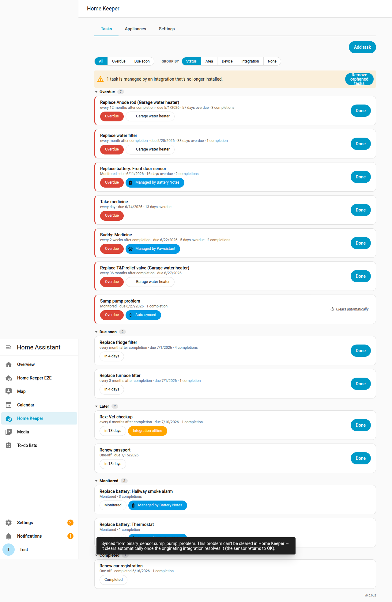

**Tidy up automatically.** If you'd rather not let finished one-offs pile up, set
**One-off retention (days)** in the panel's **Settings** tab (or via the
`home_keeper.set_options` service): a completed one-off is deleted that many days
after it's done. The default — `0` — keeps them forever.

## Logging completions (note, cost, photo, who)

By default marking a task **Done** is one tap. But for the chores you want a record
of — *"what did this service cost, who did it, what did I notice?"* — a task can
capture **per-completion detail**: a free-form **note**, a **cost**, a **photo**, and
**who** did it (a Home Assistant person).

**Use case.** Turn the completion history into a real maintenance log: track what you
spend on filters over the years, attach a photo of the part you fitted, or note which
family member last walked the dog — all queryable later from the task's history.

**How it's used.** Each task chooses its capture mode when you create or edit it
(*On completion*):

- **One-tap done** — the default; no dialog, nothing changes.
- **Ask for details (optional)** — Done opens a dialog with note / cost / photo / who,
  all optional (a *Skip details* button still completes instantly).
- **Require details** — the dialog appears and the required field(s) must be filled
  before the task can be marked done.

The dialog uploads photos through Home Assistant's native image store and picks *who*
from your `person` entities. Every recorded completion shows its note, cost, photo
thumbnail and who in the task's history, where you can **edit** a past entry (fix a
note, add a forgotten receipt) without disturbing the schedule. The most recent
completion's details are also exposed on the task's *next due* sensor attributes, and
the `home_keeper.complete_task` / `home_keeper.update_completion` services carry the
same fields for automations.

> The set of *required* fields is stored per task, so a future release can let you
> require specific fields (e.g. always a cost) without any migration.

> **Where "require details" applies.** The capture dialog — and the *required*
> gate — live in the **panel**. Completing a task from a surface that has no dialog
> (the native **to-do** checkbox, the mobile app, the device **mark-done** button, or
> a bare `home_keeper.complete_task` service call) just records the completion
> immediately, with whatever metadata was passed (none from a checkbox). This is
> deliberate: those surfaces can't prompt, and hard-blocking them would make a
> *required* task impossible to complete from the to-do list or an automation. So
> *required* is a capture prompt in the panel, not a global constraint — the dashboard
> card honours it by sending you to the panel instead of quick-completing. Automations
> that want to record detail can pass `note` / `cost` / `photo` / `who` to the service.

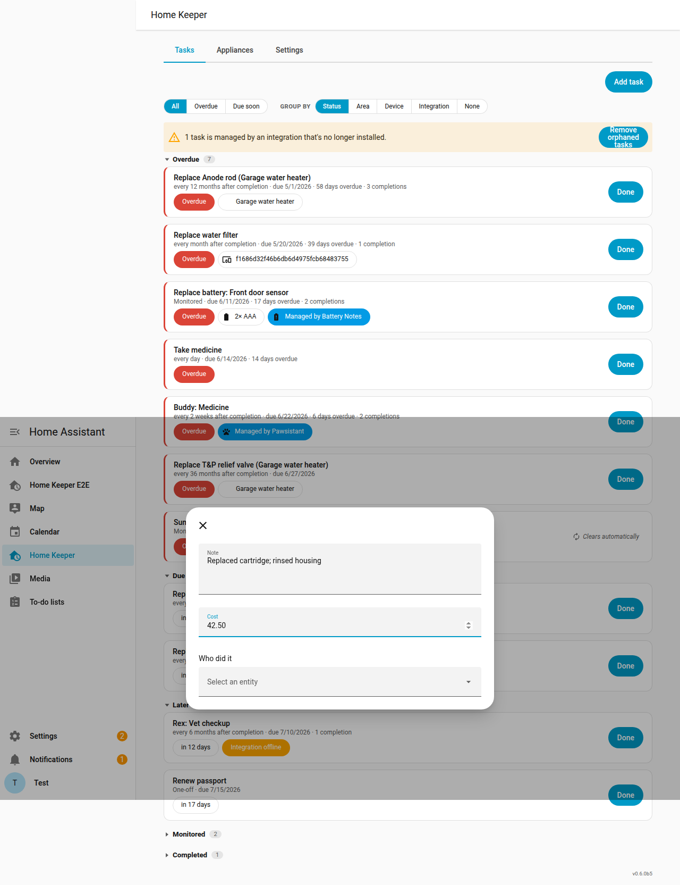

Every completion's note and cost (and who/photo) then show in the task's history,
where each entry can be edited or removed:

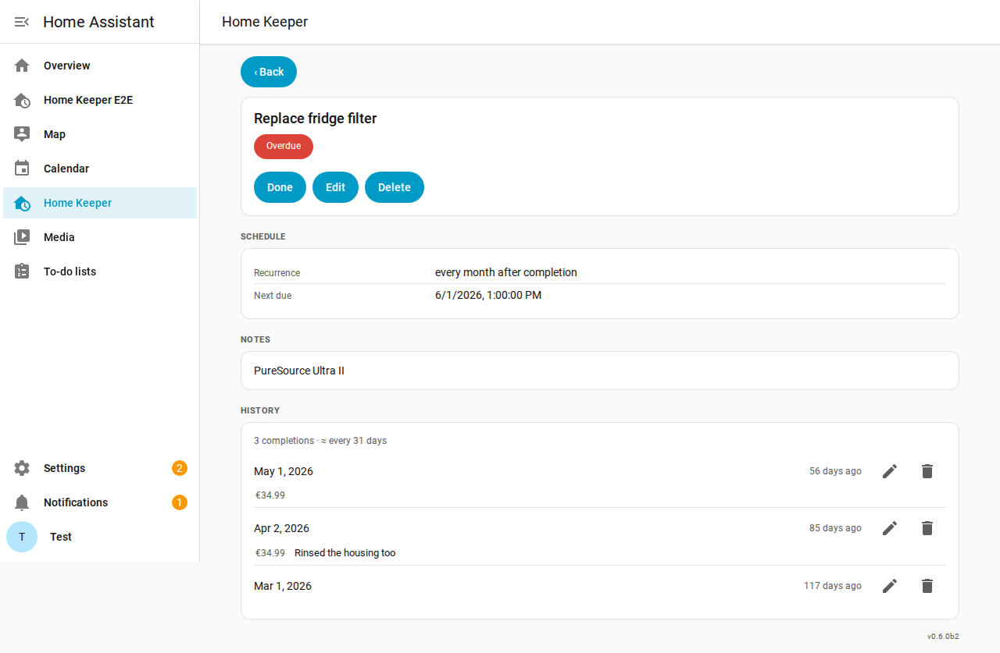

Administration and usage are intentionally **separated**: you **manage** tasks and
appliances from the **Home Keeper** sidebar panel, and **use** them through native HA
entities and the dashboard card. The panel list view can group/filter tasks, and
tapping any row opens a detail page with the full schedule, notes, and completion
history.

## Condition-driven (triggered) tasks

Some upkeep isn't periodic — it's a **reaction to a condition**: a battery dropping
low, a water sensor going wet, a filter past its pressure threshold. A **triggered**
task models exactly that. It has no schedule; an owning integration (for batteries,
the companion [Battery Notes glue](https://github.com/prestomation/ha-home-keeper-battery-notes))
**arms** it when the condition becomes true and **clears** it when resolved.

- While **armed**, it reads as **due now** everywhere — the to-do list, the device's
  overdue sensor, the panel — with a *"Managed by …"* chip showing who owns it.
- When you replace/fix the thing (from either side), the task records the event and
  goes **dormant**: it leaves the to-do list and calendar and tucks into a collapsed
  **"Monitored"** section until it's next needed.
- Because the task persists across cycles, its **completion history accumulates** — so
  you learn the real cadence ("you replace this smoke-detector battery every ~13
  months") instead of losing it on every replacement.

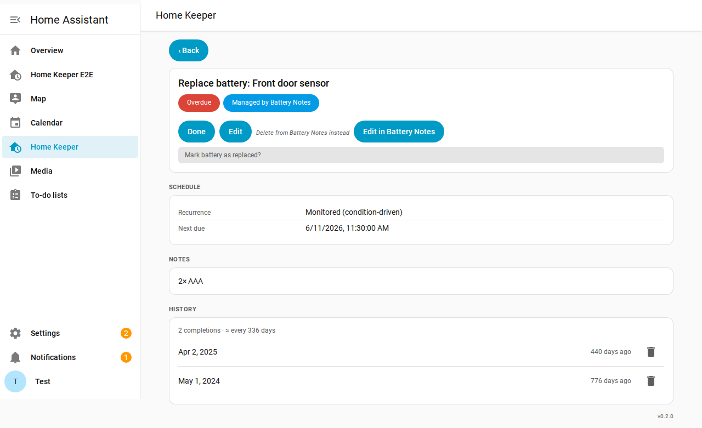

### Sync `problem` binary sensors as tasks

Lots of integrations already expose a `binary_sensor` with the **`problem`** device
class — a leak detector, an appliance fault, a UPS on battery, a printer error. Turn on
**Sync problem sensors** (*Settings → Devices & services → Home Keeper → Configure*) and
Home Keeper automatically mirrors every one of them as a triggered task, so a real-world
problem becomes a visible, trackable to-do without writing an automation.

- **What it solves:** one place that surfaces *"something is wrong"* across every
  integration — on the to-do list, the calendar, and the offending device's own page —
  instead of a problem sensor quietly flipping `on` where nobody looks.
- **How it works:** the task is **armed** while the sensor reports a problem and
  **clears itself** the moment the originating integration resolves it (the sensor goes
  back to OK). Because of that, these tasks **can't be completed in Home Keeper** — the
  problem has to be fixed for real — so the *Done* button is shown **disabled**, and
  tapping it pops up the reason (the detail page also explains how it clears). Each
  task inherits the sensor's **device and area**.
- **Scope it:** syncing is **off by default**; once on, exclude specific **entities,
  areas, or labels** — from the panel's **Settings** tab (below) or the options flow.

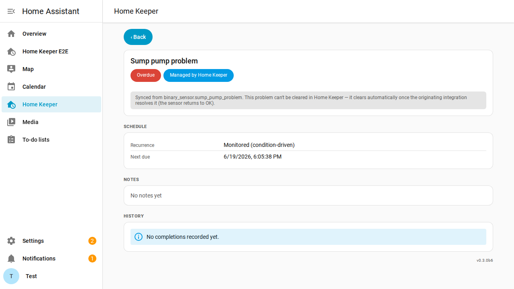

Tapping the disabled **Done** explains why it can't be completed here:

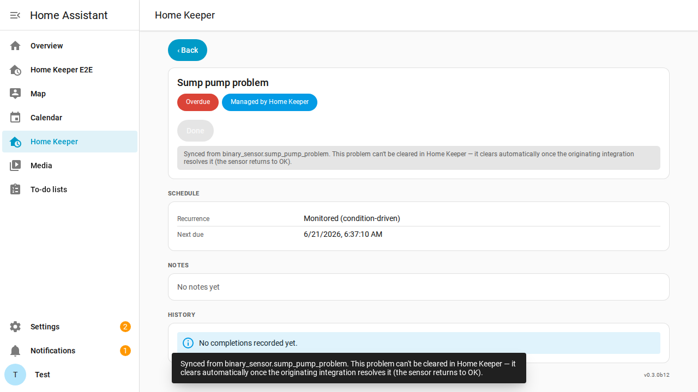

## Settings

Home Keeper's integration options are editable right in the panel — a **Settings**
tab alongside Tasks and Appliances — so you never have to dig through *Settings →
Devices & services → Configure*. It's a plain form that mirrors the options flow
(currently the **problem-sensor sync** toggle plus entity / area / label exclusions)
and **saves as you change it**. The same options remain available through the HA
options flow and the `home_keeper.set_options` service (for automations).

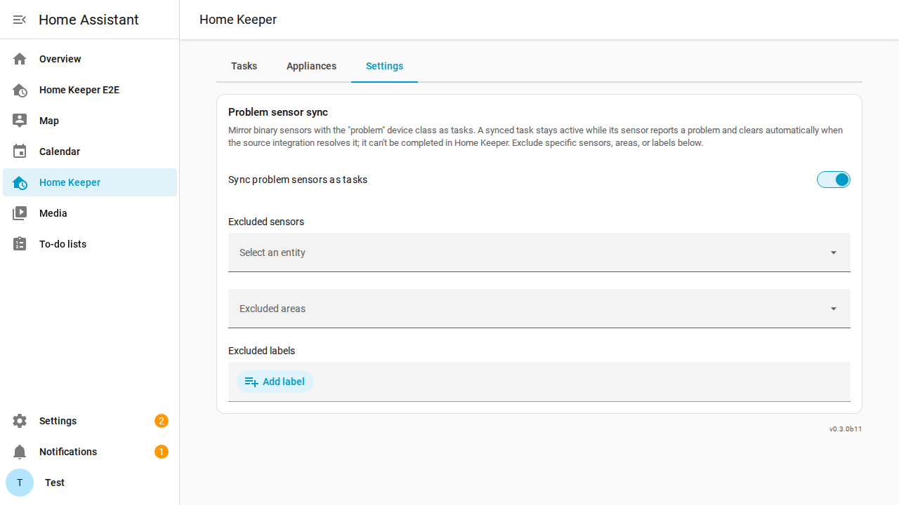

## Dashboard task card

The bundled **Home Keeper Tasks** card (`custom:home-keeper-card`) is a resizable list
of your tasks with a one-tap **Done** button on each row; tapping a row opens an inline
add/edit/delete form. It's auto-registered (no resource setup) and appears in the
dashboard **"Add card"** picker. Its GUI editor lets you filter (by status, area,
device, **label**, recurrence type, or a "due within N days" horizon), sort, group, cap
rows, and toggle what each row shows. It's built from HA's own components and theme and
reflects completions made anywhere else in real time.

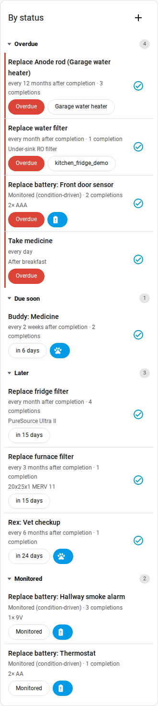

### Filter by label — one card per subject

Most homes have natural "buckets" of upkeep that don't map onto a room or a single
device: **the dog, the car, home maintenance, each kid's chores**. Tag tasks with
Home Assistant **labels** and point a card at one (or more) of them to get a focused
list per subject — a card for the dog, one for the car, one per kid.

A task matches a label filter if **the task itself** carries the label **or** its
**attached device or area** does. So labelling a Home Keeper *virtual appliance*
(which is a real device under *Settings → Devices*) — or any device a task is attached
to — automatically pulls its tasks into the matching card, and a subject never has to
be modelled as an HA area or device.

How to use it:

- **Tag tasks**: open a task's form (in the panel or the card) and pick one or more
  labels in the **Labels** field. You can also set labels via the
  `home_keeper.add_task` / `home_keeper.update_task` services.
- **Tag devices** (optional): apply the same labels to devices/appliances in
  *Settings → Devices* to sweep all their tasks into a card without tagging each one.
- **Point a card at a label**: in the card editor set **Limit to labels** (with an
  **Any/All** match mode when you list several), and optionally enable **Show labels**
  to render each task's label chips.

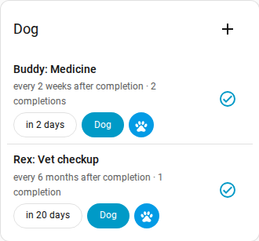

## Appliances & virtual devices

Most appliances you actually maintain — a "dumb" fridge, furnace, or water heater —
aren't Home Assistant devices, so there's nowhere to hang their maintenance tasks or
record their warranty. Home Keeper fills that gap with **appliances**, managed from the
**Appliances** tab in the panel. Two ways to use it:

- **New appliance** — Home Keeper registers a real **virtual device** for it, so
  multiple tasks share *one* device page and other integrations can attach to it too.
- **Existing device** — point Home Keeper at a device another integration already
  provides and enrich it with the same metadata, without owning it.

Either way you record **asset metadata**. A few structured fields wire into Home
Assistant — manufacturer/model, an mdi icon, a manual link, replacement cost — and
beyond that you add free-form **custom fields**, each a label with a value typed as
**text**, **link**, or **date** (seeded with common ones like serial number, warranty
expiry, purchase/install dates). Tick **track** on a date and it becomes a real `date`
**sensor** on the device page, so it's automatable natively (e.g. *"warranty expiring
in 30 days → notify me"*). Untracked dates stay display-only.

Tapping an appliance opens a **detail page** gathering its metadata, parts, related
tasks, subdevices, and full maintenance history (including retained history of tasks
deleted while still assigned to it). The tab also has an **Export inventory** button
that downloads a CSV **home inventory** — make/model, replacement cost, value of spares
on hand (with a grand total), and a Details column flattening each appliance's custom
fields. It's the grab-and-go record you want for an insurance claim.

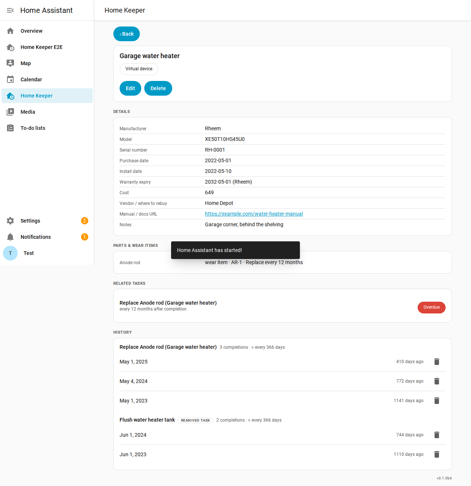

### Parts & wear items

Each appliance has a structured **parts** list — name, part number, vendor, cost, and a
type of *consumable* (a stocked spare) or *wear item*. Give a wear item a **replacement
interval** and Home Keeper automatically creates a maintenance **task** for it, attached
to the appliance's device — so it shows up in your to-do list and calendar, gets a
mark-done button and next-due sensor, and stamps the part's *last replaced* date when
completed. You can also backdate **when a wear item was last replaced** so the schedule
starts from the real date.

Any part can also track **spare inventory** — a *stock* count and a *reorder-at*
threshold. Completing a wear-item replacement consumes one spare, and when stock drops
to (or below) the threshold Home Keeper fires a `home_keeper_part_low_stock` event you
can automate on (add to a shopping list, notify, reorder).

### Relationships: subdevices & related devices

Real things nest. An appliance can be a **subdevice of** another appliance (wired
through HA's native `via_device` hierarchy, so it nests under its parent on the device
page). You can also tag arbitrary **related devices** — including ones from other
integrations HA won't let us reparent — which show up alongside the appliance.

> **Example.** Add the *Garage water heater* as a new appliance with its warranty
> expiry and an *Anode rod* **wear item** set to "replace every 12 months." The water
> heater now has its own device page with a warranty-expiry sensor, plus an automatic
> *"Replace Anode rod"* to-do that's due 12 months after each completion.

## Services

Every data action is a Home Assistant service, so it's usable from automations,
scripts, and voice:

- **Tasks** — `home_keeper.add_task`, `update_task`, `delete_task`, `complete_task`
  (with optional `note`/`cost`/`photo`/`who`), `update_completion` (amend a recorded
  completion's metadata), `trigger_task` (arm a condition-driven task), and
  `list_tasks` (returns a response).
- **Appliances** — `home_keeper.add_asset`, `update_asset`, `delete_asset`,
  `adjust_part_stock`, `list_assets`, and `export_inventory` (the last two return a
  response).

## Events & automations

Home Keeper fires a Home Assistant **bus event** for every meaningful change so you can
automate on it — tasks (created, updated, completed, uncompleted, completion-edited,
deleted, armed, and the time-based **overdue** / **due-soon** transitions), spare parts (**low stock**,
**out of stock**, **restocked**), and appliances (created, updated, deleted).

You can trigger on these two ways: pick a **device trigger** in the visual automation
editor (e.g. *"Task became overdue"*, *"Spare part out of stock"* — no event names to
memorise), or use a plain `platform: event` trigger. For example, *spare part out of
stock → add it to the shopping list*:

```yaml
automation:
  - alias: "Spare out of stock → shopping list"
    trigger:
      - platform: event
        event_type: home_keeper_part_out_of_stock
    action:
      - service: todo.add_item
        target: { entity_id: todo.shopping_list }
        data:
          item: "{{ trigger.event.data.part_name }} ({{ trigger.event.data.vendor }})"
```

Events are **edge-triggered** (one event per crossing, never repeated each cycle) and
silently baselined on restart (no "overdue" storm after a reboot). The full catalog —
every event, its payload, and more examples — is in [docs/EVENTS.md](docs/EVENTS.md).

## Integrations

Home Keeper is **open to other integrations**: they can contribute their own recurring
tasks and stay in sync with completions, without Home Keeper knowing anything about them.
Installing a compatible integration can populate and maintain your task list
automatically — for example a battery integration that schedules *"replace battery"* or a
pet tracker that schedules *"give medicine"*.

### Known integrations

| Integration | Description | How it integrates |
|---|---|---|
| [Home Keeper — Battery Notes](https://github.com/prestomation/ha-home-keeper-battery-notes) | Glue between [Battery Notes](https://github.com/andrew-codechimp/HA-Battery-Notes) and Home Keeper | Uses Home Keeper's **triggered** task type — arms a *"Replace battery"* task when a battery goes low and clears it when replaced, keeping both sides in sync so completion from either side is recorded in both. |
| [Pawsistant](https://github.com/prestomation/pawsistant) | Pet-care logger for tracking recurring pet activities | Attaches Home Keeper floating-recurrence tasks to pet care schedules (e.g. *"medicine every 2 weeks"*), so completing the task in Home Keeper logs the event in Pawsistant, and logging it in Pawsistant marks the task done — with no loop. |

> **Author an integration?** If you build a Home Assistant integration and want it to push
> tasks into Home Keeper, see the developer guide,
> [docs/INTEGRATING.md](docs/INTEGRATING.md), for the contract (the `source` field, the
> `home_keeper_task_completed` event, and two-way completion sync) — and
> [docs/GLUE_INTEGRATIONS.md](docs/GLUE_INTEGRATIONS.md) for the thin "glue" pattern that
> bridges an existing integration (like Battery Notes) to Home Keeper.

## Localization

The integration and the sidebar panel are localized into **16 languages** and follow
your Home Assistant language, falling back to English for anything untranslated.
Translations live in `custom_components/home_keeper/translations/`.

## Quality scale

Home Keeper targets Home Assistant's
[**Platinum** integration quality scale](https://developers.home-assistant.io/docs/core/integration-quality-scale/).
The per-rule self-assessment lives in
[`custom_components/home_keeper/quality_scale.yaml`](custom_components/home_keeper/quality_scale.yaml).
As a local, deviceless service integration (no network, no external dependency),
the networking/discovery/authentication rules are *exempt*; the rest are met,
including **strict typing** (the integration ships `py.typed` and CI runs `mypy`
against it with Home Assistant installed) and an **async, single-coordinator**
core.

> **One known caveat — localized exceptions:** error messages raised by services
> and entities now use Home Assistant translation keys (`strings.json` →
> `exceptions`), but their text is currently **English-first in every locale** and
> is being translated incrementally. A unit drift-guard
> (`tests/unit/test_exception_translations.py`) ensures every new raise stays
> localizable.

## Development

- Backend: `custom_components/home_keeper/` (recurrence engine in `recurrence.py`).
- Panel frontend: `custom_components/home_keeper/frontend/` (TypeScript + Rollup).
- Tests: `pytest` unit (`tests/unit`), Docker integration (`tests/integration`),
  Playwright e2e (`tests/e2e`), and vitest frontend tests.
- Typing: `mypy custom_components/home_keeper` (config in `pyproject.toml`,
  enforced by `lint.yml`). Requires Home Assistant installed so its types resolve.

See [AGENTS.md](AGENTS.md) for workflow and [RELEASE.md](RELEASE.md) for releases.
