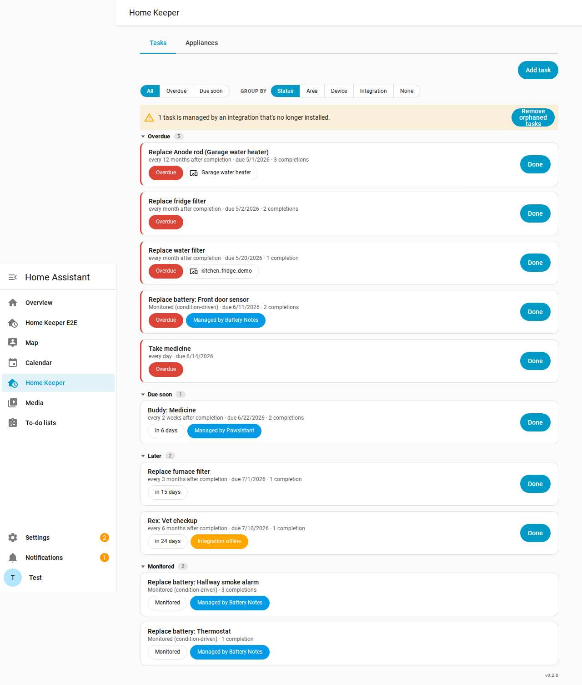
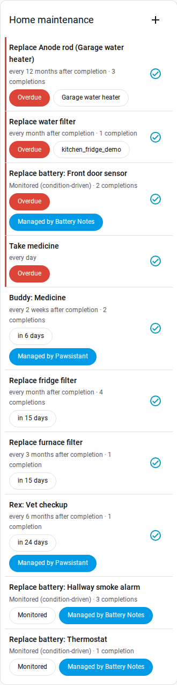
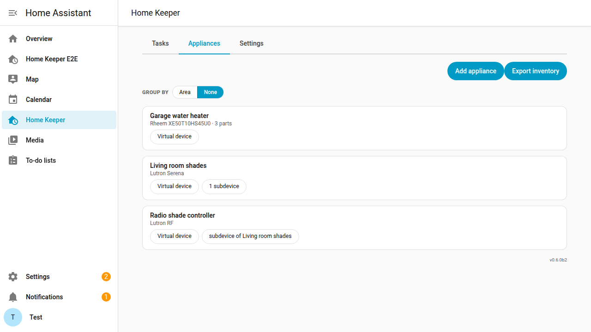
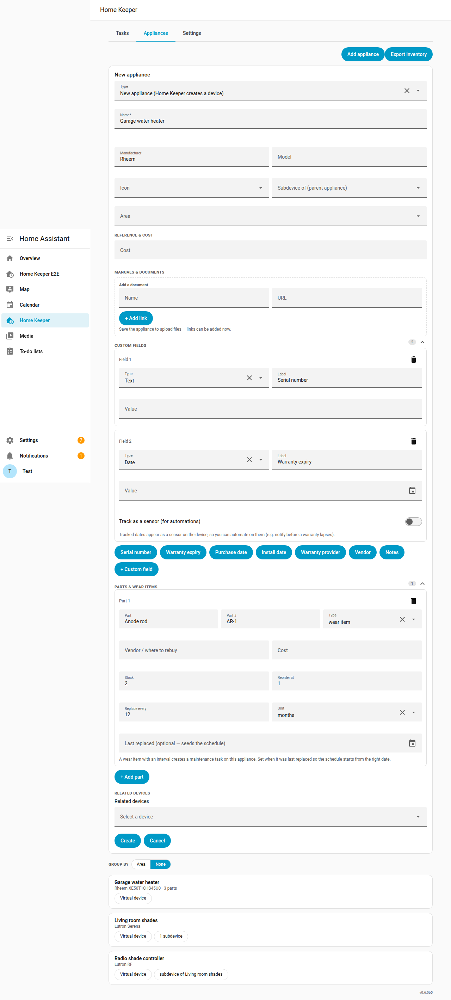

# Home Keeper

Track home **maintenance** and **chores** in Home Assistant — fridge/furnace filter
changes, water filters, taking medicine, and anything else that recurs.

> ⚠️ **Prototype.** This is an early UX prototype to try out interaction ideas. The
> data model, entities, and panel are functional but expect rough edges and change.
> See [IDEAS.md](IDEAS.md) for what's planned next.

## Concepts

A **task** has a name, notes, an optional device it's attached to, and a recurrence:

- **Floating** — measured from the last completion: *"replace the fridge filter every
  1 month after I last did it."* Completing the task resets the clock; a missed task
  stays overdue rather than silently rolling forward.
- **Fixed** — an anchored calendar schedule: *"take medicine every day at 8am"*,
  independent of when you actually complete it.
- **Triggered** — *condition-driven, no schedule.* For maintenance that's a response
  to something happening rather than a clock: *"replace this battery"* when it goes
  low, *"mop up"* when a leak sensor trips. Another integration arms the task when the
  condition becomes true and clears it when it resolves. See
  [Condition-driven tasks](#condition-driven-triggered-tasks) below.

An **appliance** (asset) is the physical thing a task is about — a fridge, furnace,
water heater. See [Appliances & virtual devices](#appliances--virtual-devices) below.

## Condition-driven (triggered) tasks

Some upkeep isn't periodic — it's a **reaction to a condition**: a battery dropping
low, a water sensor going wet, a filter past its pressure threshold. A **triggered**
task models exactly that. It has no schedule; an owning integration (for batteries,
the companion [Battery Notes glue](https://github.com/prestomation/ha-home-keeper-battery-notes))
**arms** it when the condition becomes true and **clears** it when resolved.

- While **armed**, it reads as **due now** everywhere — the to-do list, the device's
  overdue sensor, the panel — with a *"Managed by …"* chip showing who owns it.
- When you replace/fix the thing (from either side — the integration's own button or
  Home Keeper's **Done**), the task records the event and goes **dormant**: it leaves
  the to-do list and calendar entirely and tucks into a collapsed **"Monitored"**
  section, waiting for the next time it's needed.
- Because the task persists across cycles, its **completion history accumulates** — so
  you get the real cadence ("you replace this smoke-detector battery every ~13 months")
  instead of a value that's lost on every replacement.

This keeps the to-do list honest: only batteries that *actually* need attention show
as due, while the healthy ones stay out of the way but one click to browse.

## How you interact with it

Administration and usage are intentionally **separated**:

- **Manage** tasks from the **Home Keeper** panel in the sidebar — a full-page admin
  UI to create/edit/delete tasks, configure recurrence, and optionally attach a task
  to an existing device.
- **Use** tasks through native Home Assistant entities, so they show up in HA's
  built-in cards and the mobile app:
  - `todo.home_keeper_tasks` — a to-do list; checking an item off completes the task
    and advances its recurrence.
  - `calendar.home_keeper_upcoming_tasks` — upcoming occurrences on a calendar.
  - For tasks **attached to a device**, per-task `button` (mark done), `sensor`
    (next due) and `binary_sensor` (overdue) entities appear **on that device's
    page** — so e.g. your fridge shows its filter task right alongside it.
- **Drop a task card on any dashboard.** The bundled **Home Keeper Tasks** card
  (`custom:home-keeper-card`) is a resizable list of your tasks with a one-tap **Done**
  button on each row; tapping a row opens an inline add/edit/delete form. It is
  auto-registered (no resource setup) and shows up in the dashboard **"Add card"**
  picker. Its GUI editor lets you filter (by status, area, device, recurrence type, or
  a "due within N days" horizon), sort, group, cap the number of rows, and toggle what
  each row shows. It's built from HA's own components and theme, and reflects
  completions made anywhere else in real time.

The panel's list view can **group** tasks by status, area, or device and **filter**
to just what's overdue or due soon. Tapping any row opens a **detail page** with the
task's full schedule, notes, and completion history.

## Appliances & virtual devices

Most appliances you actually maintain — a "dumb" fridge, furnace, or water heater —
aren't Home Assistant devices, so there's nowhere to hang their maintenance tasks or
record their warranty. Home Assistant core can't create devices by hand; they only
come from integrations. Home Keeper fills that gap with **appliances**, managed from
the **Appliances** tab in the panel.

There are two ways to use it:

- **New appliance** — Home Keeper registers a real **virtual device** for it. Now
  multiple tasks (replace filter, flush tank, change anode rod) share *one* device
  page instead of each becoming its own throwaway device. Because it's a genuine
  registry device, other integrations (e.g. Battery Notes) can attach to it too.
- **Existing device** — point Home Keeper at a device another integration already
  provides (a smart fridge) and enrich it with the same metadata, without owning it.

Either way you can record **asset metadata** — manufacturer/model/serial, an mdi
icon, purchase / install / **warranty-expiry** dates, cost, vendor, and a manual
link. Dates become real `date` **sensors** on the device page, so they're automatable
natively — e.g. *"warranty expiring in 30 days → notify me"* — and show up in state
history without any custom card.

Tapping an appliance opens a **detail page** that gathers its metadata, parts, related
tasks, subdevices, and full maintenance history (including the retained history of
tasks deleted while still assigned to it) in one place.

The **Appliances** tab also has an **Export inventory** button that downloads a CSV
**home inventory** — make/model/serial, purchase and warranty dates, replacement cost,
and the value of spares on hand, with a grand total. It's the grab-and-go record you
want for an insurance claim, built from metadata you've already entered.

### Parts & wear items

Each appliance has a structured **parts** list — name, part number, vendor, cost, and
a type of *consumable* (a stocked spare) or *wear item*. Give a wear item a
**replacement interval** and Home Keeper automatically creates a maintenance **task**
for it, attached to the appliance's device — so it shows up in your to-do list and
calendar, gets a mark-done button and a next-due sensor on the device page, and
stamps the part's *last replaced* date when you complete it. No separate bookkeeping.

Any part can also track **spare inventory** — a *stock* count and a *reorder-at*
threshold. Completing a wear-item replacement consumes one spare, and when stock drops
to (or below) the threshold Home Keeper fires a `home_keeper_part_low_stock` event you
can automate on (add the part to a shopping list, notify, reorder). The panel flags
low parts and the export below values your spares on hand.

### Relationships: subdevices & related devices

Real things nest. An appliance can be a **subdevice of** another appliance (e.g.
*Radio shade controller* under *Living room shades*); Home Keeper wires this through
Home Assistant's native `via_device` hierarchy, so the subdevice nests under its
parent on the device page. You can also tag arbitrary **related devices** — including
ones from other integrations that HA won't let us reparent (your existing humidity
sensor next to your *Piano*) — which show up alongside the appliance in the panel.

> **Example.** Add the *Garage water heater* as a new appliance with its warranty
> expiry and an *Anode rod* **wear item** set to "replace every 12 months." The water
> heater now has its own device page with a warranty-expiry sensor, plus an automatic
> *"Replace Anode rod"* to-do that's due 12 months after each completion.

## Services

Task services: `home_keeper.add_task`, `update_task`, `delete_task`, `complete_task`,
`trigger_task` (arm a condition-driven task), and `list_tasks` (returns a response).

Appliance services: `home_keeper.add_asset`, `update_asset`, `delete_asset`, and
`list_assets` (returns a response). All are available for automations.

## Integrating with Home Keeper

Other integrations can contribute their own recurring tasks to Home Keeper and stay in
sync with completions — without Home Keeper knowing anything about them. See
[docs/INTEGRATING.md](docs/INTEGRATING.md) for the contract (the `source` field, the
`home_keeper_task_completed` event, and two-way completion sync).

## Development

- Backend: `custom_components/home_keeper/` (recurrence engine in `recurrence.py`).
- Panel frontend: `custom_components/home_keeper/frontend/` (TypeScript + Rollup).
- Tests: `pytest` unit (`tests/unit`), Docker integration (`tests/integration`),
  Playwright e2e (`tests/e2e`), and vitest frontend tests.

See [AGENTS.md](AGENTS.md) for workflow and [RELEASE.md](RELEASE.md) for releases.
