# Home Keeper

[![Integration Usage][usage-shield]][usage]
[![GitHub Downloads][downloads-shield]][releases]
[![GitHub Release][release-shield]][releases]
[![GitHub Release Date][release-date-shield]][releases]
[![GitHub Activity][commits-shield]][commits]
[![License][license-shield]](LICENSE)
[![hacs][hacs-shield]][hacs]
![Project Maintenance][maintenance-shield]
[![ko-fi][kofi-shield]][kofi]
[![HACS Validation][hacs-validation-shield]][hacs-validation]
[![HA Version][ha-version-shield]][ha-version]
[![Docs][docs-shield]][docs]

Home Keeper tracks home maintenance and chores in Home Assistant. This includes
fridge and furnace filter changes, water filters, taking medicine, and anything
else that recurs.

> 📖 **Full documentation** (a browsable User Guide and Developer Guide) lives at
> **<https://prestomation.github.io/ha-home-keeper/>**. The site is generated from this
> README and `docs/`, so they never drift.

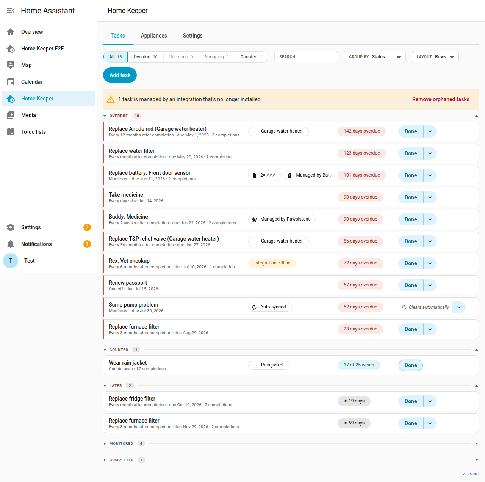
## Features at a glance

- Tasks support 5 recurrence types. These are floating, fixed, one-off, triggered,
  and sensor-based. See [Concepts](#concepts).
- Home Keeper provides native Home Assistant entities. A `todo` list and an
  upcoming-tasks `calendar` and per-device entities on a task's device page.
- Home Keeper syncs the tasks of a profile to any `todo` entity as they become
  due. A completion on that list completes the task in Home Keeper.
- The bundled dashboard card `custom:home-keeper-card` has a Done button and
  inline add and edit. It supports filtering and grouping.
- Every notes field on a task or appliance or part or completion is Markdown
  with a live preview.
- A task can link to a Home Assistant tag so that a scan completes it. The task
  can require the scan.
- An appliance has a device page with structured metadata and optional
  tracked-date sensors. It has parts and wear items and spare-part inventory and
  documents. A CSV home-inventory export is available for insurance.
- Home Keeper fires a bus event for every state change and provides device
  triggers such as "Task became overdue" for the visual automation editor.
- Every data action is a `home_keeper.*` service for automations and scripts and
  voice.
- Home Keeper is localized in 16 languages and follows the Home Assistant
  language setting.
- Other integrations can contribute their own recurring tasks and stay in sync
  with completions.


## Installation

Home Keeper is a custom integration installed with [HACS](https://hacs.xyz/):

1. In HACS, add this repository as a custom repository, category
   Integration: `https://github.com/prestomation/ha-home-keeper`.
2. Install Home Keeper and restart Home Assistant.
3. Add the integration from **Settings → Devices & Services → Add Integration →
   Home Keeper**.

A Home Keeper panel then appears in the sidebar. Tasks and appliances are
stored locally in a single JSON document, `.storage/home_keeper`.


## Concepts

A task has a name, notes, an optional attached device, and a recurrence:

- Floating, shown as **Repeats after each completion** in the form, measures from the last
  completion. An example is a fridge filter every 1 month after the last
  completion. Each completion resets the interval. A missed task stays overdue and
  does not roll forward.
- Fixed, shown as **Repeats on a fixed schedule** in the form, is an anchored calendar schedule
  that is independent of completions. An example is medicine every day at 8am.
- One-off, shown as **Just once** in the form, runs one time. See
  [One-off tasks](#one-off-do-once-tasks) below.
- Triggered is monitored and condition-driven, with no schedule. See below.
- Sensor-based, shown as **Based on a sensor** in the form, is driven by an entity instead of the
  clock. An example is a generator service every 500 running hours. See
  [Sensor-based tasks](#sensor-based-tasks-usage-meters-thresholds--states) below.

An appliance, also called an asset, is the physical thing a task is about,
such as a fridge, furnace, or water heater. See
[Appliances & virtual devices](#appliances--virtual-devices).

The panel is admin-only. This includes appliances and settings and profiles and
notifications and the inventory export. The to-do list, the calendar, the
device-page buttons, and the dashboard card are available to every user. See
[the security model](docs/SECURITY.md) for what a non-admin user can read.

### Put a task in a room

A task can have a Home Assistant area. Select the area in the **Area** field of the
task form.

A task attached to a device takes that device's area. The field is for tasks with
no device, such as the plants in the living room. A selected area overrides the
device's area. Clear the field to return the task to its device's area.

A task with an area can be grouped by Area on the Tasks tab. A
[dashboard card](#dashboard-task-card) or a
[Profile](#profiles-saved-filters-you-reuse-everywhere) can filter by area. The
`home_keeper.add_task` and `home_keeper.update_task` services also set the area.

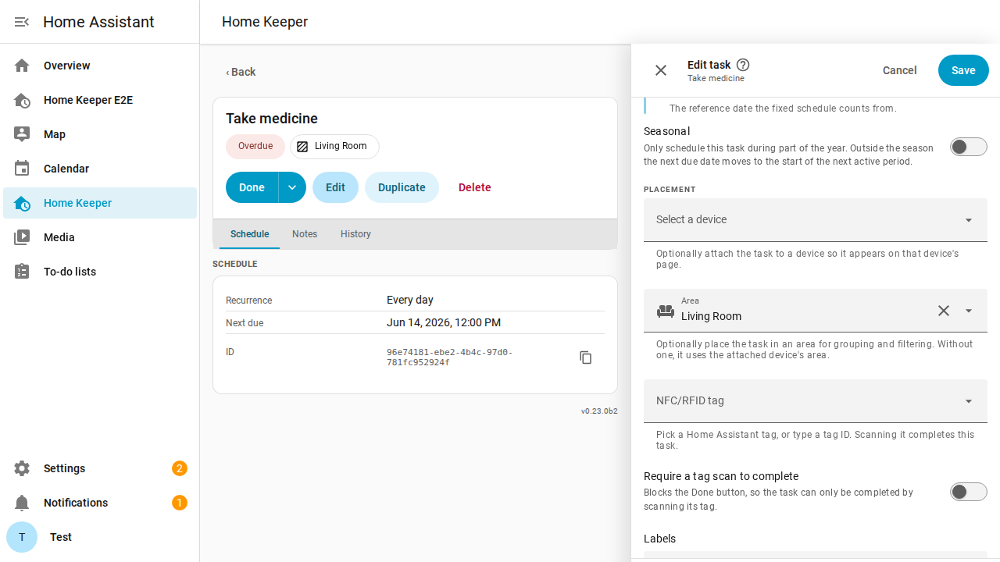

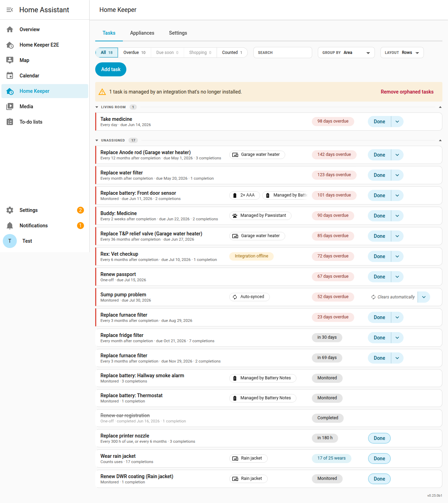


## Getting around the panel

The panel has the tabs **Tasks**, **Appliances**, and **Settings**.


On the **Tasks** tab:

- Select a scope pill to filter the list by status.
- Select a saved Profile in the **Profile** picker or a grouping in **Group by**.
- Press **Add task** to create a task.
- Press **Edit** on a task to open its form. The form has the groups Basics,
  Schedule, Placement, and Completion. Press **Save** in the header or **Delete** in
  the footer.

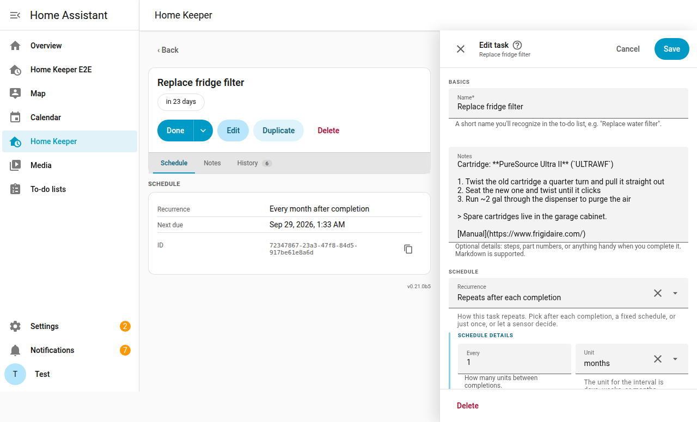

On the **Appliances** tab, select an appliance to open it. An appliance has the
sub-tabs **Parts**, **Tasks**, **Documents**, **Details**, **Related**, and
**History**. Each sub-tab has its own URL, such as
`/home-keeper/appliances/<id>/documents`. Press **Edit** to open the appliance form.

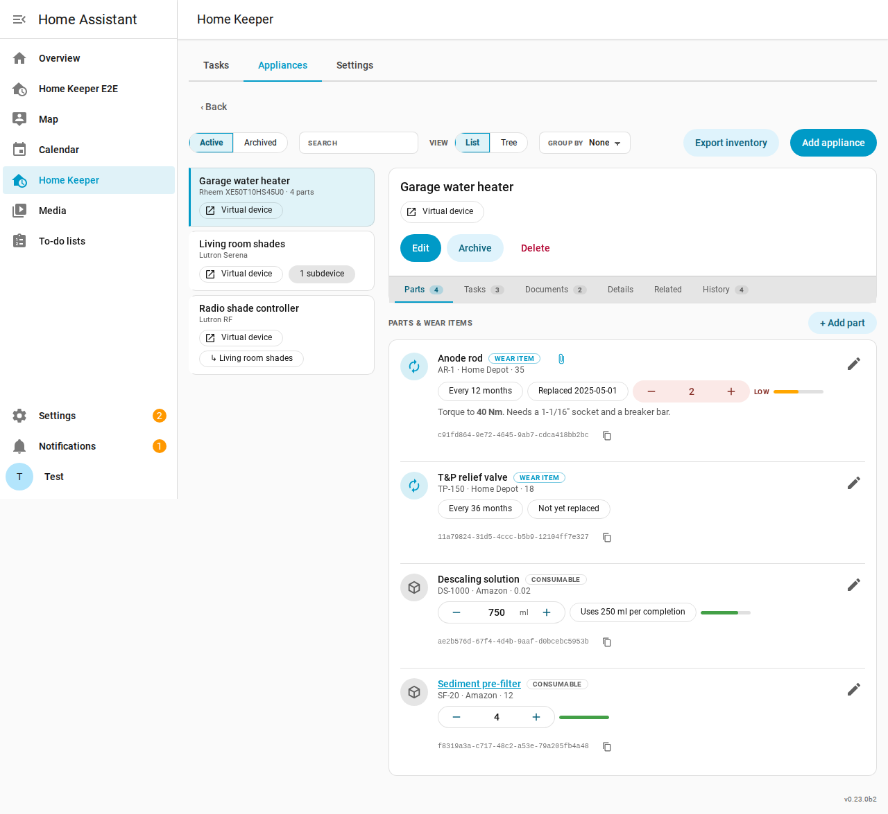

### Duplicate a task

To create a task from a copy of another task, press **Duplicate** on the task's page.
The create form opens with the values of the original. Change the values and press
**Create**. Nothing is saved before **Create**.

The copy does not include:

- the completion history
- the starting reading of a meter task
- the NFC tag and the require-scan setting
- the required completion fields
- integration-provided chips and the integration source

A task that another owner manages cannot be duplicated. **Duplicate** is disabled for
these tasks and shows the owner when pressed. This applies to:

- a wear item from an appliance part
- a synced problem sensor
- a condition-driven task
- a task that another integration manages

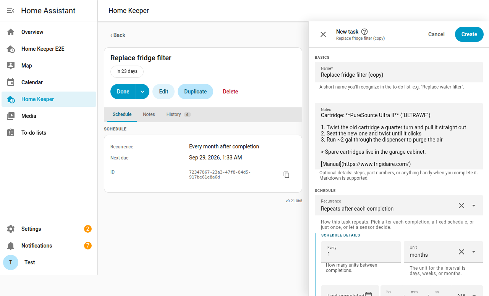


## One-off (do-once) tasks

Home Keeper supports a one-off task for something a user does 1 time. This is
useful for a task with no recurrence, such as renewal of a passport or
registration of a car.

Select **Just once** on the task form and select a due date. The due date
defaults to today.

A one-off task behaves like any other task until it is complete. It appears
on:

- the to-do list
- the upcoming-tasks calendar
- the overdue and next-due sensors

A user can log the usual completion details:

- a note
- a cost
- who completed it
- a photo

A completed one-off task does not reschedule. It is removed from the active
surfaces and listed in the **Completed** section of the panel with its completion
record. Undo the completion to return the task to its due date.

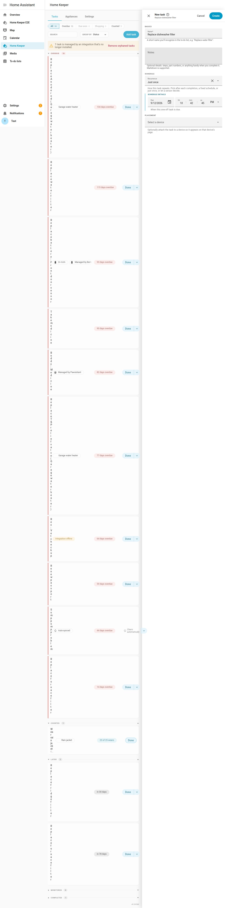

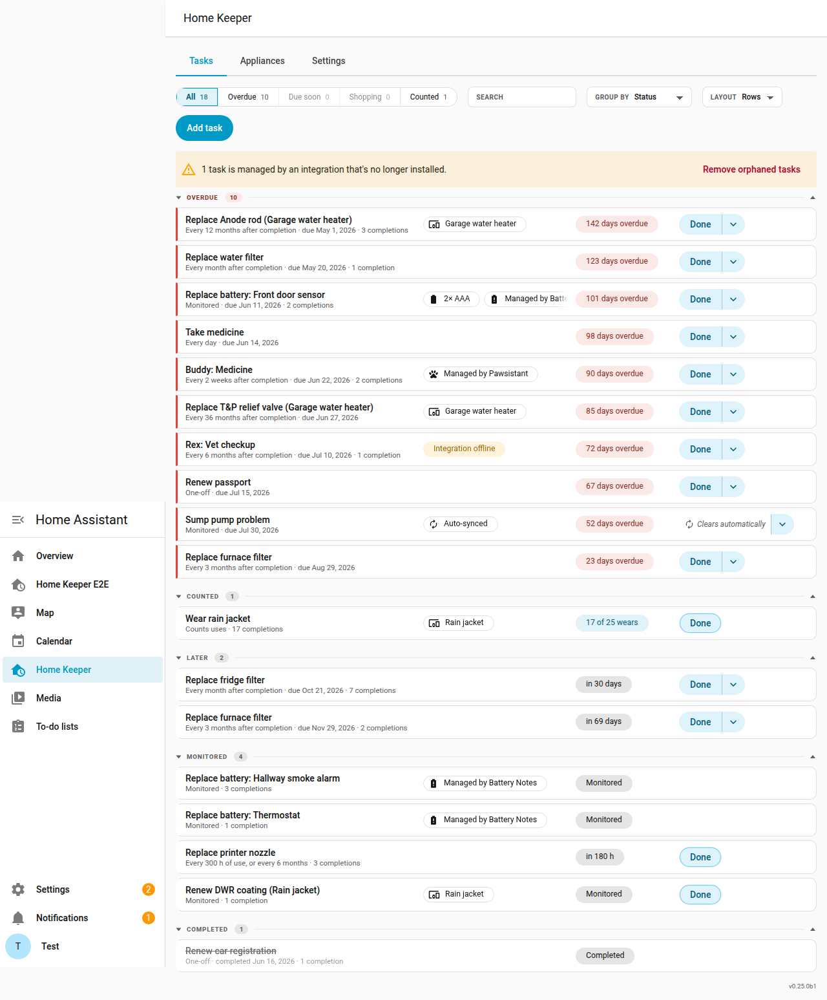

Set **One-off retention (days)** in the panel's **Settings** tab, or with the
`home_keeper.set_options` service, to delete a completed one-off task
automatically. A completed one-off task is deleted that many days after
completion. The default, `0`, keeps a completed one-off task forever.


## Notes are Markdown

Home Keeper supports **Markdown** in every **Notes** field:

- a task
- an appliance
- a part
- a logged completion

This is useful for structured content, such as a numbered procedure or a
table of settings.

A notes field supports GitHub-flavored Markdown:

- headings
- **bold** and *italic* text
- lists
- links
- tables
- quotes
- code

A user writes Markdown in 2 places:

- **Inline on the detail page.** The Notes card has an **Edit note** button
  that opens an editor with a **live preview**. The preview appears only when
  the text contains Markdown.
- **In the edit form.** The task, appliance, part, and completion editors have
  a notes field with the same live preview.

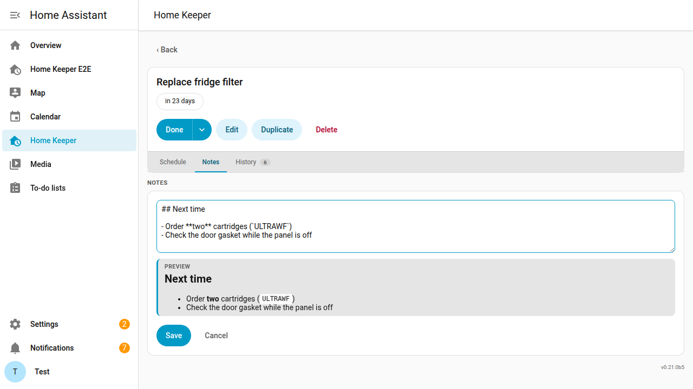

Home Keeper stores notes as **Markdown source**, not HTML. The raw text is
sent to:

- the `todo` item description
- the `calendar` event description
- anything that reads a task through the services or events

Home Assistant renders those descriptions with its own Markdown support.

The `home_keeper.add_asset` and `update_asset` services set the appliance **Notes**
field. Each **part** also has a notes field.

Home Assistant's `ha-markdown` component renders and sanitizes the notes, so a
note matches the current theme.


## Logging completions (note, cost, photo, who)

Home Keeper supports **per-completion detail** on a task. The default is a 1-tap
**Done**. This is useful for a maintenance log
of a task's cost and notes.

A completion can record:

- a free-form note
- a cost
- a photo
- who completed it, a Home Assistant `person` entity

A task sets its capture mode in the **On completion** field:

- **One-tap done** is the default, with no dialog.
- **Ask for details (optional)** opens a dialog with the completion fields,
  all optional. A **Skip details** button completes the task without them.
- **Require details** opens the dialog and blocks **Done** until a user fills
  the required fields.

The dialog uploads a photo through Home Assistant's image store. The **who**
field lists the `person` entities.

The task's history shows each completion's:

- note
- cost
- photo
- who

A past entry can be edited there without a change to the schedule. The details of
the most recent completion are also attributes of the task's **next due** sensor.
The `home_keeper.complete_task` and `home_keeper.update_completion` services
accept the same fields.

The dialog's **Completed at** field defaults to now. A user can set it to log
a completion for the time the work happened.

The next due date of a **floating** task is measured from the completion date, so
the completion date moves the schedule.

The **move date** button on a history row changes the date of that entry. The
**edit** button changes the recorded details and not the date. The
`home_keeper.move_completion` service performs the same move.

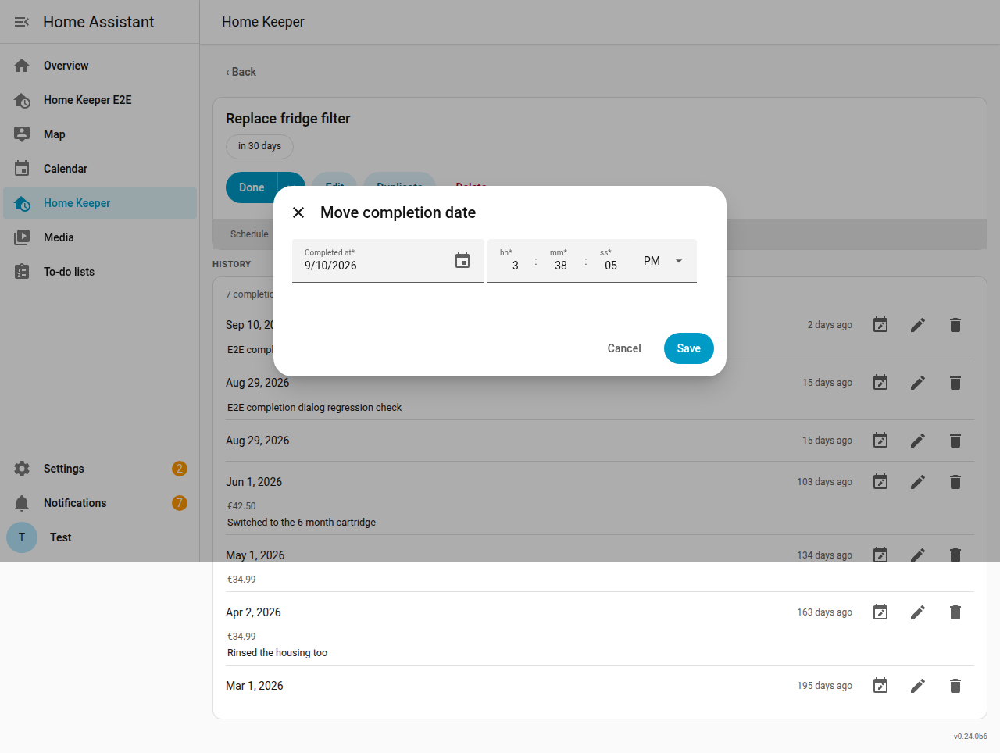

> The capture dialog and the **required** gate apply only in the **panel**. A
> task completed from another surface completes immediately, with whatever
> metadata is passed:
>
> - the native **to-do** checkbox, which passes no metadata
> - the mobile app
> - the device **mark-done** button
> - a bare `home_keeper.complete_task` service call
>
> The dashboard card sends a user to the panel to complete a required task,
> instead of completing it directly. An automation can pass `note`, `cost`,
> `photo`, and `who` to the `home_keeper.complete_task` service.

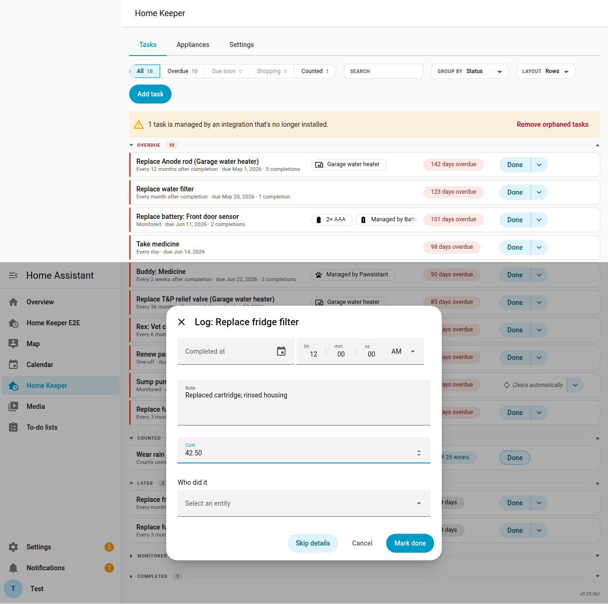

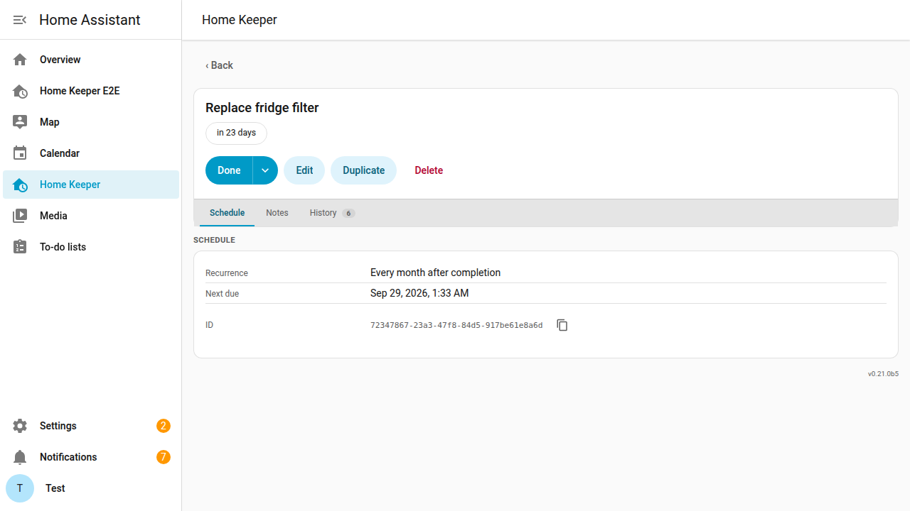


## Complete tasks with NFC/RFID tags

Home Keeper supports linking a task to a [Home Assistant
tag](https://www.home-assistant.io/integrations/tag/). When a user scans the
tag, Home Keeper completes the task. This is useful for completing a task by
scanning a tag placed on the item, without opening the dashboard.

No `tag_scanned` automation is needed. The **Done** button continues to work.

The **Require tag scan to complete** toggle blocks **Done** on every surface:

- panel
- card
- to-do list
- device button
- notifications

With the toggle on, a user completes the task only by scanning its tag.

Write the tag once in Home Assistant **Settings → Tags**, or let the companion app
register it on the first scan. Then select the tag in the **NFC/RFID tag** field
of the task form, or type the tag ID.

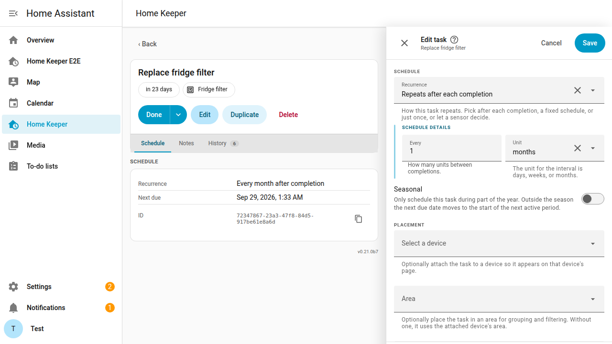

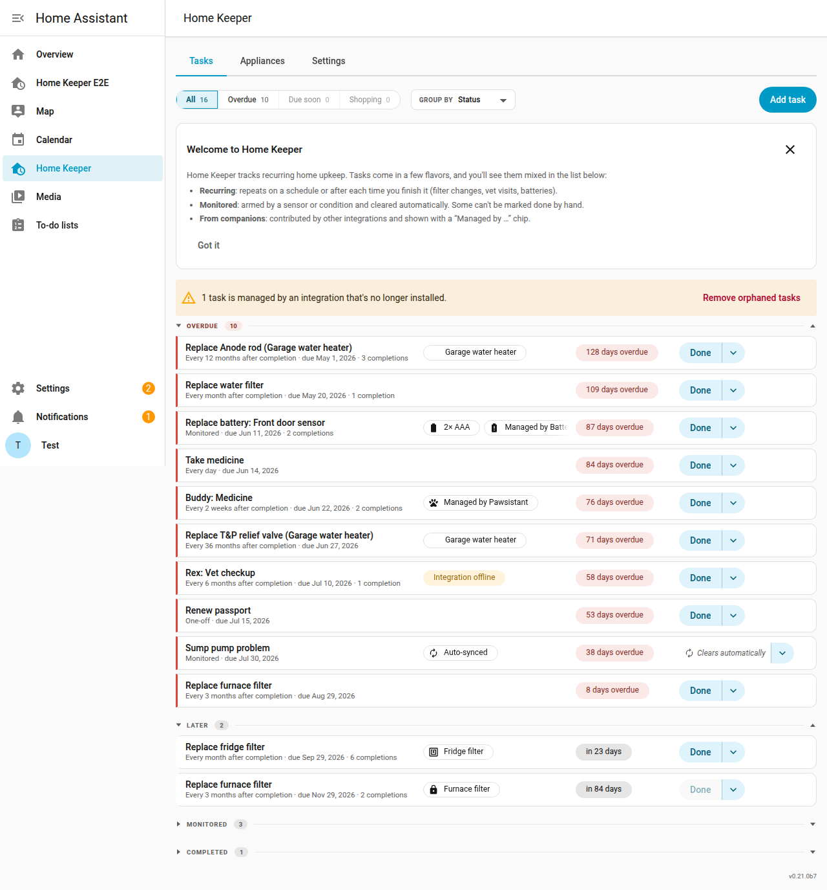

A scan completion fires the `home_keeper_task_completed` event with
`origin: home_keeper_tag_scan`. Automations can pass the same origin to
`home_keeper.complete_task` to complete a scan-locked task. See
[docs/EVENTS.md](docs/EVENTS.md).


## Condition-driven (triggered) tasks

Home Keeper supports triggered tasks. A triggered task has no schedule. The owning
integration arms it when a condition becomes true and clears it when the condition
resolves. This is useful for maintenance that reacts to a condition, such as a low
battery or a wet water sensor. For batteries, the
[Battery Notes glue integration](https://github.com/prestomation/ha-home-keeper-battery-notes)
does this.

- An armed triggered task is due now on the to-do list and the device's overdue
  sensor and the panel. A **Managed by** chip names the owning integration.
- A completion in Home Keeper or in the owning integration records the event. The
  task then leaves the to-do list and the calendar and is listed in the
  **Monitored** section until it is armed again.
- The task persists across cycles and its completion history accumulates.

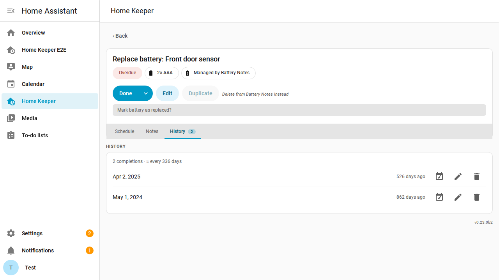

### Integration-provided metadata chips (`task_chips`)

Home Keeper supports metadata chips that an integration attaches to a task. This is
useful for an integration-owned fact on the task row, such as a battery type or a
part number or a reorder link.

The owning integration sets `task_chips` in `home_keeper.add_task` or
`home_keeper.update_task`. The panel task list and the dashboard card show the
chips. A chip cannot be edited by a user.

Each chip is `{label, icon?, url?}`. The icon must be an `mdi:` name. The URL must
be `http(s)://`. A chip with an empty label is dropped.

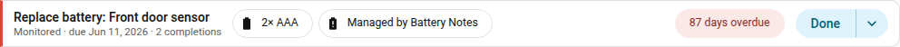

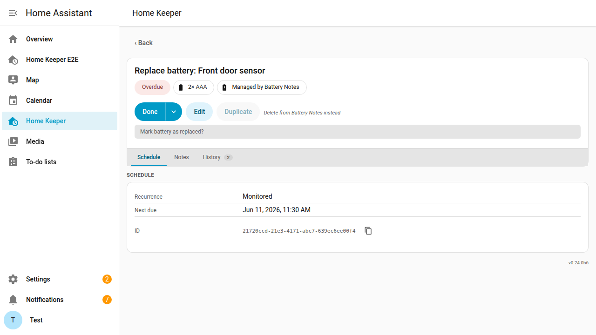

### Sync `problem` binary sensors as tasks

Home Keeper supports syncing every `binary_sensor` with the `problem` device class
as a triggered task. This is useful for a leak detector or an appliance fault or a
printer error without an automation. Turn on **Sync problem sensors** in
*Settings → Devices & services → Home Keeper → Configure*.

- Home Keeper arms the task while the sensor reports a problem and clears the task
  when the sensor reports OK.
- A synced task cannot be completed in Home Keeper. The problem must be resolved at
  its source.
- Each synced task inherits the sensor's device and area.
- An armed synced task is listed as overdue on the task list and the card and in a
  [Profile](#profiles-saved-filters-you-reuse-everywhere) and in notifications. A
  notification for a synced task offers **Snooze** instead of **Mark done**.
- The sync is off by default. With the sync on, entities or devices or areas or
  labels can be excluded in the panel **Settings** tab or in the options flow. An
  excluded device excludes every problem sensor that belongs to it.
- Open the task and use **Add a note** to record the fix. The note is tied to the
  sensor and is kept when the task clears and re-arms or is removed and recreated.

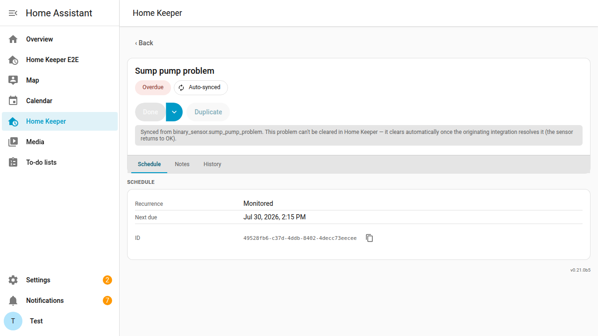

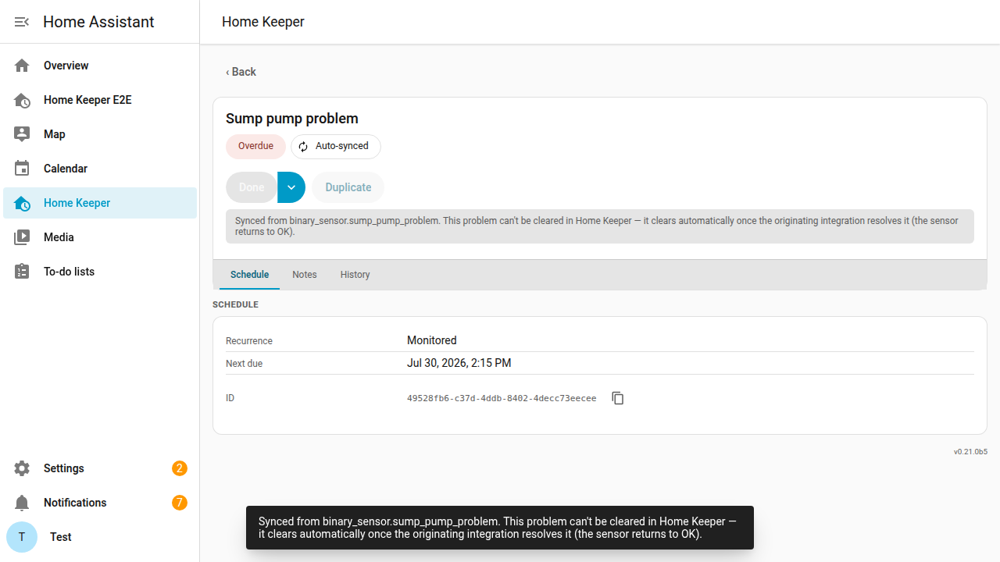

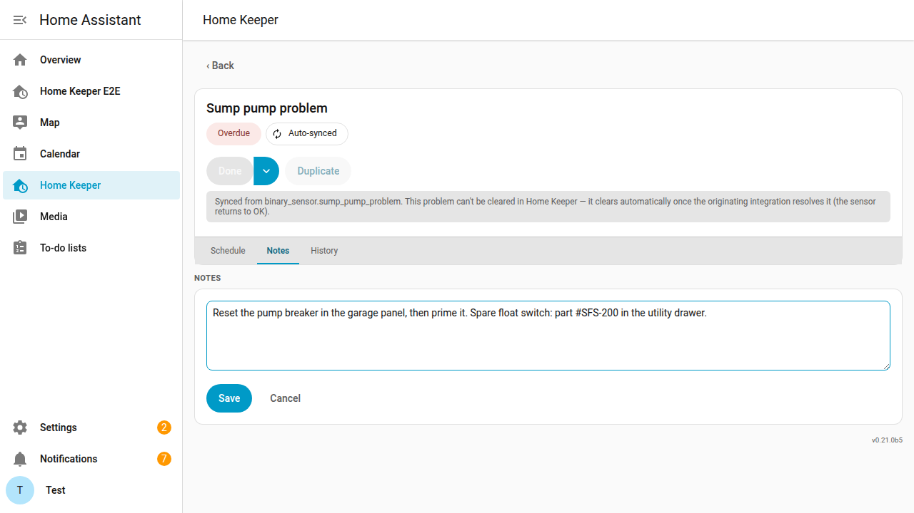


## Sensor-based tasks (usage meters, thresholds & states)

Home Keeper supports sensor-based tasks. A sensor-based task is bound to a Home
Assistant entity and Home Keeper arms it from the entity's state. This is useful
for a service that is due after an amount of use, such as an oil change every
15000 km. It is also useful for a reading that crosses a limit, such as a filter
change when airflow drops below 60%, and for a binary sensor that reports the
condition, such as a water tank empty sensor. No automation is needed.

On the task form, select **Based on a sensor** and select the sensor and a mode:

- **Usage or meter**: set a target. Home Keeper records the sensor reading at task
  creation and at each completion as the baseline. The task becomes due when the
  meter advances by the target from the baseline. A completion re-anchors the
  baseline at the current reading. Home Keeper re-anchors automatically if the
  reading drops below the baseline after a meter reset. This mode suits
  odometers and runtime-hour sensors and cycle counters.

  > **Starting reading.** The baseline at task creation is the current reading. If
  > the equipment was serviced before, set **Starting reading** to the reading at
  > that service. An odometer reads 48000 and the last oil change was at 45000.
  > With a starting reading of 45000 and a target of 10000 the task is due at
  > 55000. Leave the field empty to anchor at the current reading.
  >
  > **Last completed** sets the same anchor for the time half of a combined rule.
  > See [below](#hours-or-months-whichever-comes-first).
- **Threshold**: set a comparison (`≥ ≤ > < = ≠`) and a value. The optional hold
  requires the reading to stay past the limit for a number of seconds before the
  task arms. An optional attribute reads an entity attribute instead of the state.
  One example is `current_temperature` of a climate entity. The task arms on the crossing
  and stays due until it is completed. A short recovery does not clear it. The
  task re-arms on the next crossing.
- **State**: select the state that the entity must reach, with the same optional
  hold. For a `binary_sensor` the choices are **On** and **Off**. For any other
  entity the state is matched as text. An example is `vacuum.rosie` = `docked`. See
  [below](#when-a-device-just-tells-you).

An armed sensor task behaves like any other task. It is on the to-do list and the
calendar. It sets the device's overdue sensor and fires the
`home_keeper_task_overdue` event. Before it is armed, a usage task shows the
remaining usage in the task list, such as "in 7000 miles". A threshold or state
task is listed as **Monitored**. The `home_keeper.add_task` service creates a sensor
task with a `sensor` mapping.

### Hours or months, whichever comes first

Home Keeper supports a usage target combined with a time cadence on a usage task.
This is useful for a service interval that has a use amount and a time period, such
as:

- 300 print hours or 6 months
- 8000 km or 12 months
- 500 run-hours or 3 months

Turn on **Also come due on a schedule** and set the **Or every** cadence and unit
and a **Combine with** choice:

- **Whichever comes first** is the default. The task becomes due when the meter
  reaches its target or when the cadence elapses.
- **Both must be met** makes the task due only when both halves are met. An example
  is a generator that is run at least monthly and serviced after 100 engine hours.

The form shows the resulting rule under **When it comes due** and updates it as the
fields change.

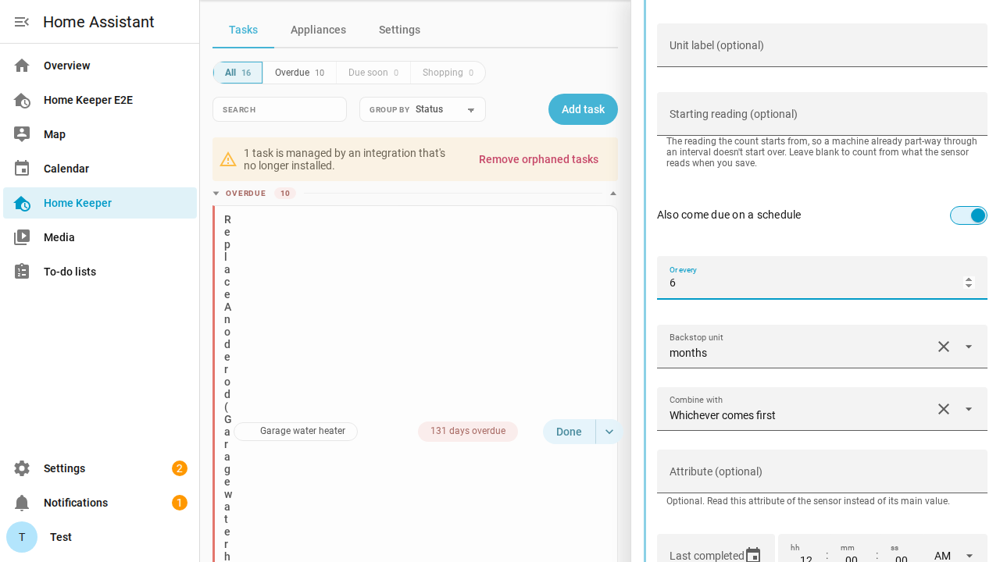

The time half runs from the last completion, or from task creation before the
first completion. A completion resets the meter and the time half together. The
time half continues while the sensor is unavailable.

**Progress.** The task detail page shows the remaining usage, such as "180 h to
go". The unit label is prefilled from the sensor and can be changed. The same
figures are attributes of the task's next-due sensor entity: `usage_consumed`,
`usage_remaining`, `usage_percent`, `usage_target`, `usage_unit`,
`usage_baseline`, `backstop_due`, and `last_completion_reading`. The entity exists
only for a task attached to a device.

**History.** A completion of a sensor task records the sensor reading with the
note and cost and photo. Each history row shows the reading and the reading can be
edited. The reading on the most recent completion is the meter anchor, so an edit
to it moves the anchor. An older row is a log entry only.

The completion dialog prefills the reading from the sensor. To back-date a
completion, set **Completed at** and type the reading from that date.

**Re-anchor without a completion.** The `home_keeper.set_task_meter` service
re-anchors the baseline of a usage task without a completion record. This is
useful for work done before the task existed or after a meter swap. Omit
`baseline` to anchor at the current reading.

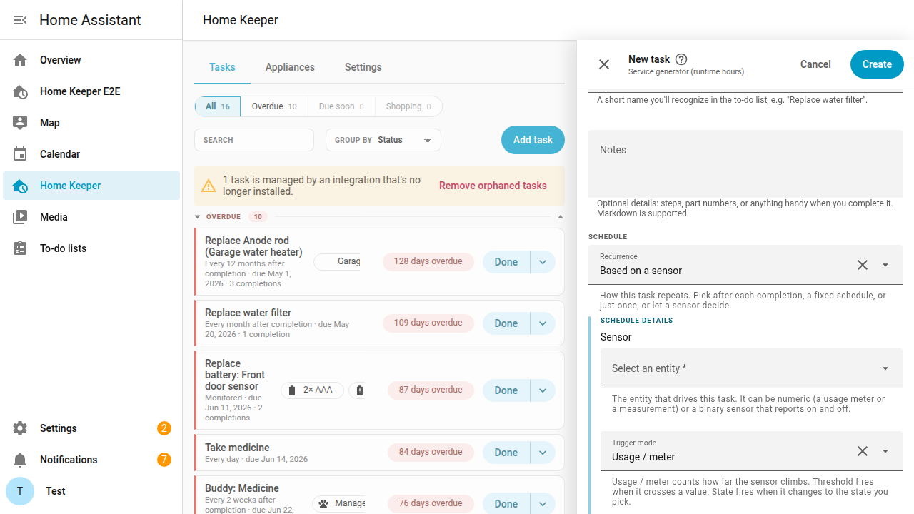

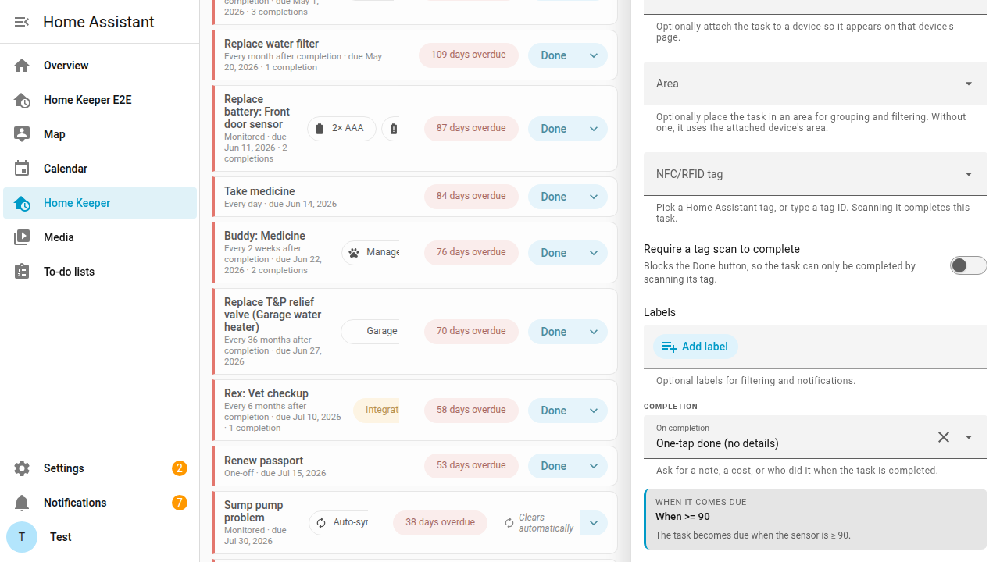

### When a device just tells you

Home Keeper supports a sensor task that is bound to an entity that reports the
condition directly. This is useful for hardware with no number to meter, such as:

- a robot vacuum water tank empty state
- a battery sensor that reports `battery_almost_empty`
- a leak detector
- a filter-needs-replacing flag

Use **State** mode. Select the entity and the state that arms the task.

- The task arms on the transition into the state and stays armed while the sensor
  remains in that state. After a completion the task arms again only after the
  sensor returns to normal and reaches the state again.
- If the sensor is already in the state when Home Assistant starts, the task does
  not arm again.
- An optional hold ignores short trips, such as a door that must stay open for 10
  minutes before the task arms.
- For an entity that is not a binary sensor the state field accepts free text.

**Automatic clearing.** Turn on **Clear when back to normal** to complete the task
when the sensor returns to normal. A completion is recorded. If the task is
[linked to a consumable](#link-a-task-to-a-consumable-auto-reorder), the automatic
completion draws down the part's per-use amount. The switch is off by default.

> **Difference from [problem-sensor sync](#sync-problem-binary-sensors-as-tasks).**
> The sync creates a task for every `device_class: problem` sensor, and these tasks
> cannot be completed by hand. State mode creates 1 task for any entity and any
> device class, and the task is completed by hand unless automatic clearing is on.

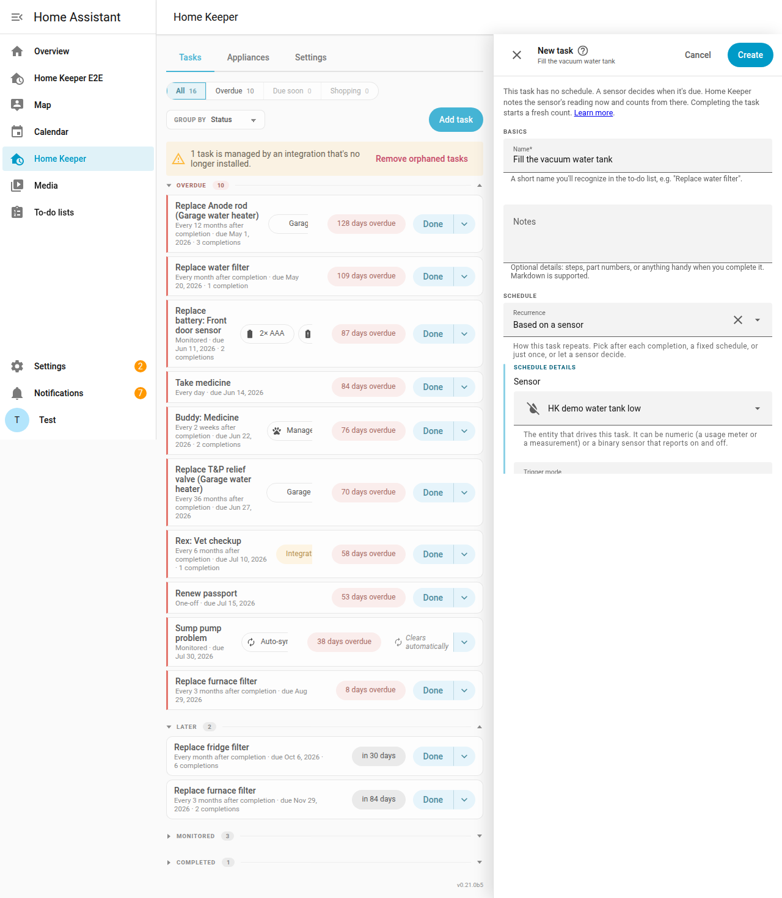

### Link a task to a consumable (auto-reorder)

Home Keeper supports linking a task to a consumable part of an appliance. This is
useful for a task that uses a part kept in stock, such as a water filter. A
completion draws down the part's [stock](#parts--wear-items) by its per-use amount.
The default is 1 whole part unless the part sets
[its own amount](#stock-you-measure-rather-than-count). Home Keeper fires a
`home_keeper_part_low_stock` event when the stock crosses the reorder-at threshold.
The linked task is independent of the auto-generated wear-item tasks and stays
editable.

A [sensor-based](#sensor-based-tasks-usage-meters-thresholds--states) task can be
linked to a consumable. An example is a task bound to a filter-life entity and
linked to the filter part. The entity arms the task and a completion draws down
the part.

Select the part in the **Linked consumable** field on the task form. The field lists
the parts of the appliance that the task is attached to with **Attach to device**.
The field is hidden if the appliance has no consumable parts. The
`home_keeper.set_task_consumable` service sets the same link. Omit the ids to
unlink. The task detail shows the linked part and its current stock.

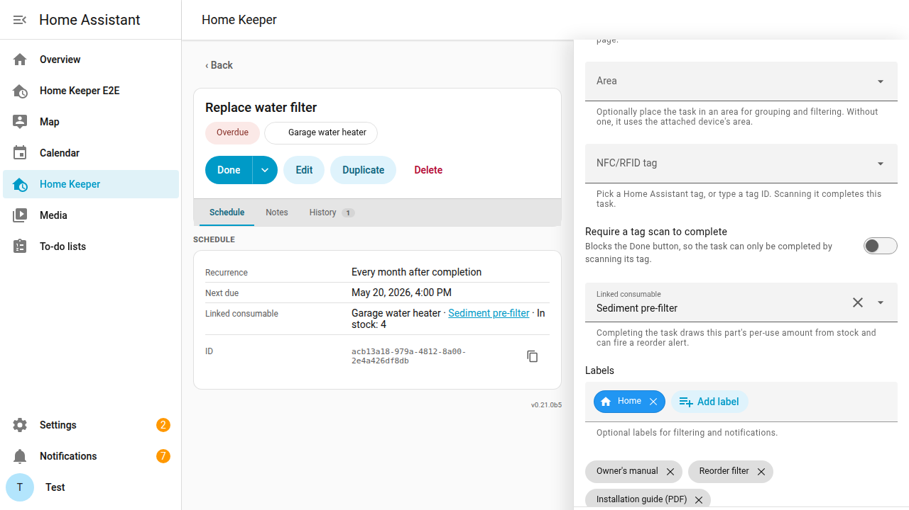

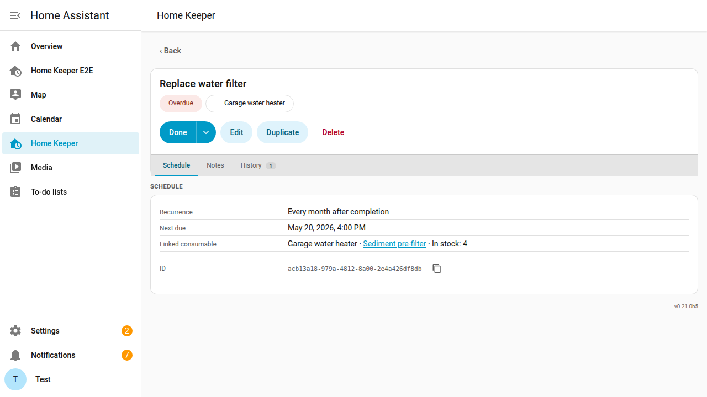


## Appliances & virtual devices

Home Keeper supports **appliances** for maintenance tasks and warranty records on
things that are not Home Assistant devices, such as a fridge, furnace, or water
heater. This is useful for tasks and warranty data on a thing that has no device of
its own. Manage appliances on the **Appliances** tab in the panel. Add a new
appliance, or select an existing device.

<!-- vale ai-tells.ColonUsage = NO -->
- **New appliance**: Home Keeper registers a **virtual device** for it. Multiple
  tasks share one device page, and other integrations can attach to it too.
<!-- vale ai-tells.ColonUsage = YES -->
- **Existing device**: select a device that another integration provides and add
  the same metadata to it. Home Keeper does not own the device. The manufacturer
  and model and serial number are prefilled from the device registry when present.

An appliance has structured fields that Home Assistant reads: manufacturer and model
and serial number and an mdi icon and replacement cost. The **Notes** field renders
as [Markdown](#notes-are-markdown). **Custom fields** are a label with a value of type
**text** or **link** or **date**. Common fields such as serial number and warranty
expiry are seeded. Enable **track** on a date field to create a `date` **sensor** on
the device page for use in automations. An untracked date is display-only.

The appliance detail page has the metadata and parts and related tasks and
subdevices and the full maintenance history. The history keeps the completions of
tasks that were deleted while assigned to the appliance. Press **Export inventory**
on the Appliances tab to download a CSV home inventory with make and model and
replacement cost and the value of spares on hand and a total. A Details column
lists each appliance's custom fields.


### Archiving appliances

**Archive** an appliance to remove it from the active list and keep its history. The
documents and parts and metadata and maintenance history are kept. The device page
and the entities continue to work. Use the **Active / Archived** toggle on the
Appliances tab to show archived appliances. An archived appliance can be
**restored** at any time or **deleted** from its detail page.

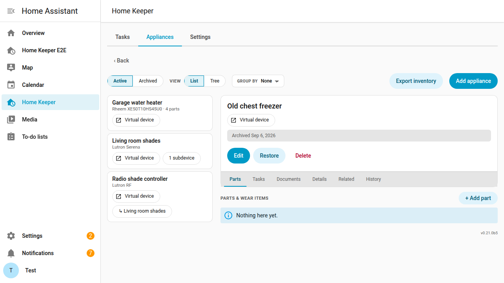

**Delete** asks for confirmation for an appliance and for a task.

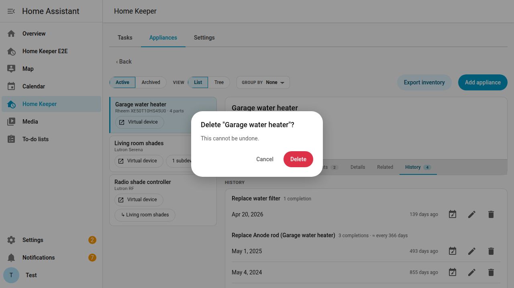

### Tree view

Home Keeper supports parent and child relationships between appliances. A child is a
**subdevice** of its parent. Use the **View** toggle on the Appliances tab to show
the appliances as a tree with children under their parents.

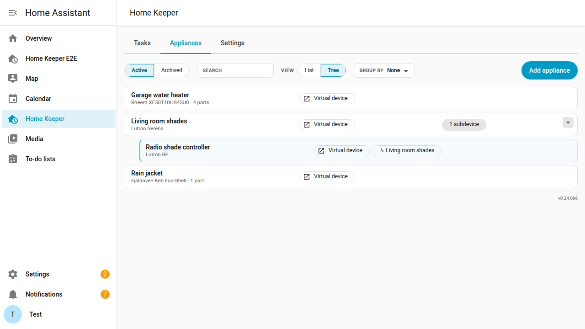

### Parts & wear items

Each appliance has a **parts** list. A part has a name and part number and vendor
and cost and **notes** in [Markdown](#notes-are-markdown). Each part is a *consumable*
or a *wear item*. Set a **replacement interval** on a wear item and Home Keeper
creates a maintenance **task** for it on the appliance's device. The task appears in
the to-do list and the calendar with a mark-done button and a next-due sensor. A
completion sets the part's *last replaced* date. The **last replaced** date can be
set to a past date so that the schedule starts from the real date.

A part can have a **product URL**. The part's name on the appliance detail page then
opens the product page in a new tab. A task that is linked to the part shows the
same link on its detail page and on the dashboard card.

Each part can have 1 **attached file**, such as a receipt or a photo. Upload it from
the part editor. Open or remove it from the same card.

A part can track **spare inventory** with a *stock* count and a *reorder-at*
threshold. A wear-item replacement draws down the part's per-use amount. The default
is 1 spare. When the stock drops to or below
the threshold Home Keeper fires a `home_keeper_part_low_stock` event for use in an
automation. Any task can be
**[linked to a consumable part](#link-a-task-to-a-consumable-auto-reorder)** and a
completion of that task then draws down the same stock. Stock deduction applies to
every completion path. This includes manual completion and tag scans and
[auto-clearing sensor tasks](#sensor-based-tasks-usage-meters-thresholds--states).

#### Stock you measure rather than count

Home Keeper supports stock that is measured in a unit instead of counted. This is
useful for a liquid in a bottle or a line on a spool. 2 optional fields on a
stock-tracked part set this up.

- **Stock unit** sets the unit of the stock numbers, such as `ml` or `bottles`. The
  unit is shown with the stock and in the `unit` field of the
  [stock events](docs/EVENTS.md). An empty unit means whole spares.
- **Used per completion** sets how much 1 completion draws down. An empty value
  means 1 whole spare. A value of `0.33` means that 3 completions use 1 bottle.

The stock fields and the `delta` field of `home_keeper.adjust_part_stock` accept
decimals. A part with no unit and no per-use amount accepts whole spares only.

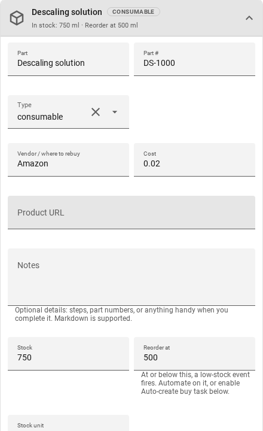

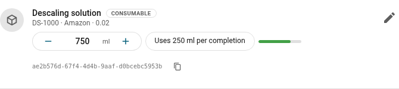

#### Auto-create a buy task when a part runs low

Turn on **Auto-create buy task** on a stock-tracked part. The option is shown when
the part has a reorder-at threshold. When the stock drops to or below the threshold,
Home Keeper adds a one-off **"Buy {part}"** task on the appliance's device and in
the to-do list and in the panel. Only 1 buy task exists while the stock is low.

A completion of the buy task **restocks the part** by its **Restock quantity**. The
default is 1. Set the restock quantity high enough to lift the stock above the
threshold. If the stock stays at or below the threshold, the reminder remains.

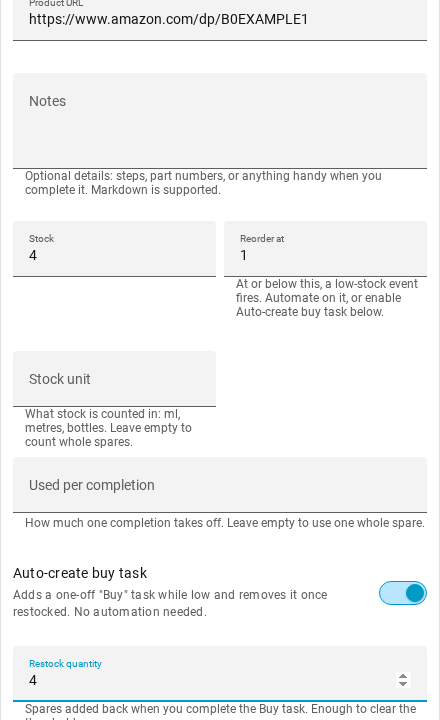

#### Send buy reminders to your shopping list

Select a to-do list in **Settings → Shopping list**. Every auto-created
**"Buy {part}"** task is then added to that list as an item. The Home Assistant
shopping list and a `local_todo` list are supported.

The sync works in both directions:

- If the item is marked complete on the list, Home Keeper completes the buy task
  and restocks the part. The completed item remains on the list.
- If the buy task is completed in Home Keeper, the item is marked complete.
- If the part is restocked another way, the item is removed. A manual stock change
  and switching Auto-create buy task off both count.

Home Keeper manages the items it added and an open item with the same name that
is already on the list. A completed item is not modified. Clear the setting to turn
the feature off.

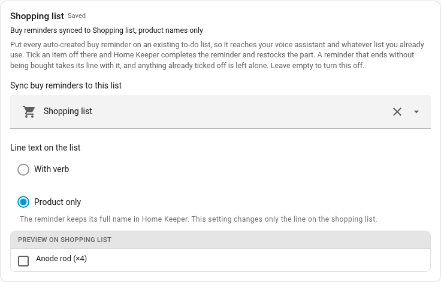

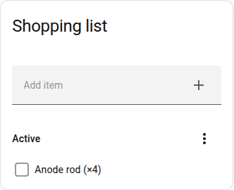

### Offline manuals & documents

Every appliance has a list of **documents**, such as manuals and warranties and
receipts. A document is an external **link** or an **uploaded file**. The uploaded
file is a PDF or an image that is stored under the Home Assistant config directory
and served through an authenticated endpoint with a short-lived signed URL. Open
the appliance's **Manuals & documents** editor to add a link or to **Upload file**.
A removed document and a deleted appliance delete the stored file.

**Open** shows the document in a new tab. **Edit** renames a document and changes
the URL of a link. An uploaded file can be renamed only. A link can be added while
the appliance is created. A file upload is available after the appliance is saved.

The services `home_keeper.add_asset_document` and
`home_keeper.update_asset_document` and `home_keeper.remove_asset_document` manage
link documents from an automation. File uploads are supported from the panel only.

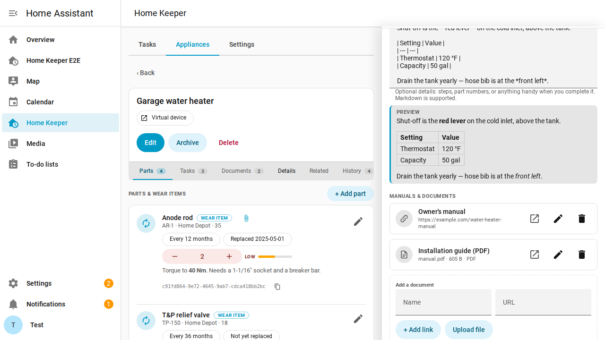

#### Upload progress and failures

Press **Cancel upload** to stop an upload. **Save** is disabled while an upload runs.
If an upload fails, the reason is shown under the **Upload file** button and as a
Home Assistant notification.

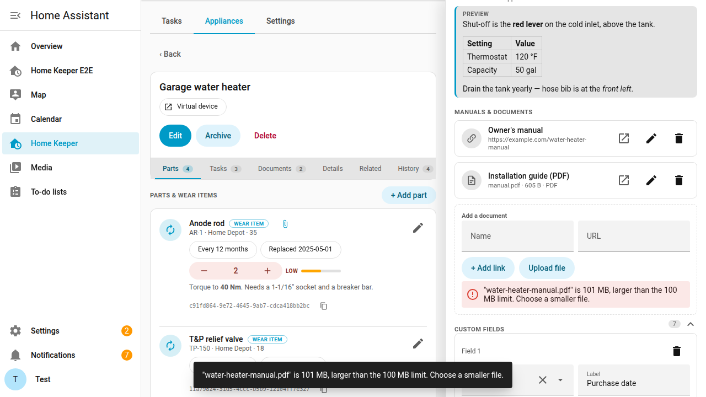

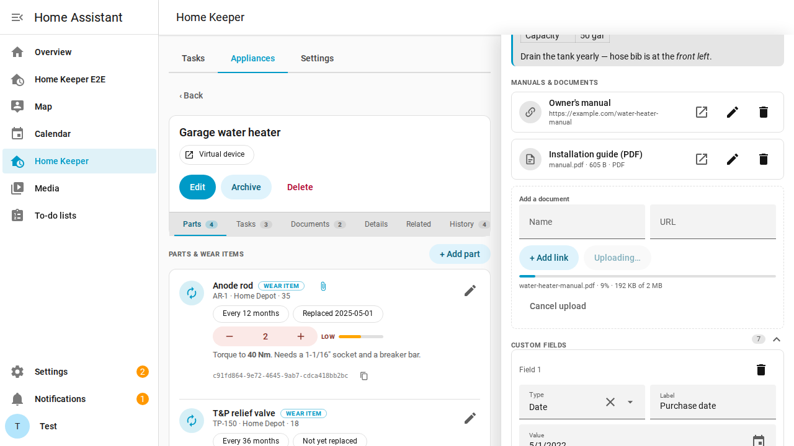

#### Large uploads (413)

Home Keeper accepts uploads up to **100 MB**. The panel checks the file size before
the upload and rejects a larger file. Uploads are streamed to disk.

If an upload fails with **HTTP 413** or is cut off before it finishes, a **reverse
proxy in front of Home Assistant** rejected the file. The usual cause is the proxy
request-body limit. nginx defaults `client_max_body_size` to 1 MB. Raise the limit
above the largest manual:

- **nginx manual config**: add `client_max_body_size 110M;` to the `server` or
  `location /` block, then run `nginx -t && nginx -s reload`.
<!-- vale ai-tells.ColonUsage = NO -->
- **Nginx Proxy Manager**: Proxy Host → **Advanced** → *Custom Nginx Configuration* →
  add `client_max_body_size 110M;` → Save.
<!-- vale ai-tells.ColonUsage = YES -->
- **"NGINX Home Assistant SSL proxy" add-on**: create `/share/nginx_proxy_default.conf`
  containing `client_max_body_size 110M;`, set `customize.active: true` in the add-on
  options, and restart the add-on.
- **Caddy**: `request_body { max_size 110MB }`.
- **Traefik**: a `buffering` middleware with `maxRequestBodyBytes`.
- **Nabu Casa / HA Cloud Remote UI** has its own limit. Upload from the local
  network instead.

To confirm that the proxy is the cause, upload through the direct LAN URL
`http://<ha-ip>:8123`.

### Relationships: subdevices & related devices

An appliance can be a **subdevice of** another appliance through the Home Assistant
`via_device` hierarchy. It is then nested under its parent on the device page. An
appliance can also list **related devices** from any integration. These are shown
with the appliance.

> **Example.** Add the *Garage water heater* as a new appliance with its warranty
> expiry and an *Anode rod* **wear item** with a 12 month replacement interval. The
> water heater then has a device page with a warranty-expiry sensor and a
> *"Replace Anode rod"* task that is due 12 months after each completion.

## Profiles (saved filters you reuse everywhere)

Home Keeper supports saving a filter as a **Profile**. A Profile has a status tier and
optional **label**, **area**, **device**, and **companion** filters. Create and edit
Profiles in **Settings → Profiles**.

A Profile is used in 4 places:

- A notification selects a Profile to designate which tasks are sent.
- A to-do list sync uses a Profile to designate which tasks are synchronized.
- The **Profile** dropdown on the **Tasks** tab filters the task list in the panel.
- The **Filter by profile** option in the card editor filters the dashboard card.

### Status tiers

The **Include** setting has 3 tiers. Each tier includes the tiers before it:

- **Overdue only**: overdue tasks.
- **Overdue and due soon**: overdue tasks and tasks that are due in the next 3 days.
- **Every scheduled task**: all scheduled tasks.

### Filter by companion

An integration that creates tasks in Home Keeper is a
[companion](#companions). The Battery Notes
glue is one: it raises a **Replace battery** task when a battery gets low. Every task a
companion creates records which integration owns it, and the panel shows a **Managed
by** chip on that task.

The **Companions** filter selects tasks by their owner. This makes one card per source
without any manual work:

- A card of only the battery tasks. Select **Battery Notes** in **Companions**.
- A card of only the printer tasks. Select the printer glue.
- Everything except one source. Put that companion in **Exclude companions**.

The picker lists each connected companion, and each integration that already owns a
task. A companion that is only a suggestion is not listed, because it owns no tasks.

> **A task you create in the panel has no companion.** No integration owns it, so a
> **Companions** filter does not select it, and an **Exclude companions** filter does
> not remove it. Use a label filter for tasks you make yourself.

### Exclusions

**Exclude labels**, **Exclude areas**, **Exclude devices**, and **Exclude companions**
remove tasks from the Profile. An exclusion takes precedence over the include filters. Nothing is removed
if the exclusion is empty. This is useful for a Profile of all tasks except the tasks with one
label, such as `professional`.

Exclusions apply to inherited labels and areas. A task that has the `professional`
label through its device or its area is also excluded.

### Synced problem sensors

A task synced from a [`problem` binary sensor](#sync-problem-binary-sensors-as-tasks)
is included in a Profile while its sensor reports a problem. A notification for this
task shows **Snooze** instead of **Mark done** and **Skip**.

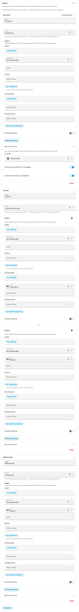

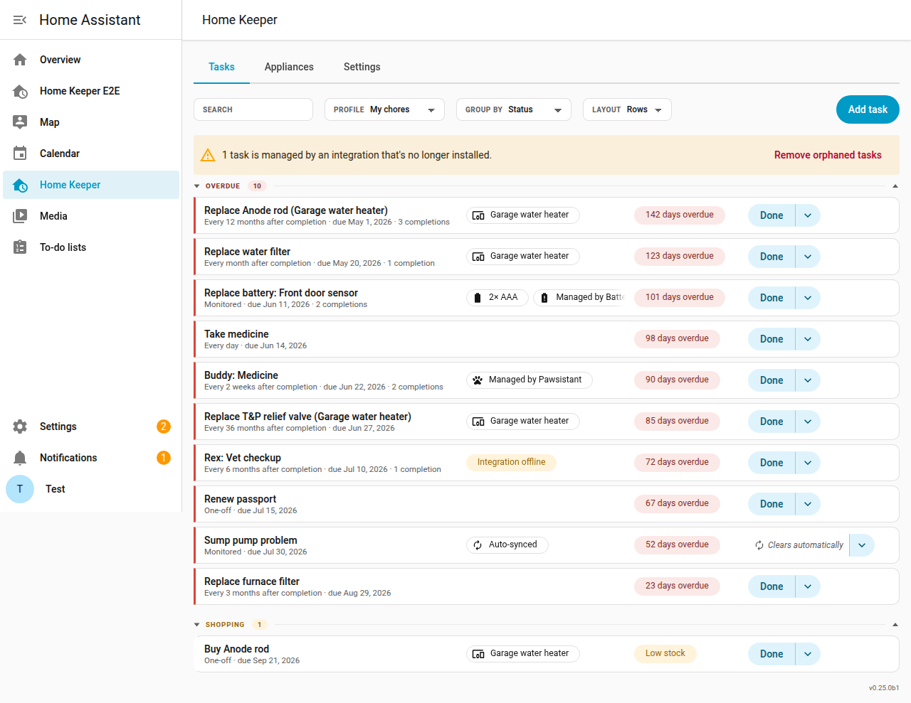


## Send tasks to your to-do lists

Home Keeper supports synchronizing the tasks from a
[Profile](#profiles-saved-filters-you-reuse-everywhere) to any `todo` entity. This
is useful for tracking these tasks in an external to-do system that is separately
integrated into your Home Assistant setup, such as Google Tasks, Todoist, or CalDAV.

### Configuration

Open **Settings → Profiles** and expand the profile. In the **Sync to a to-do list**
group, select a list in the **To-do list** picker. The profile's tasks are then added
to that list. Clear the picker to stop the sync. Home Keeper then removes the
profile's open items from the list.

The profile designates which tasks are synchronized to the configured to-do list.
The profile's filters select the tasks. The profile's **Include** tier sets when a
task is added to the list:

- **Overdue only**: when the task becomes due.
- **Overdue and due soon**: 3 days before the task becomes due.
- **Every scheduled task**: as soon as the task is scheduled.

One profile synchronizes to one list. Configure a profile per list, such as a
profile per child with a different list in each.

### Two-way sync

Synchronization works in both directions:

- If an item is marked complete on the to-do list, Home Keeper completes the task
  and records the completion in the task's history. A recurring task is rescheduled
  and a new item is added when the task next becomes due. The completed item
  remains on the list.
- If a task is completed in Home Keeper, the item is marked complete on the list.
- If a task no longer matches the profile or is rescheduled or disabled, Home
  Keeper removes its open item from the list.

Items include the task's due date and notes if the list supports these fields.
Home Keeper modifies only the items it added and does not modify an item that is
already complete.

Items that a user adds to the list are not imported into Home Keeper. Only the
completion state is read back from the list.

Tasks that require an NFC or RFID tag scan are synchronized, but a completion on the
to-do list does not complete the task. The item is re-added on the next sync.

### Options

2 switches are under the picker. Both are on by default.

- **Two-way sync**: turn this off for a display-only list. Completions on the list
  are then ignored.
- **Treat removed items as completed**: some providers such as Todoist hide
  completed items from Home Assistant. With this switch on a removed item is treated
  as complete. Turn it off if the list reports completions correctly. A `local_todo`
  list does. A removed item is then re-added on the next sync.

### CalDAV and Nextcloud

CalDAV lists such as Nextcloud, Baikal, and Radicale are supported. Home Assistant
polls a CalDAV server every 15 minutes, so a completion on the server can take up to
15 minutes to reach Home Keeper.

In Nextcloud, select a task list. The default **Personal** calendar contains only
events and is not exposed as a `todo` entity.

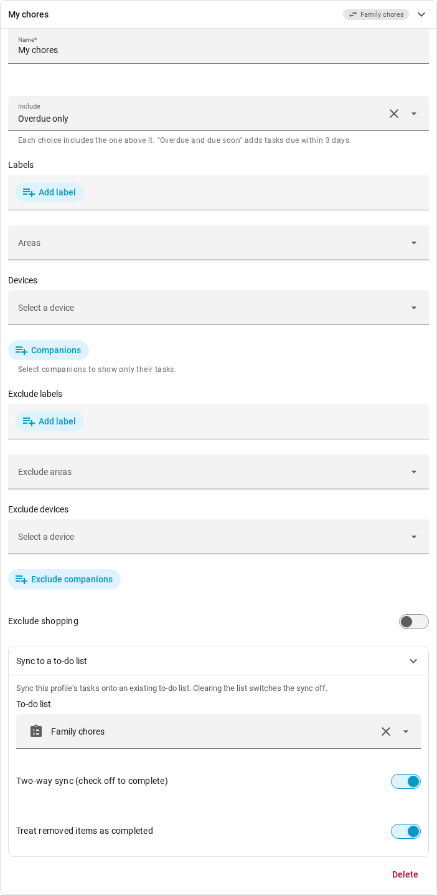

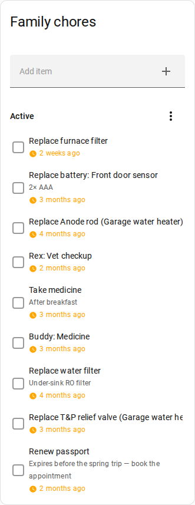

<!-- vale ai-tells.OverusedVocabulary = NO -->


## Notifications (actionable reminders on your phone)
<!-- vale ai-tells.OverusedVocabulary = YES -->

Home Keeper supports sending a mobile-app notification for due tasks, with the
action buttons **Mark done**, **Snooze**, **Skip**, and **Open**. This is useful
for completing a task from the phone lock screen and for sending each user the
tasks from their own profile. The buttons act on the task in Home Keeper:

- **Mark done** completes the task and advances the recurrence.
- **Snooze** defers the due date by the configured snooze duration.
- **Skip** moves the task to its next occurrence.
- **Open** opens the task in Home Keeper.

### Configuration

Configure notifications in **Settings → Notifications**. Each notification has these
fields:

- **Profile**: the [Profile](#profiles-saved-filters-you-reuse-everywhere) that
  selects the tasks. All due tasks are included if no profile is set.
- **Send to**: one or more `mobile_app_*` companion-app devices selected from a
  list. Only these devices and `persistent_notification` are supported as targets.
  Other notify services are not supported.
- **Buttons**: which of the 4 buttons are shown and the snooze duration.
- **Style**: **walk** or **digest**. A walk sends the first due task. Each Mark done,
  Snooze, or Skip then sends the next due task. When no task is due the walk sends
  an "All caught up" notification. The digest style sends one summary of all due
  tasks.
- **Notification channel** and **Urgency**: the delivery settings that the phone
  applies. See [Channels and urgency](#channels-and-urgency).
- **Auto-send**: send the notification when a matching task becomes overdue or
  due soon.

Press **Test** on a notification to send it now. Home Keeper saves the notification
first, then calls `home_keeper.notify` for it, so the phone receives the delivery the
form shows. If no task is due, Home Keeper sends nothing and says so.

### Channels and urgency

Home Keeper supports a **Notification channel** and an **Urgency** on each
notification. This is useful when a medication task and a battery task must not
arrive in the same way.

On Android the channel is a notification channel. The companion app creates the
channel the first time a notification uses the name. The channel then appears in the
phone settings for Home Assistant, where the user sets its sound and its Do Not
Disturb override. A Medication channel can then make a sound during Do Not Disturb
while a Batteries channel stays silent.

An iPhone has no channels. Home Keeper sends the same name as a thread identifier, so
these notifications group together. The urgency becomes the iOS interruption level.

| Urgency | Android | iPhone |
| --- | --- | --- |
| Quiet | Low importance | Passive |
| Normal | App default | Active |
| High | High importance | Time-sensitive |
| Critical | Max importance | Critical alert |

At High and Critical urgency Home Keeper also asks Android to deliver the
notification immediately. An idle phone otherwise holds it until the next batch.

Critical urgency has a condition on each platform. The user must allow **Critical
Alerts** for Home Assistant in the iPhone settings. On Android a channel keeps the
settings it was created with. A change of urgency does not move a channel that
already exists. Give the channel a new name or change the channel in the phone
settings.

If the channel is empty, the notification arrives on the General channel of the
companion app.

### Language

The button labels and the notification text are localized to the language that is
configured for the Home Assistant instance in **Settings → System → General**. The
setting is instance-wide, so every user receives notifications in the same
language.

### Automations

With **Auto-send** on, a notification is sent when a task in the profile becomes
overdue or due soon. Use a Home Assistant automation for more control over when
notifications are sent. Send only when a person is at home, or send during a "Chore
time" calendar event.

The `home_keeper.notify` service sends a notification from an automation. Set
`notification:` to a saved notification or `profile:` to a saved Profile. Set
`target:` to override the destinations. The button actions fire events that other
automations can use. See [Events & automations](#events--automations).

### Automation examples

Home Keeper sends a notification once. Use a Home Assistant automation to send it
again until the task is complete. The `home_keeper.notify` service sends nothing when
no task matches, so a schedule that runs all day costs nothing on a day with no due
task. Build these automations in **Settings → Automations & scenes**.

**Repeat a notification every 2 hours.** This automation sends *Walk my chores*
again every 2 hours between 08:00 and 21:00.

```yaml
automation:
  - alias: "Home Keeper → chores every 2 hours"
    trigger:
      - platform: time_pattern
        hours: "/2"
    condition:
      - condition: time
        after: "08:00:00"
        before: "21:00:00"
    action:
      - service: home_keeper.notify
        data:
          notification: Walk my chores
```

**Send only when a person is at home.** This automation looks every 30 minutes in the
evening. It sends the notification only when the person entity is home.

```yaml
automation:
  - alias: "Home Keeper → chores while I'm home"
    trigger:
      - platform: time_pattern
        minutes: "/30"
    condition:
      - condition: state
        entity_id: person.sam
        state: home
      - condition: time
        after: "17:00:00"
        before: "21:00:00"
    action:
      - service: home_keeper.notify
        data:
          notification: Walk my chores
```

**Repeat a critical notification every 15 minutes.** This automation looks every 15
minutes between 08:00 and 10:00. Give the notification its own channel at Critical
urgency.

```yaml
automation:
  - alias: "Home Keeper → medication window"
    trigger:
      - platform: time_pattern
        minutes: "/15"
    condition:
      - condition: time
        after: "08:00:00"
        before: "10:00:00"
    action:
      - service: home_keeper.notify
        data:
          notification: Medication
```

Each automation sends the same notification, so the phone replaces the previous one
instead of adding a second. The next run of the automation finds no due task after
the task is complete, and the notifications stop.

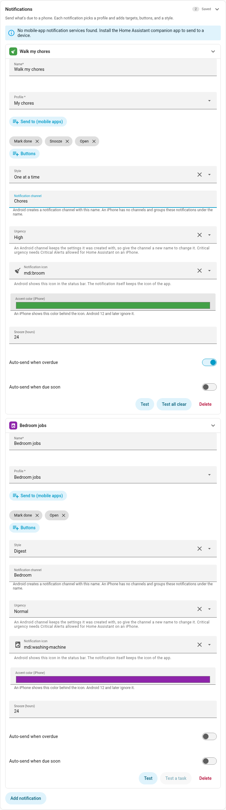


## Dashboard task card

Home Keeper supports a dashboard card, **Home Keeper Tasks** (`custom:home-keeper-card`),
that lists tasks and completes them with a **Done** button. This is useful for a task
list on a dashboard or a wall tablet. The card resource is registered automatically.
To add the card, select **Home Keeper Tasks** in the dashboard **Add card** picker.

From the card, a user can:

- complete a task with **Done**
- add a task with the **+** button in the header
- open the document links that a task shows

Editing and deletion of a task are supported only in the panel.

The card editor has these options:

- Filter by status, area, device, label, recurrence type, a "due within N days"
  window, or a saved [Profile](#profiles-saved-filters-you-reuse-everywhere).
- Sort and group the tasks, and limit the number of rows.
- Select what each row shows.
- **Hide card when empty** removes the card from the dashboard when the filter matches
  no task. Without it the card shows "No tasks match this filter."

A completion made in the panel or on another surface is shown on the card immediately.

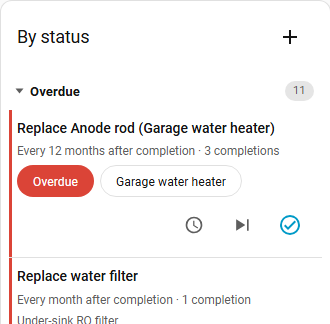

### Show a task's appliance documents on the card

A task that is attached to an [appliance](#appliances--virtual-devices) can show the
appliance's documents on its row. This includes document links and uploaded files
and metadata links. Nothing is shown by default.

1. Open the task in the panel editor.
2. In **Links to show on card**, select the documents. The field is shown only if the
   appliance has at least 1 document.

The `card_links` field of the `home_keeper.add_task` and `home_keeper.update_task`
services sets the same list. Each selected document is shown as a chip on the task
row and opens in a new tab. An uploaded file opens through a short-lived signed URL.
If a document is renamed or removed on the appliance, the chip is updated or removed.

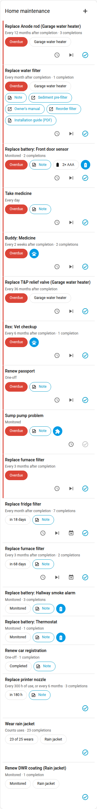

### Filter by label: one card per subject

A card can be limited to tasks with a Home Assistant label. This is useful for one
card per subject, such as the car or the dog. A task matches a label if the task has
the label or if its attached device or area has the label.

1. Open the task and select the labels in the **Labels** field. The
   `home_keeper.add_task` and `home_keeper.update_task` services also set labels.
2. Optional. Apply the same labels to devices or appliances in **Settings → Devices**
   to include all their tasks.
3. In the card editor, set **Limit to labels**. With more than 1 label, set the
   **Any/All** match mode.
4. Optional. Enable **Show labels** to show each task's labels on its row.

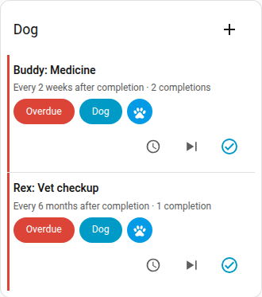


## Settings

The **Settings** tab in the panel edits the integration options. The form matches the
Home Assistant options flow and saves each change immediately. The same options are
available in the options flow under **Settings → Devices & services → Configure** and
through the `home_keeper.set_options` service.

The tab has 6 sections:

- **General** sets how long completed one-off tasks are kept.
- **Shopping list** selects the to-do list that
  [buy reminders are synced to](#send-buy-reminders-to-your-shopping-list).
- **Profiles** holds the saved filters. See
  [Profiles](#profiles-saved-filters-you-reuse-everywhere).
- **Notifications** holds the notification configurations. See
  [Notifications](#notifications-actionable-reminders-on-your-phone).
- **Problem sensor sync** has the sync switch and the exclusions for entities and
  devices and areas and labels. The exclusions apply only when the sync is on.
- **Companions** lists the integrations that work with Home Keeper.

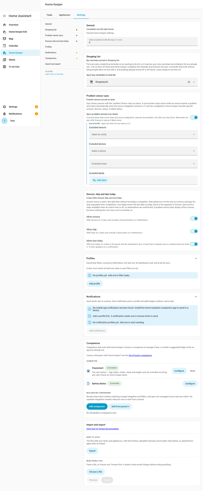

### Companions

A companion is an integration that works with Home Keeper. Examples are a pet-care
tracker that creates recurring tasks and a glue integration that turns a low battery
into a replacement task. The **Companions** section at the end of the Settings tab
lists them in 2 groups:

- **Connected** lists the companions that registered themselves with Home Keeper.
  Examples are [Pawsistant](https://github.com/prestomation/pawsistant) and the
  [Battery Notes glue integration](https://github.com/prestomation/ha-home-keeper-battery-notes).
  Each row has a **Configure** button that opens the companion's own page.
- **Suggested** lists popular integrations that Home Keeper detects from a catalog
  and that have no glue integration installed. An example is **Battery Notes**. Each
  row has an **Install** link and a **Dismiss** button.

To add a companion or a [glue integration](docs/GLUE_INTEGRATIONS.md) to the catalog,
[open a GitHub issue](https://github.com/prestomation/ha-home-keeper/issues/new?title=Companion%20suggestion:%20).

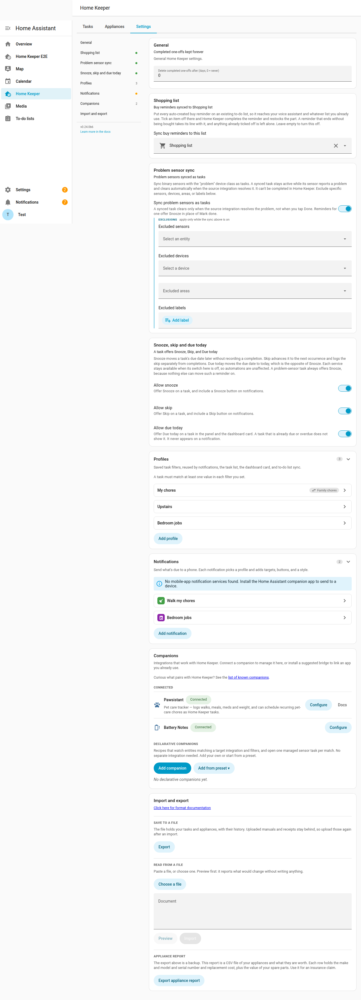


## Services

Home Keeper exposes every data action as a Home Assistant service. This is useful
for automations, scripts, and voice control. The
[API reference](https://prestomation.github.io/ha-home-keeper/developer/api#actions)
lists all of them with their fields.

- **Tasks**: `home_keeper.add_task`, `update_task`, `delete_task`, and
  `complete_task` cover the basic actions. `complete_task` takes an optional
  `completed_at` to back-date it, plus `note`, `cost`, `photo`, and `who`.
  `update_completion` changes a recorded completion's metadata. `move_completion`
  changes a recorded completion's timestamp, identified by its current `old_ts`.
  `trigger_task` arms a condition-driven task. `snooze_task` defers the due date
  by `hours` without completing the task. `skip_task` advances the task to its
  next occurrence without completing it. `set_task_consumable` links a task to an
  appliance consumable, so a completion draws down its stock. Omit the ids to
  unlink. `list_tasks` returns a response.
<!-- vale ai-tells.OverusedVocabulary = NO -->
- **Notifications**: `home_keeper.notify` sends an actionable notification for the
  tasks that are due, from a saved notification or profile. It returns
  `{matched, sent}`. See
  [Notifications](#notifications-actionable-reminders-on-your-phone).
<!-- vale ai-tells.OverusedVocabulary = YES -->
- **Appliances**: `home_keeper.add_asset`, `update_asset`, and `delete_asset`
  manage an appliance. `adjust_part_stock` adjusts a part's stock.
  `add_asset_document`, `update_asset_document`, and `remove_asset_document`
  attach, rename, or detach a manual, a warranty, or a receipt. A file uploads
  from the panel. `list_assets` and `export_inventory` return a response.

### Use a name instead of an id

Every `task_id`, `asset_id`, `part_id`, and `document_id` field takes the object's
**name** or its id.

```yaml
action: home_keeper.complete_task
data:
  task_id: Replace furnace filter
```

The panel shows the id on every task and appliance page and beside each part and
document, with a copy button. Use the id when 2 objects share a name. An ambiguous
name returns an error that lists the matching ids.

A task can also be completed through the `todo.home_keeper_tasks` list with
`todo.update_item`, which addresses the item by name:

```yaml
action: todo.update_item
target:
  entity_id: todo.home_keeper_tasks
data:
  item: Replace furnace filter
  status: completed
```


## Events & automations

Home Keeper fires a Home Assistant bus event for every state change. Use these
events to build automations. The events are:

| Object | Events |
| --- | --- |
| Task | created, updated, completed, uncompleted, completion edited, deleted, armed, snoozed, skipped, overdue, due soon |
| Part | low stock, out of stock, restocked |
| Appliance | created, updated, deleted, archived, restored |
| Companion | connected, suggested |

There are 2 ways to trigger on an event. Select a device trigger in the visual
automation editor on a Home Keeper appliance, such as "Task became overdue" or
"Spare part out of stock". Or use a plain `platform: event` trigger.

For a task attached to a device that another integration owns, automate on the
task's own entities or on the event. Home Assistant offers device triggers only
for the one integration a device belongs to.

An automation can add a part to the shopping list when the part goes out of stock.
This is useful for a part without
[Auto-create buy task](#auto-create-a-buy-task-when-a-part-runs-low):

```yaml
automation:
  - alias: "Spare out of stock → shopping list"
    trigger:
      - platform: event
        event_type: home_keeper_part_out_of_stock
    action:
      - service: todo.add_item
        target: { entity_id: todo.shopping_list }
        data:
          item: "{{ trigger.event.data.part_name }} ({{ trigger.event.data.vendor }})"
```

The built-in [shopping-list sync](#send-buy-reminders-to-your-shopping-list) does
this for a part already on auto-buy, and removes the line again when the part is
restocked.

Events are edge-triggered. Home Keeper fires 1 event per transition and does not
repeat it each cycle. Events are baselined on restart, so no overdue events are
fired after a reboot. The full catalog with every event and payload is in
[docs/EVENTS.md](docs/EVENTS.md).


## Integrations

Home Keeper supports contributions from other integrations. An integration can
add its own recurring tasks and stay in sync with completions. Installing a
compatible integration can populate and maintain the task list automatically. A
battery integration can schedule a "replace battery" task. A pet tracker can
schedule a "give medicine" task.

### Known integrations

| Integration | Description | How it integrates |
|---|---|---|
| [Home Keeper - Battery Notes](https://github.com/prestomation/ha-home-keeper-battery-notes) | Glue between [Battery Notes](https://github.com/andrew-codechimp/HA-Battery-Notes) and Home Keeper | Uses the **triggered** task type. A *"Replace battery"* task is armed when a battery goes low and cleared when the battery is replaced. A completion on either side is recorded on both. |
| [Pawsistant](https://github.com/prestomation/pawsistant) | Pet-care logger for tracking recurring pet activities | Attaches floating tasks to pet care schedules such as *"medicine every 2 weeks"*. A completion in Home Keeper is logged in Pawsistant. A completion in Pawsistant completes the Home Keeper task. |
| [Home Keeper - Bambu Lab](https://github.com/prestomation/ha-home-keeper-bambu-lab) | Glue between [Bambu Lab](https://github.com/greghesp/ha-bambulab) 3D printers and Home Keeper | Uses Home Keeper's **triggered** task type to track a printer's firmware-update status as a read-only *"Update firmware: …"* task, armed when an update is available and cleared once it is installed. Optionally also creates a per-printer maintenance-task catalog (lead-screw greasing, filter replacement, and more, following Bambu Lab's own published schedule), gated on each printer's detected model. |

The panel's **[Companions](#companions)** section, under the Settings tab, lists
installed companions and links to each one's settings. Home Keeper suggests the
Battery Notes bridge when Battery Notes is installed without the glue
integration.

> **Author an integration?** To push tasks into Home Keeper from a Home
> Assistant integration, see the developer guide,
> [docs/INTEGRATING.md](docs/INTEGRATING.md). It documents the contract, the
> `source` field, the `home_keeper_task_completed` event, two-way completion
> sync, and `home_keeper.register_companion` to register under **Companions**.
> See [docs/GLUE_INTEGRATIONS.md](docs/GLUE_INTEGRATIONS.md) for the glue
> integration pattern that connects an existing integration, such as Battery
> Notes, to Home Keeper.

> The [API reference](https://prestomation.github.io/ha-home-keeper/developer/api)
> is the generated list of every service, event, and payload.


## Localization

The integration and the panel are localized into 16 languages. Home Keeper
follows the Home Assistant language and falls back to English for text that has
no translation. Translations are in
`custom_components/home_keeper/translations/`.


## Upgrading to Home Assistant 2026.8

Home Assistant 2026.8 changed how a device works. A device now belongs to 1
integration instead of being shared. Home Keeper used the shared behavior to
place a task's button and sensors on the page of the device the task is about,
such as a dishwasher or a printer.

Home Keeper 0.13.0 includes the fix and repairs an install that already
upgraded. No action is needed.

### If you already upgraded Home Assistant

Home Assistant already split the devices by the time the fix arrived. Symptoms
include:

- a second device for an existing item, sometimes labelled with a long
  identifier instead of a name
- tasks that shared a device page split across 2 entries when grouped by device
- for a companion integration such as Battery Notes or Bambu Lab, a duplicate
  task next to the original

Updating to 0.13.0 repairs all of it on the next restart. Tasks return to the
real device, and the leftover devices are removed. Duplicated companion tasks
become 1 task again. An item that has a recorded completion is never removed. History, notes, and schedules stay unchanged.

### If you have not upgraded Home Assistant yet

Update Home Keeper first. 0.13.0 detaches from a device it does not own before
Home Assistant splits devices. Nothing then needs repair. Either order results
in a correct state.

### Device triggers on devices of other integrations

For a task attached to a device that another integration owns, the device page
no longer lists Home Keeper triggers under Add automation. Home Assistant
offers a device's triggers only for the single integration the device belongs
to.

An automation built that way must be rebuilt on the task's own entities,
`binary_sensor.<task>_overdue` and `sensor.<task>_next_due`, or on the matching
`home_keeper_*` event. These react to the same transitions. Home Keeper
appliances are not affected and keep their device triggers.


## Quality scale

Home Keeper targets Home Assistant's
[**Platinum** integration quality scale](https://developers.home-assistant.io/docs/core/integration-quality-scale/).
The per-rule self-assessment is in
[`custom_components/home_keeper/quality_scale.yaml`](custom_components/home_keeper/quality_scale.yaml).
Home Keeper is a local, deviceless service integration with no network and no
external dependency, so the networking, discovery, and authentication rules are
exempt. The remaining rules are met. Strict typing is met: the integration
includes `py.typed`, and CI runs `mypy` against it with Home Assistant
installed. An async, single-coordinator core is met.

> Error messages raised by services and entities use Home Assistant translation
> keys, `strings.json` under `exceptions`. Most exception messages are
> translated in every locale, and 11 messages are still English in every
> locale. A drift-guard unit test, `tests/unit/test_exception_translations.py`,
> checks that every new raise stays localizable.


## Development

- Backend: `custom_components/home_keeper/`. The recurrence engine is in
  `recurrence.py`.
- Panel frontend: `custom_components/home_keeper/frontend/`, built with
  TypeScript and Rollup.
- Tests: `pytest` unit tests in `tests/unit`, Docker integration tests in
  `tests/integration`, Playwright end-to-end tests in `tests/e2e`, and vitest
  frontend tests.
- Typing: `mypy custom_components/home_keeper`, configured in `pyproject.toml`
  and enforced by `lint.yml`. Home Assistant must be installed for its types to
  resolve.

See [AGENTS.md](AGENTS.md) for workflow and [RELEASE.md](RELEASE.md) for
releases.

[usage-shield]: https://img.shields.io/badge/dynamic/json?color=41BDF5&logo=home-assistant&label=integration%20usage&suffix=%20installs&cacheSeconds=15600&url=https%3A%2F%2Fanalytics.home-assistant.io%2Fcustom_integrations.json&query=%24.home_keeper.total&style=for-the-badge
[usage]: https://analytics.home-assistant.io/
[downloads-shield]: https://img.shields.io/github/downloads/prestomation/ha-home-keeper/total.svg?style=for-the-badge
[releases]: https://github.com/prestomation/ha-home-keeper/releases
[release-shield]: https://img.shields.io/github/release/prestomation/ha-home-keeper.svg?style=for-the-badge
[release-date-shield]: https://img.shields.io/github/release-date/prestomation/ha-home-keeper?style=for-the-badge
[commits-shield]: https://img.shields.io/github/last-commit/prestomation/ha-home-keeper?style=for-the-badge
[commits]: https://github.com/prestomation/ha-home-keeper/commits/main
[license-shield]: https://img.shields.io/github/license/prestomation/ha-home-keeper.svg?style=for-the-badge
[hacs-shield]: https://img.shields.io/badge/HACS-Custom-41BDF5.svg?style=for-the-badge
[hacs]: https://github.com/hacs/integration
[maintenance-shield]: https://img.shields.io/badge/maintainer-%40prestomation-blue.svg?style=for-the-badge
[hacs-validation-shield]: https://github.com/prestomation/ha-home-keeper/actions/workflows/hacs.yml/badge.svg
[hacs-validation]: https://github.com/prestomation/ha-home-keeper/actions/workflows/hacs.yml
[ha-version-shield]: https://img.shields.io/badge/Home%20Assistant-2024.1%2B-blue.svg?style=for-the-badge
[ha-version]: https://www.home-assistant.io/
[docs-shield]: https://img.shields.io/badge/docs-website-03a9f4.svg?style=for-the-badge
[docs]: https://prestomation.github.io/ha-home-keeper/
[kofi-shield]: https://img.shields.io/badge/Ko--fi-donate-FF5E5B?style=for-the-badge&logo=kofi&logoColor=white
[kofi]: https://ko-fi.com/prestomation
