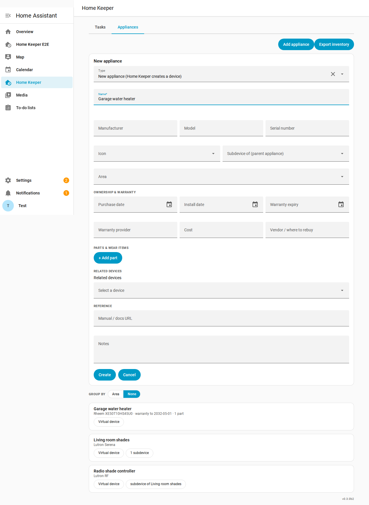
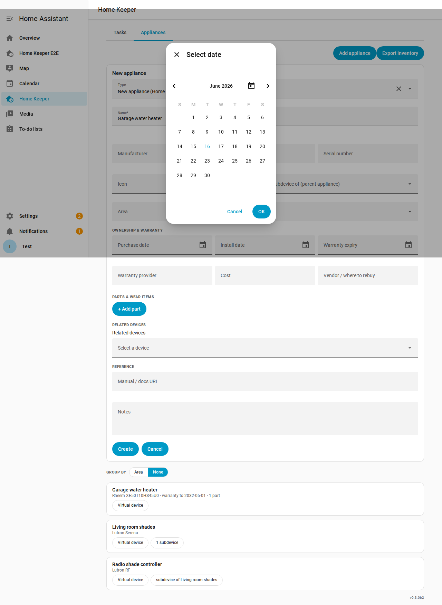
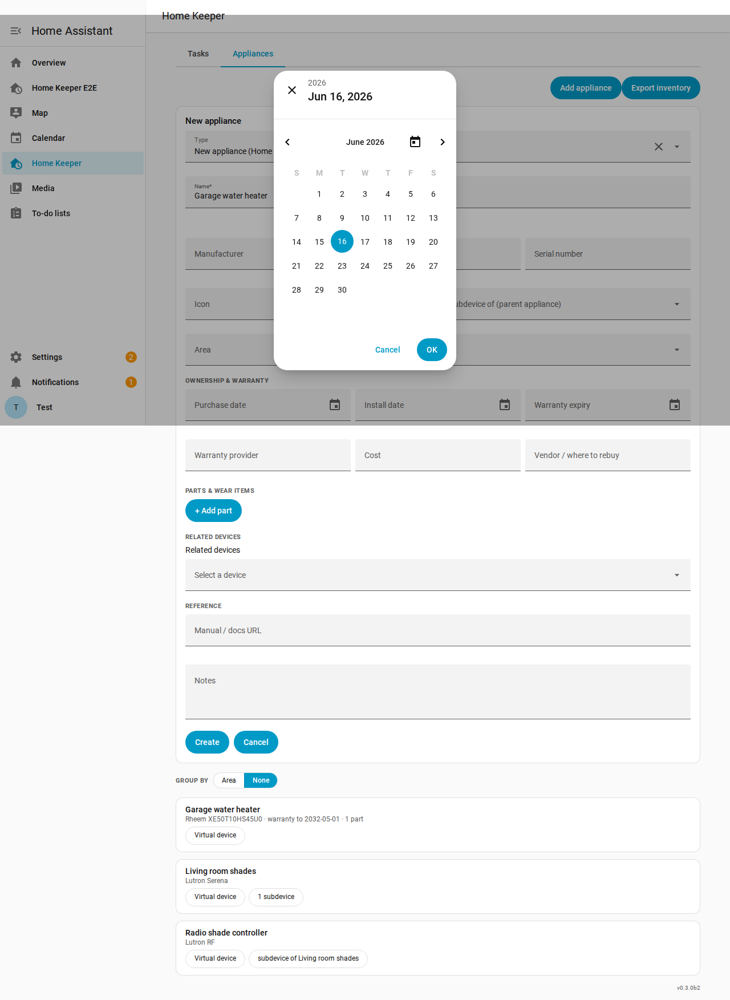
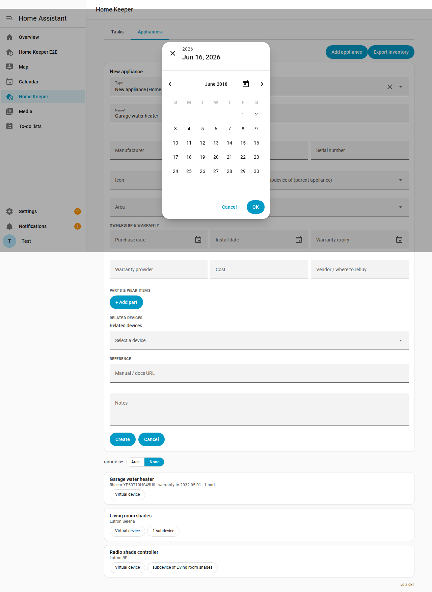
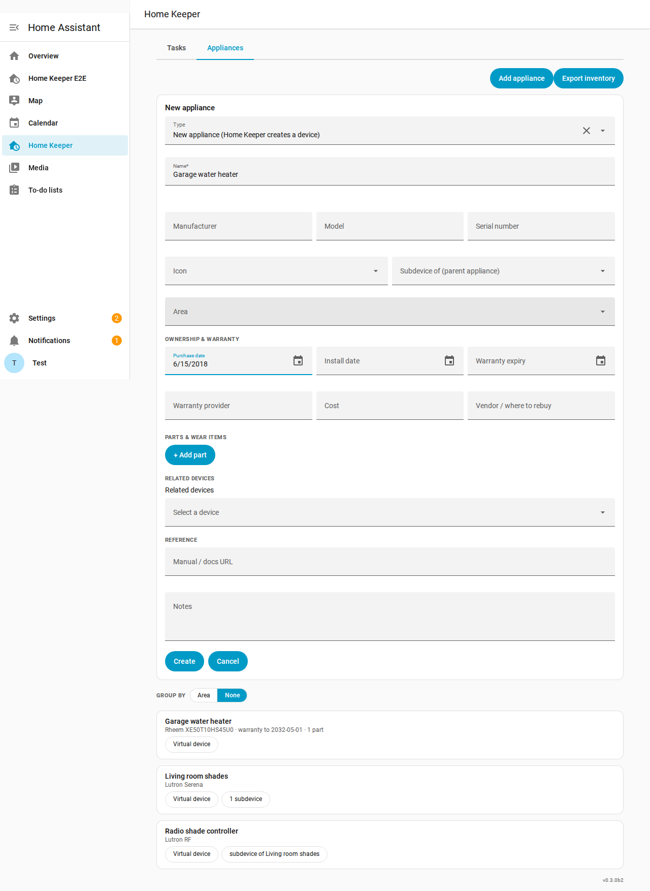

# Appliance date control — exploration findings

**Question:** When creating an appliance, purchase / installation / warranty dates
can be years in the past, but the date picker only steps back **one month at a
time**. Are there other date-control options that make entering old dates easier?

**Short answer:** Not within Home Assistant's built-in `date` selector. The fields
use `{ date: {} }` (`ha-selector-date` → `ha-date-input`), which on HA 2026.6
renders an `ha-dialog-date-picker` built on the [Cally](https://wicky.nillia.ms/cally/)
calendar web component (`<calendar-date>` / `<calendar-month>`). That control has
**no year picker, no keyboard entry, and no "jump to year"** — month-by-month
navigation is the only way back. This was verified by driving the real control in
a Home Assistant container (see screenshots below and the reproducible capture at
`tests/e2e/date-control-explore.capture.ts`).

## What the control actually does (verified, HA 2026.6.3)

| Behaviour | Result |
| --- | --- |
| Closed field input | `readOnly`, `type="text"` → **you cannot type a date** |
| Open picker default view | Month grid titled "Select date" |
| Navigation | `<` / `>` arrows only — **one month per click** |
| "Today" (📅) icon | Jumps to the current month only (no help for old dates) |
| Header year ("2026") after selecting a day | **Inert label** — `role=button` count is 0; clicking it does nothing |
| Reaching ~2018 from 2026 | **96 `<` clicks** (≈12 per year) |
| Does an old date land in the field? | Yes — month-by-month works, it's just tedious (`6/15/2018`) |

So the earlier suggestion that you can "click the month/year header to jump years"
was **wrong** for this HA version — that header is not interactive.

## Screenshots

**1. The date fields in the appliance form** (read-only, picker-only):



**2. Picker opened — month grid with only `<` / `>` month navigation:**



**3. After selecting a day the header shows the year — but it's an inert label,
not a clickable year picker:**



**4. The only way back: 96 `<` clicks to reach June 2018 (note the header still
reads the originally-selected "Jun 16, 2026"):**



**5. The old date does land in the field once selected:**



## Options (for reference — no code changed in this PR)

The date control was intentionally **left as-is** per the request. If the
month-by-month grind becomes a priority, the realistic fixes are:

1. **Swap the date fields to a typeable `text` input** (with a `YYYY-MM-DD` hint +
   validation). The panel already has a `selText()` helper; this lets you type
   `2018-03-15` directly. Trade-off: lose the calendar affordance and own the
   parsing/validation, plus wire the load/save paths.
2. **A small custom date control** (e.g. separate year / month / day dropdowns, or
   a year-grid shortcut) layered over the stored `YYYY-MM-DD` value. More work, but
   keeps a picker UX while removing the month-stepping.

There is **no configuration knob** on HA's `date` selector to enable year-first
navigation — confirmed against the live control.

## Reproducing

```bash
# From repo root, with the e2e HA container up (KEEP_UP=1 bash ci/e2e-up.sh ...):
cd tests/e2e
SHOT_DIR=/tmp/date-shots npx playwright test date-control-explore.capture.ts \
  --config=date-control-explore.config.ts
```
