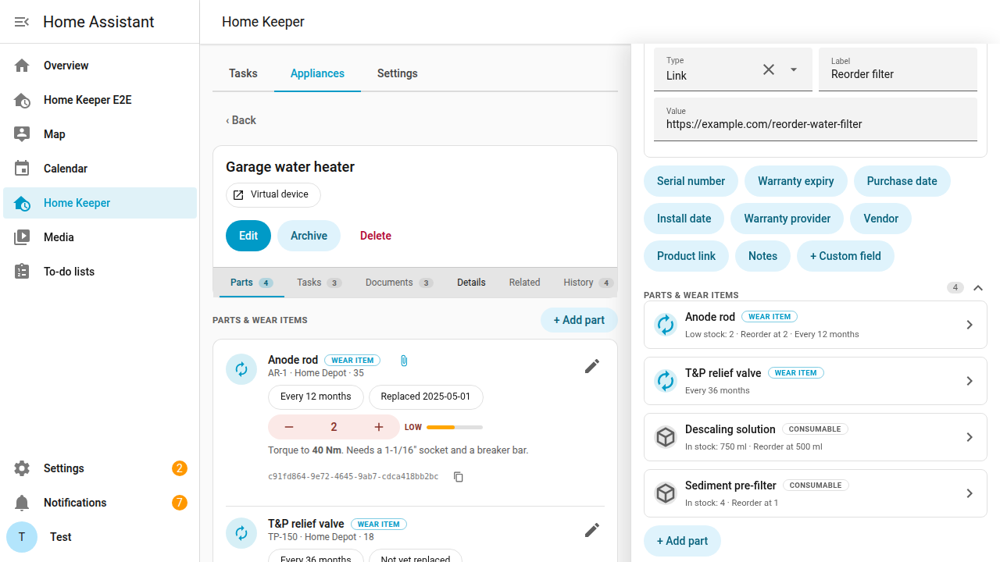
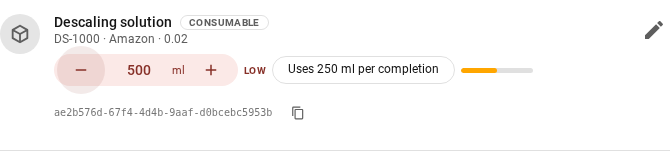

# Appliances & virtual devices

Home Keeper supports **appliances** for maintenance tasks and warranty records on
things that are not Home Assistant devices, such as a fridge, furnace, or water
heater. This is useful for tasks and warranty data on a thing that has no device of
its own. Manage appliances on the **Appliances** tab in the panel. Add a new
appliance, or select an existing device.

<!-- vale ai-tells.ColonUsage = NO -->
- **New appliance**: Home Keeper registers a **virtual device** for it. Multiple
  tasks share one device page, and other integrations can attach to it too.
<!-- vale ai-tells.ColonUsage = YES -->
- **Existing device**: select a device that another integration provides and add
  the same metadata to it. Home Keeper does not own the device. The manufacturer
  and model and serial number are prefilled from the device registry when present.

An appliance has structured fields that Home Assistant reads: manufacturer and model
and serial number and an mdi icon and replacement cost. The **Notes** field renders
as [Markdown](../tasks/markdown-notes.md). **Custom fields** are a label with a value of type
**text** or **link** or **date**. Common fields such as serial number and warranty
expiry are seeded. Enable **track** on a date field to create a `date` **sensor** on
the device page for use in automations. An untracked date is display-only.

The appliance detail page has the metadata and parts and related tasks and
subdevices and the full maintenance history. The history keeps the completions of
tasks that were deleted while assigned to the appliance. Press **Export inventory**
on the Appliances tab to download a CSV home inventory with make and model and
replacement cost and the value of spares on hand and a total. A Details column
lists each appliance's custom fields.

#### Archiving appliances

**Archive** an appliance to remove it from the active list and keep its history. The
documents and parts and metadata and maintenance history are kept. The device page
and the entities continue to work. Use the **Active / Archived** toggle on the
Appliances tab to show archived appliances. An archived appliance can be
**restored** at any time or **deleted** from its detail page.

**Delete** asks for confirmation for an appliance and for a task.

#### Tree view

Home Keeper supports parent and child relationships between appliances. A child is a
**subdevice** of its parent. Use the **View** toggle on the Appliances tab to show
the appliances as a tree with children under their parents.

#### Parts & wear items

Each appliance has a **parts** list. A part has a name and part number and vendor
and cost and **notes** in [Markdown](../tasks/markdown-notes.md). Each part is a *consumable*
or a *wear item*. Set a **replacement interval** on a wear item and Home Keeper
creates a maintenance **task** for it on the appliance's device. The task appears in
the to-do list and the calendar with a mark-done button and a next-due sensor. A
completion sets the part's *last replaced* date. The **last replaced** date can be
set to a past date so that the schedule starts from the real date.

The appliance edit drawer shows the parts list as collapsible rows. A collapsed row
shows the part's name and a one-line summary. Only 1 row is open at a time, and a
new part opens by itself.

The appliance page's **Parts** tab has an **Edit** icon on each part row and an
**Add part** button. Both open the part in the edit drawer, expanded and scrolled
into view.

A part can have a **product URL**. The part's name on the appliance detail page then
opens the product page in a new tab. A task that is linked to the part shows the
same link on its detail page and on the dashboard card.

Each part can have 1 **attached file**, such as a receipt or a photo. Upload it from
the part editor. Open or remove it from the same card.

A part can track **spare inventory** with a *stock* count and a *reorder-at*
threshold. A wear-item replacement draws down the part's per-use amount. The default
is 1 spare. When the stock drops to or below
the threshold Home Keeper fires a `home_keeper_part_low_stock` event for use in an
automation. Any task can be
**[linked to a consumable part](../tasks/sensor-tasks.md#link-a-task-to-a-consumable-auto-reorder)** and a
completion of that task then draws down the same stock. Stock deduction applies to
every completion path. This includes manual completion and tag scans and
[auto-clearing sensor tasks](../tasks/sensor-tasks.md).

On the appliance page's **Parts** tab, the **In stock** chip is a stepper. Press
**−** or **+** to move the stock by 1 spare. For a part measured in a unit, 1 press
moves 1 completion's amount. To save a typed value, press **Enter** or move focus
away. Each change uses the same `home_keeper.adjust_part_stock` service path as a
completion, so low-stock events and auto-created buy tasks still fire.

##### Stock you measure rather than count

Home Keeper supports stock that is measured in a unit instead of counted. This is
useful for a liquid in a bottle or a line on a spool. 2 optional fields on a
stock-tracked part set this up.

- **Stock unit** sets the unit of the stock numbers, such as `ml` or `bottles`. The
  unit is shown with the stock and in the `unit` field of the
  [stock events](../../EVENTS.md). An empty unit means whole spares.
- **Used per completion** sets how much 1 completion draws down. An empty value
  means 1 whole spare. A value of `0.33` means that 3 completions use 1 bottle.

The stock fields and the `delta` field of `home_keeper.adjust_part_stock` accept
decimals. A part with no unit and no per-use amount accepts whole spares only.

##### Auto-create a buy task when a part runs low

Turn on **Auto-create buy task** on a stock-tracked part. The option is shown when
the part has a reorder-at threshold. When the stock drops to or below the threshold,
Home Keeper adds a one-off **"Buy {part}"** task on the appliance's device and in
the to-do list and in the panel. Only 1 buy task exists while the stock is low.

A completion of the buy task **restocks the part** by its **Restock quantity**. The
default is 1. Set the restock quantity high enough to lift the stock above the
threshold. If the stock stays at or below the threshold, the reminder remains.

A buy task has no due date, and a task with no due date is due immediately. Before
version 0.20, the buy task was shown in the Overdue section with the overdue
maintenance tasks. The buy task now has a **Shopping** section of its own, on the
Tasks tab and on the [dashboard card](../views/dashboard-card.md). Its status reads
**Low stock**. The scope pills, the overdue `binary_sensor` of the task, and a saved
Profile all still count the buy task as overdue.

##### Send buy reminders to your shopping list

Select a to-do list in **Settings → Shopping list**. Every auto-created
**"Buy {part}"** task is then added to that list as an item. The Home Assistant
shopping list and a `local_todo` list are supported.

The line shows the amount to buy. A part that measures its stock in a
[unit](#stock-you-measure-rather-than-count) shows the amount on the line, such as
"Buy fabric softener (500 ml)". A part with a **Restock quantity** of more than 1
shows "Buy air filter (×2)". A part that restocks 1 whole spare is not changed. The
amount is shown only on the shopping-list line. In the panel and the calendar and the
notifications, the task keeps its own name.

The sync works in both directions:

- If the item is marked complete on the list, Home Keeper completes the buy task
  and restocks the part. The completed item remains on the list.
- If the buy task is completed in Home Keeper, the item is marked complete.
- If the part is restocked another way, the item is removed. A manual stock change
  and switching Auto-create buy task off both count.

Home Keeper manages the items it added and an open item with the same name that
is already on the list. A completed item is not modified. Clear the setting to turn
the feature off.

#### Offline manuals & documents

Every appliance has a list of **documents**, such as manuals and warranties and
receipts. A document is an external **link** or an **uploaded file**. The uploaded
file is a PDF or an image that is stored under the Home Assistant config directory
and served through an authenticated endpoint with a short-lived signed URL. Open
the appliance's **Manuals & documents** editor to add a link or to **Upload file**.
A removed document and a deleted appliance delete the stored file.

**Open** shows the document in a new tab. **Edit** renames a document and changes
the URL of a link. An uploaded file can be renamed only. A link can be added while
the appliance is created. A file upload is available after the appliance is saved.

The services `home_keeper.add_asset_document` and
`home_keeper.update_asset_document` and `home_keeper.remove_asset_document` manage
link documents from an automation. File uploads are supported from the panel only.

##### Upload progress and failures

Press **Cancel upload** to stop an upload. **Save** is disabled while an upload runs.
If an upload fails, the reason is shown under the **Upload file** button and as a
Home Assistant notification.

##### Large uploads (413)

Home Keeper accepts uploads up to **100 MB**. The panel checks the file size before
the upload and rejects a larger file. Uploads are streamed to disk.

If an upload fails with **HTTP 413** or is cut off before it finishes, a **reverse
proxy in front of Home Assistant** rejected the file. The usual cause is the proxy
request-body limit. nginx defaults `client_max_body_size` to 1 MB. Raise the limit
above the largest manual:

- **nginx manual config**: add `client_max_body_size 110M;` to the `server` or
  `location /` block, then run `nginx -t && nginx -s reload`.
<!-- vale ai-tells.ColonUsage = NO -->
- **Nginx Proxy Manager**: Proxy Host → **Advanced** → *Custom Nginx Configuration* →
  add `client_max_body_size 110M;` → Save.
<!-- vale ai-tells.ColonUsage = YES -->
- **"NGINX Home Assistant SSL proxy" add-on**: create `/share/nginx_proxy_default.conf`
  containing `client_max_body_size 110M;`, set `customize.active: true` in the add-on
  options, and restart the add-on.
- **Caddy**: `request_body { max_size 110MB }`.
- **Traefik**: a `buffering` middleware with `maxRequestBodyBytes`.
- **Nabu Casa / HA Cloud Remote UI** has its own limit. Upload from the local
  network instead.

To confirm that the proxy is the cause, upload through the direct LAN URL
`http://<ha-ip>:8123`.

#### Relationships: subdevices & related devices

An appliance can be a **subdevice of** another appliance through the Home Assistant
`via_device` hierarchy. It is then nested under its parent on the device page. An
appliance can also list **related devices** from any integration. These are shown
with the appliance.

> **Example.** Add the *Garage water heater* as a new appliance with its warranty
> expiry and an *Anode rod* **wear item** with a 12 month replacement interval. The
> water heater then has a device page with a warranty-expiry sensor and a
> *"Replace Anode rod"* task that is due 12 months after each completion.
