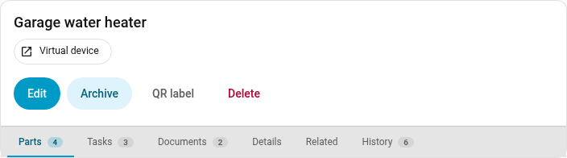
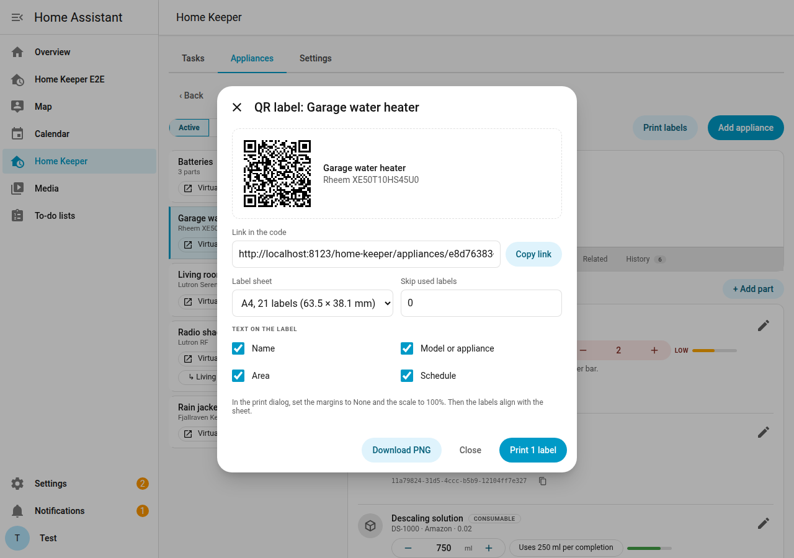
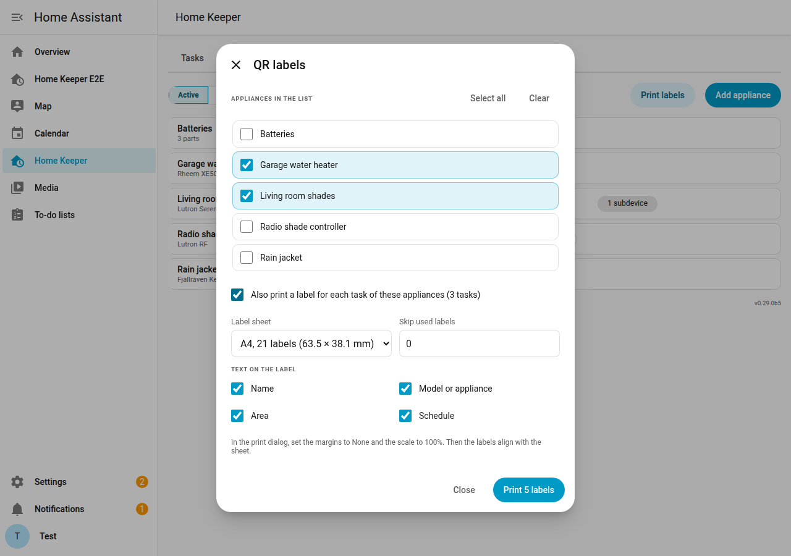
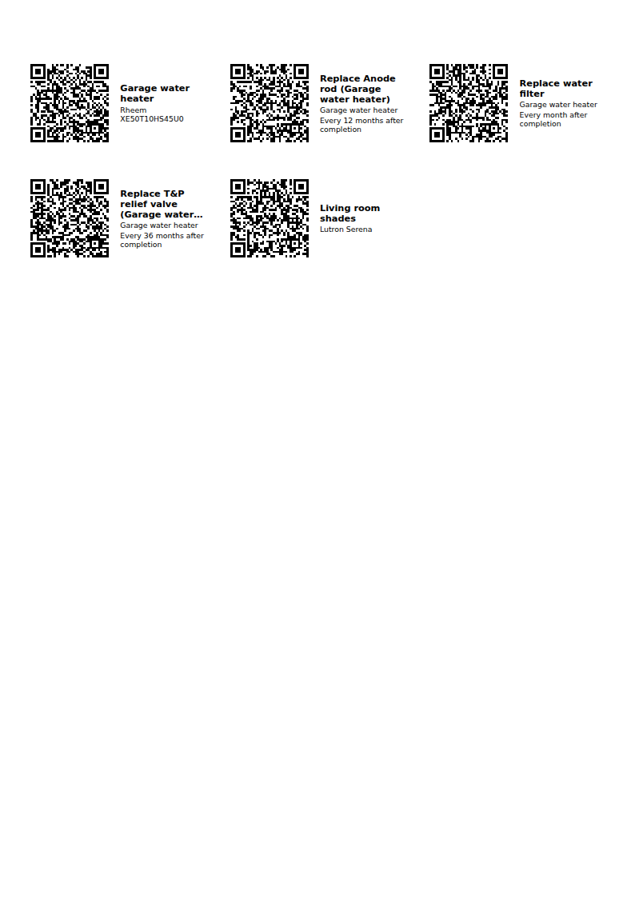
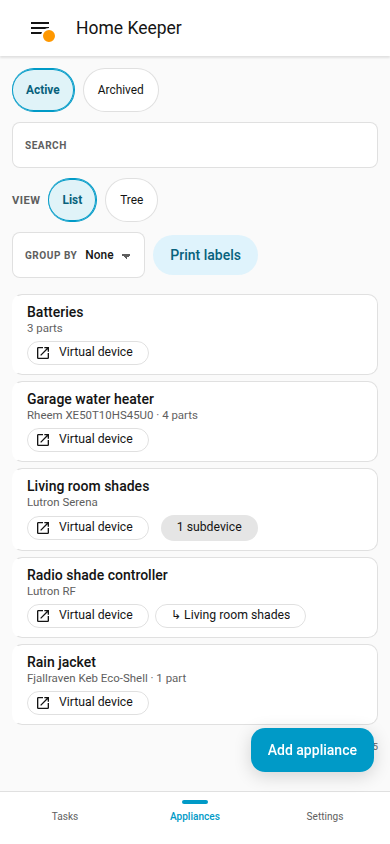
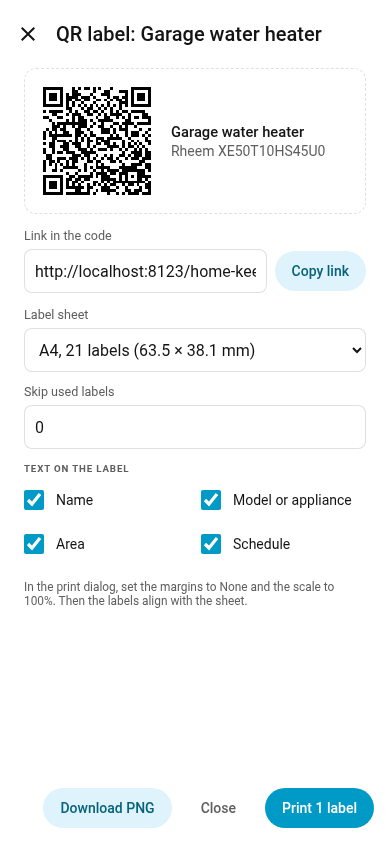

# QR code labels

Home Keeper supports QR code labels for appliances and tasks. Each code is a link to the
page of its appliance or task in the Home Keeper panel. Put a label on the appliance.
Then scan it with a phone camera to open the page in the panel.

The panel is for admins only, so the link opens only for an admin. To complete a task
with a scan, use a Home Assistant tag. See [NFC and RFID tags](../tasks/nfc-tags.md).

## Print 1 label

1. Open the page of an appliance or a task.
2. Select **QR label**.
3. Optional: change the print settings. See [Label sheets](#label-sheets) and
   [Text on the label](#text-on-the-label).
4. Select **Print 1 label**. The print dialog of the browser opens.

The dialog also has these buttons:

- **Copy link** copies the link in the code.
- **Download PNG** saves the code as an image. Use it with the app of a label printer.

## Print many labels

1. On the **Appliances** tab or on the **Tasks** tab, select **Print labels**.
2. Select the appliances or the tasks to print. **Select all** selects all of the list.
3. Optional: for appliances, select **Also print a label for each task of these
   appliances**.
4. Select **Print**. The print dialog of the browser opens.

The dialog shows the same appliances or tasks as the list. To print fewer, type in the
**Search** box before you select **Print labels**.

## Label sheets

Home Keeper prints on 2 common label sheets:

| Sheet | Labels | Label size | Same layout as |
|---|---|---|---|
| US Letter | 30 | 2⅝ × 1 in | Avery 5160 |
| A4 | 21 | 63.5 × 38.1 mm | Avery L7160 |

The first sheet comes from the country in the Home Assistant settings. The panel keeps
your choice of sheet and text in this browser.

If a sheet is part used, set **Skip used labels** to the number of used labels. The
first label then prints on the next free label.

In the print dialog, do these steps, or the labels do not align with the sheet:

1. Set the margins to **None**.
2. Set the scale to **100%**.

To make a PDF file, select **Save as PDF** as the printer.

## Text on the label

Select the lines to print next to the code:

| Line | Appliance | Task |
|---|---|---|
| Name | Name | Name |
| Model or appliance | Manufacturer and model | Appliance of the task |
| Area | Area | Area of the task, or of its appliance |
| Schedule | None | How the task repeats |

## The link

The code holds the external URL of Home Assistant, then the path of the page. For
example: `https://ha.example.com/home-keeper/appliances/<id>`. If Home Assistant has no
external URL, the code holds the internal URL. If it has neither, the code holds the
address of the browser that printed the label.

Set the URLs in **Settings → System → Network** before you print. If the URL changes
later, print the labels again. A label of an appliance or a task that you delete opens a
page that tells you so.

## On a phone

