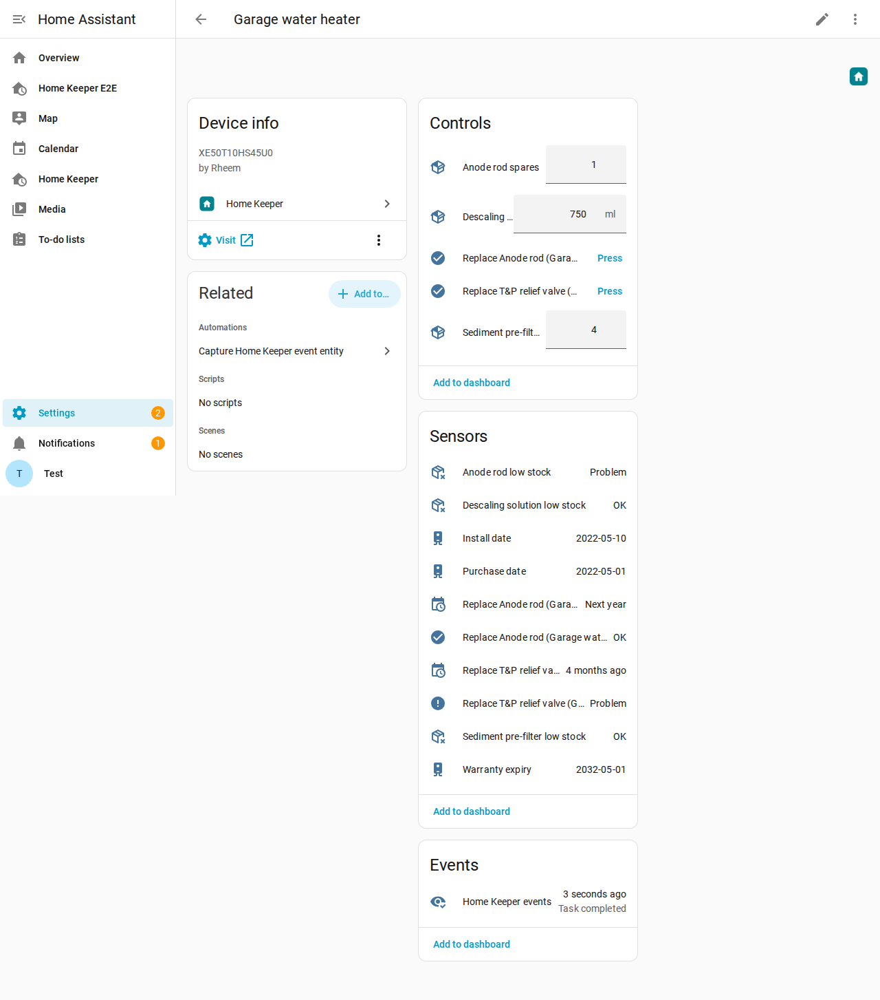
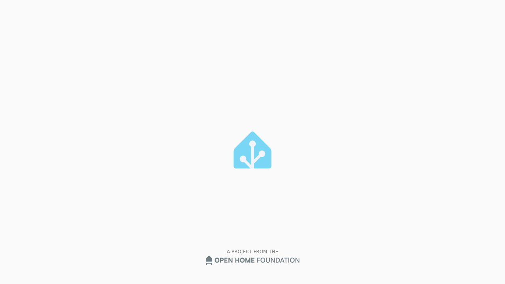
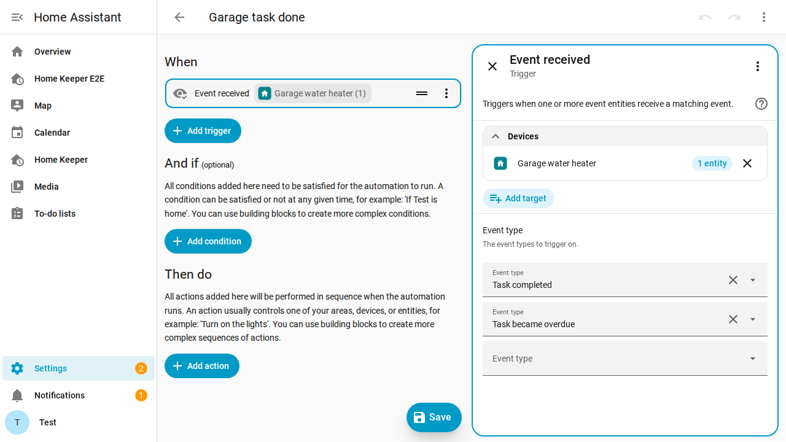
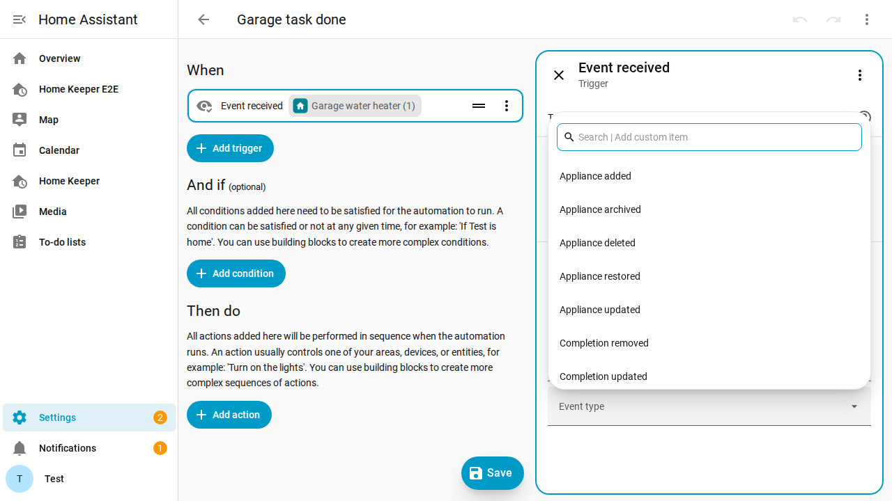
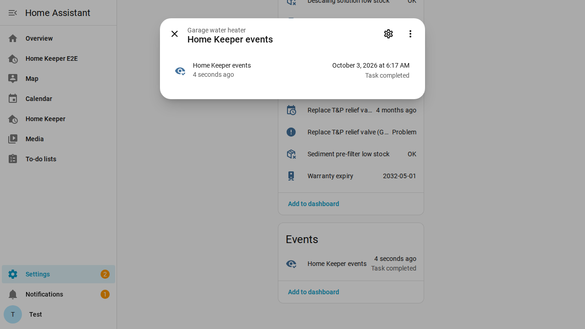

# Events & automations

Home Keeper fires a Home Assistant bus event for every state change. Use these
events to build automations. The events are:

| Object | Events |
| --- | --- |
| Task | created, updated, completed, uncompleted, completion edited, deleted, armed, snoozed, due today set, skipped, overdue, due soon |
| Part | low stock, out of stock, restocked |
| Appliance | created, updated, deleted, archived, restored |
| Companion | connected, suggested |

There are 3 ways to trigger on an event:

- Use the **Event received** trigger on a Home Keeper event entity. See
  [Event entities](#event-entities) below.
- Select a device trigger in the visual automation editor on a Home Keeper
  appliance, such as "Task became overdue" or "Spare part out of stock".
- Use a plain `platform: event` trigger.

For a task attached to a device that another integration owns, use the event
entity, the task's own entities or the event. Home Assistant offers device triggers
only for the 1 integration a device belongs to.

## Event entities

Home Keeper adds an event entity for each Home Assistant device that has a Home
Keeper task or appliance. The entity is named **Home Keeper events** and is on the
device page. It gets each task, part and appliance event of that device.



Home Keeper also adds 1 **Home Keeper Events** entity on the Home Keeper device. It
gets all events. Use it for a task that has no device, and for the events when a task
or an appliance is created or deleted.



To use an event entity in an automation (Home Assistant 2026.7 or later):

1. Go to **Settings → Automations & scenes**, and create an automation.
2. Select **Add trigger**, then **Event received**.
3. In **Target**, select the device, an area or a label. You can also select the
   entity.
4. In **Event type**, select 1 or more events, such as **Task completed** or
   **Task became overdue**.





The event type is the event name without `home_keeper_`, such as
`task_completed` or `part_low_stock`. The attributes are the event data, without the
large fields (`source`, `managed_by`, `task_chips`, `active_season`, `note` and
`photo`). In YAML:

```yaml
automation:
  - alias: "Garage task done"
    triggers:
      - trigger: event.received
        target:
          area_id: garage
        options:
          event_type: [task_completed]
    actions:
      - action: notify.notify
        data:
          message: "Done: {{ trigger.to_state.attributes.name }}"
```

If 2 tasks are on the same device, add a condition on the `task_id` or `name`
attribute to select 1 task.

The more-info dialog of the entity shows the last event and when it occurred.



The event entities copy the bus events. If an event fires while Home Keeper
reloads, the entity can miss it. Home Keeper reloads when you add a task to a device.
The bus event always fires. Use a `platform: event` trigger if an automation must
never miss an event.

An automation can add a part to the shopping list when the part goes out of stock.
This is useful for a part without
[Auto-create buy task](../appliances/appliances.md#auto-create-a-buy-task-when-a-part-runs-low):

```yaml
automation:
  - alias: "Spare out of stock → shopping list"
    trigger:
      - platform: event
        event_type: home_keeper_part_out_of_stock
    action:
      - service: todo.add_item
        target: { entity_id: todo.shopping_list }
        data:
          item: "{{ trigger.event.data.part_name }} ({{ trigger.event.data.vendor }})"
```

The built-in [shopping-list sync](../appliances/appliances.md#send-buy-reminders-to-your-shopping-list) does
this for a part already on auto-buy, and removes the line again when the part is
restocked.

Events are edge-triggered. Home Keeper fires 1 event per transition and does not
repeat it each cycle. Events are baselined on restart, so no overdue events are
fired after a reboot. The full catalog with every event and payload is in
[docs/EVENTS.md](../../EVENTS.md).
