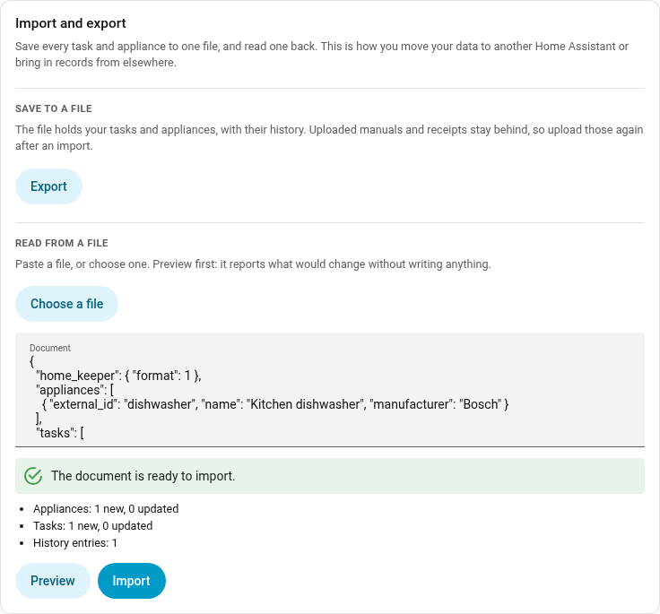
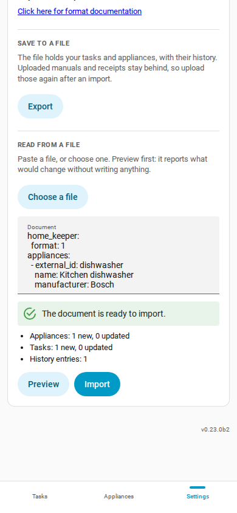

# Import and export

Home Keeper reads and writes its data as one file. Use it to move to another Home
Assistant, or to keep a copy of your own. Use it also to bring in records you keep
in a spreadsheet or an old app.

**Settings → Import and export** has both halves.

- **Export** saves every task and appliance, with the history, as a YAML file.
- **Import** reads such a file. Paste it, or choose it from disk, then press
  **Preview**. Preview only reports what would change. **Import** stays off until a
  preview of that exact text comes back clean.

Both halves are also actions, so a script or an automation can call them:
`home_keeper.export_data` and `home_keeper.import_data`. Both are admin-only.

#### The file

An export is also a worked example. The file it writes is the file import reads, so
one export shows you the whole format:

```yaml
home_keeper:
  format: 1

appliances:
  - external_id: furnace
    name: Furnace
    area: Basement
    manufacturer: Carrier
    model: 59TP6A
    serial_number: "1234-5678"
    cost: 4200
    parts:
      - name: Filter
        part_number: FILXXFCC0021
        type: consumable
        stock: 2
        reorder_at: 1

tasks:
  - external_id: furnace-filter
    name: Replace furnace filter
    appliance: furnace
    interval: 3
    unit: months
    notes: MERV 13 only.
    history:
      - completed_at: "2026-03-04"
        note: Used a MERV 13
        cost: 24.50
      - completed_at: "2025-12-01"
    skips:
      - skipped_at: "2025-09-01"
        note: Away
```

**A record takes the same fields as the action that creates it.** A `tasks` record is
an `add_task` payload. An `appliances` record is an `add_asset` payload. The
[API reference](https://prestomation.github.io/ha-home-keeper/developer/api#actions)
lists every field of both, so it documents the file as well.

The same fields also have a
[JSON Schema](https://prestomation.github.io/ha-home-keeper/schema/home-keeper-1.schema.json).
Every export names it on the first line, so an editor such as Visual Studio Code
checks the file and completes the field names as you type. Home Keeper builds the
schema from the code, so it always matches the version you run.

A record also takes these fields:

| Field | Applies to | What it does |
| --- | --- | --- |
| `external_id` | both | Your own name for the record. See below. |
| `area` | both | An area name. A stated `area_id` wins. |
| `appliance` | tasks | Which appliance the task belongs to, by `external_id`, name, or id. A stated `device_id` wins, if that device is on this Home Assistant. |
| `history` | tasks | Past completions. Each entry needs `completed_at`, and can add `note`, `cost`, `who`, `photo`. A usage or threshold task can also add `reading`. |
| `skips` | tasks | Past skips. Each entry needs `skipped_at`. |
| `parent_asset_id` | appliances | The appliance this one sits under, by `external_id`, name, or id. List a parent before its children. An appliance cannot sit under itself, through one link or a chain of them. |
| `archived` | appliances | `true` for an archived appliance. |

A `reading` on any other task is an error. Preview names any entry field it does not
read, then ignores it.

Dates can be a plain `2026-03-04` or a full timestamp. History is read in date order,
whatever order you write it in.

If you write a file by hand, put quotation marks around a text value such as `no`,
`on` or `NO`. Home Keeper reports an error and names the field if you forget. Add
quotation marks and import the file again. Indent with spaces, because YAML does not
accept a tab.

A JSON file also imports, because YAML accepts JSON. Indent it with spaces.

#### How a record finds its match

Import creates a record, or updates the one it already has. It decides which in 3
steps, and stops at the first that matches:

1. **`id`**, Home Keeper's own id. Every export includes it, so re-importing an
   export updates the same records.
2. **`external_id`**, the name you choose. Set this one in a file you write
   yourself, because it makes a second run update the same records instead of making
   a copy of everything. An `external_id` names one record, so 2 records in one file
   cannot share one. If they do, you get an error that names both.
3. **`name`**, an exact match first, then one that ignores case and spaces.

Home Keeper creates a record that matches no stored record. When a name matches 2
records you get an error that names both, because Home Keeper does not guess which one
you meant. To create every record and match no stored record, pass `match: none` to
`home_keeper.import_data`.

An update only changes the fields the file states. Fields it leaves out keep the
value they have.

#### Import/Export Limitations

The file does not hold every record. What an export leaves out is listed in its own
`home_keeper` block, and the preview names every field that Home Keeper did not read
on the way back in.

- **Uploaded manuals and receipts.** A text file has no room for a picture or a
  PDF, so upload those again after an import. A link to a document is only text,
  so it stays.
- **Tasks that another part of Home Keeper owns**, such as a wear part's replacement
  reminder, a buy reminder, a problem-sensor mirror, or a recipe's task. Home Keeper
  builds these again from the appliance and its parts, which the file does include.
  A counted wear item keeps its count. The count is on the part, because the 2
  tasks that use it are not in the file.
- **Tasks created by companions.**
- **Settings, profiles, notifications and recipes.** These stay in the config entry.

#### How big a file can be

The panel and the service each hold their own limit.

| Path | Limit | Reason |
| --- | --- | --- |
| Paste or choose a file in the panel | 4 MB | Home Assistant's own limit on a websocket message. Home Keeper cannot raise it. |
| Call the `home_keeper.import_data` service | 8 MB | Home Keeper's own limit on that service. |

A file between 4 MB and 8 MB must go through `home_keeper.import_data`. A file
over 8 MB must go in as several files. Each of `tasks` and `appliances` also
holds at most 2000 records.

#### Ask an AI agent to write one

The format is meant to be easy to generate. Export what you have, then give the file
to an AI agent with whatever holds your records now, such as a photo of a spreadsheet
or a page of notes. Ask for the same shape back as one YAML document,
with an `external_id` on every record. Paste the answer into the Import
box and press **Preview** first: it checks every record and reports each problem with
the path to it, so you can fix the file and try again. Nothing is written until the
preview is clean.




