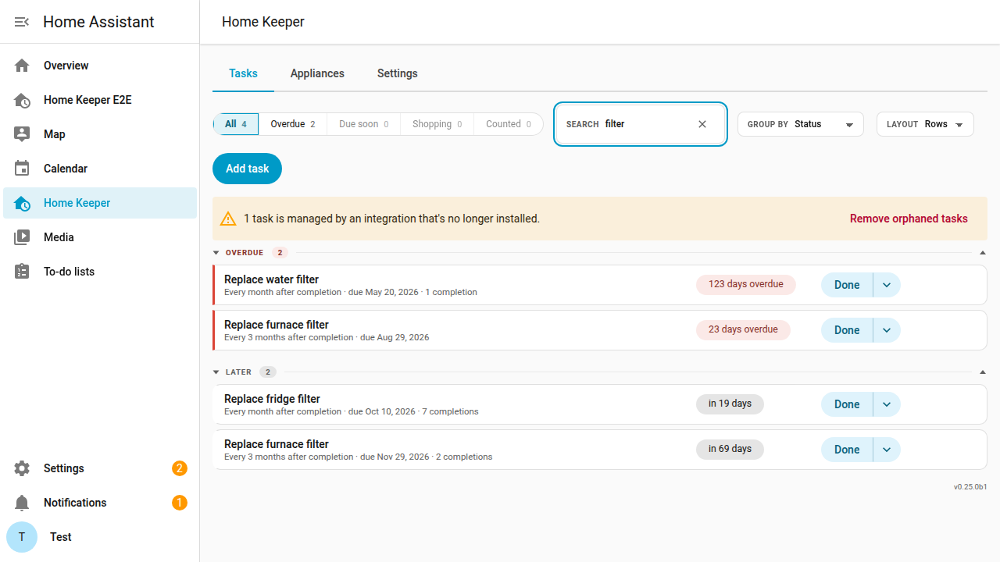
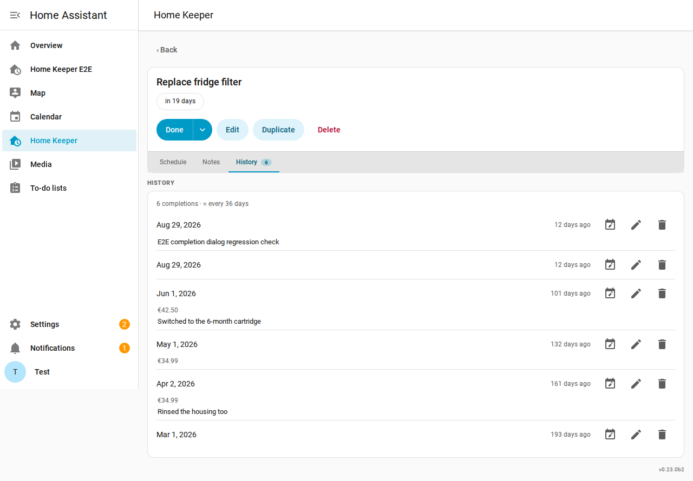
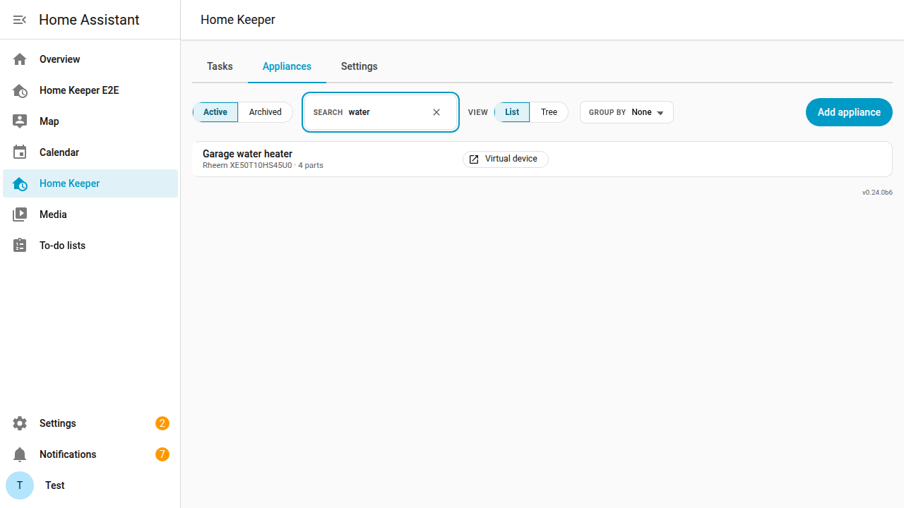

# Getting around the panel

The panel has the tabs **Tasks**, **Appliances**, and **Settings**.

On the **Tasks** tab:

- Select a scope pill to filter the list by status.
- Type in the **Search** box to narrow the list to the tasks that match.
- Select a saved Profile in the **Profile** picker or a grouping in **Group by**.
- Press **Add task** to create a task.
- Press **Edit** on a task to open its form. The form has the groups Basics,
  Schedule, Placement, and Completion. Press **Save** in the header or **Delete** in
  the footer.
- Select a task's device chip to open its appliance. The appliance list and an
  appliance's own page link straight to the Home Assistant device instead. A mark on
  the chip shows when it opens the device page.

The **Search** box reads these parts of a task:

- the name and the notes
- the attached device and the area
- the companion that supplied the task

Every word you type must appear somewhere, in any order. Accents are ignored, so
`cistic` finds `Čistič`. The scope pill counts follow the box, so a pill never
promises more than the list shows.

The task list and the appliance list are compact, so more rows fit on the screen.
On a phone, each task row keeps the Done button next to the task.

A task's page has the sub-tabs **Schedule**, **Notes**, and **History**. Each
sub-tab has its own URL, such as `/home-keeper/tasks/<id>/notes`. The page opens on
the **Schedule** tab.

On the **Appliances** tab, select an appliance to open it. An appliance has the
sub-tabs **Parts**, **Tasks**, **Documents**, **Details**, **Related**, and
**History**. Each sub-tab has its own URL, such as
`/home-keeper/appliances/<id>/documents`. Press **Edit** to open the appliance form.

The same **Search** box narrows the appliance list. It matches the model and the serial
number as well as the name.

#### Duplicate a task

To create a task from a copy of another task, press **Duplicate** on the task's page.
The create form opens with the values of the original. Change the values and press
**Create**. Nothing is saved before **Create**.

The copy does not include:

- the completion history
- the starting reading of a meter task
- the NFC tag and the require-scan setting
- the required completion fields
- integration-provided chips and the integration source

A task that another owner manages cannot be duplicated. **Duplicate** is disabled for
these tasks and shows the owner when pressed. This applies to:

- a wear item from an appliance part
- a synced problem sensor
- a condition-driven task
- a task that another integration manages

