# Getting around the panel

The panel has the tabs **Tasks**, **Appliances**, and **Settings**.

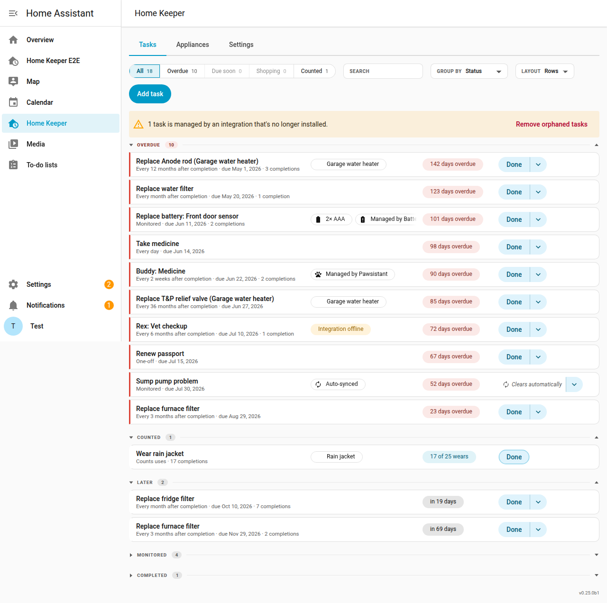

On the **Tasks** tab:

- Select a scope pill to filter the list by status.
- Type in the **Search** box to narrow the list to the tasks that match.
- Select a saved Profile in the **Profile** picker or a grouping in **Group by**.
- Press **Add task** to create a task.
- Press **Edit** on a task to open its form. The form has the groups Basics,
  Schedule, Placement, and Completion. Press **Save** in the header or **Delete** in
  the footer.
- Select a task's device chip to open its appliance. The appliance list and an
  appliance's own page link straight to the Home Assistant device instead. A mark on
  the chip shows when it opens the device page.

The **Search** box reads these parts of a task:

- the name and the notes
- the attached device and the area
- the companion that supplied the task

Every word you type must appear somewhere, in any order. Accents are ignored, so
`cistic` finds `Čistič`. The scope pill counts follow the box, so a pill never
promises more than the list shows.

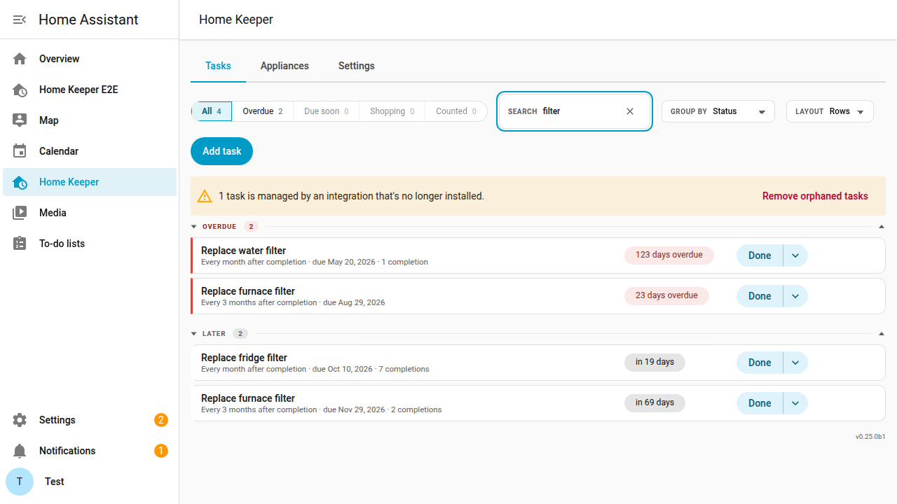

#### Presets for your home

Home Keeper has built-in [presets](../views/settings.md#declarative-companions-config-driven-no-separate-integration)
that watch common entities, such as firmware updates. [Integration
presets](../views/settings.md#integration-presets) watch the parts and supplies of one
integration's devices, such as the filter of a robot vacuum. When a preset matches
entities in your home, the **Tasks** tab tells you. You do not have to find the preset
in Settings.

The first time, a dialog shows each preset that matches, with the number of entities.
Select the presets you want and press **Add**. Home Keeper saves them with their
default settings. You can change each one later in **Settings**, **Companions**. A
preset that matches more than 50 entities is not in the dialog. It shows on the card,
where **Set up** lets you narrow it before you save.

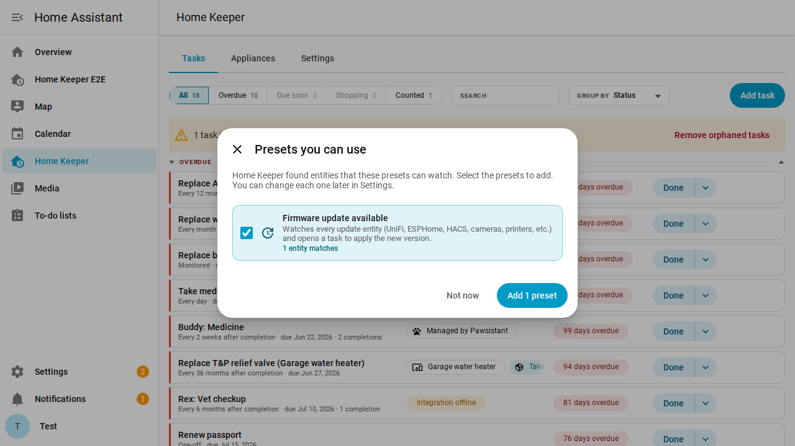

Press **Not now** to close the dialog. A card above the task list then keeps the
presets. On the card:

- Press **Set up** to open the Add dialog on that preset. Check or change it, then
  save.
- Press **Not now** to hide the card.
- Press **See all presets** to open **Settings**, **Companions**.

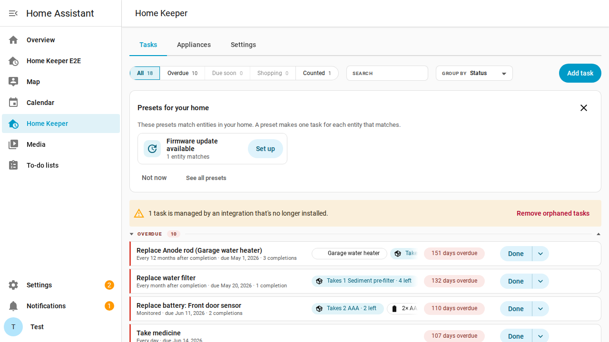

The dialog opens one time for each preset. A hidden preset does not come back. A
preset that starts to match later shows again. This can occur after you install an
integration. Home Keeper keeps these choices for each Home Assistant user, so they
follow you to each browser and phone.

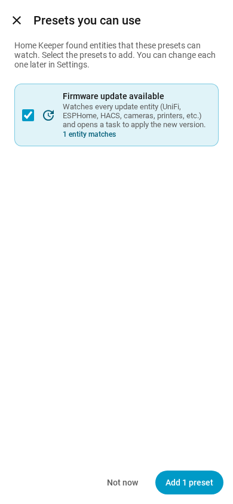

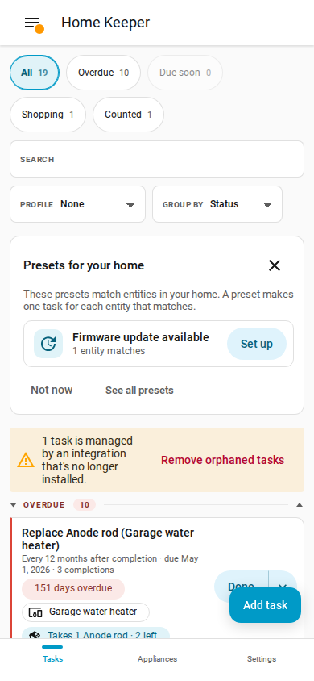

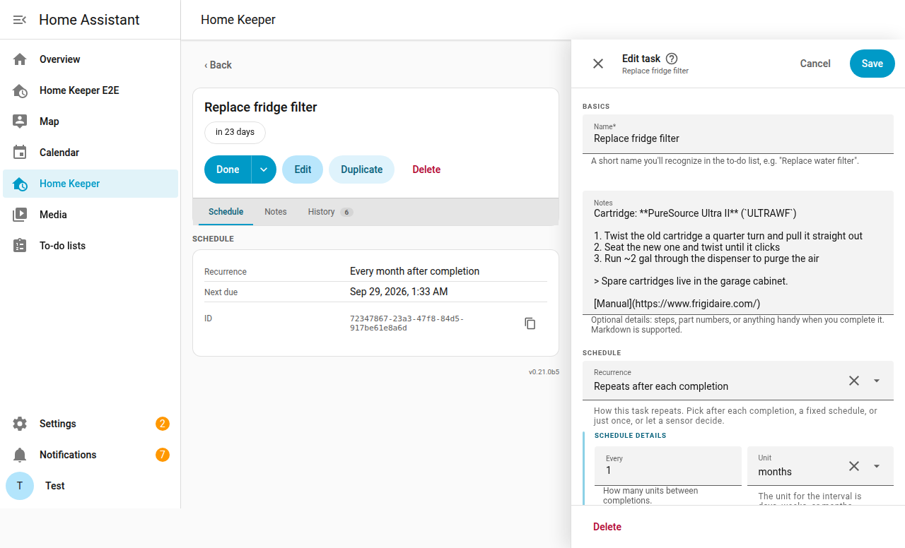

The task list and the appliance list are compact, so more rows fit on the screen.
On a phone, each task row keeps the Done button next to the task.

A task's page has the sub-tabs **Schedule**, **Notes**, and **History**. Each
sub-tab has its own URL, such as `/home-keeper/tasks/<id>/notes`. The page opens on
the **Schedule** tab.

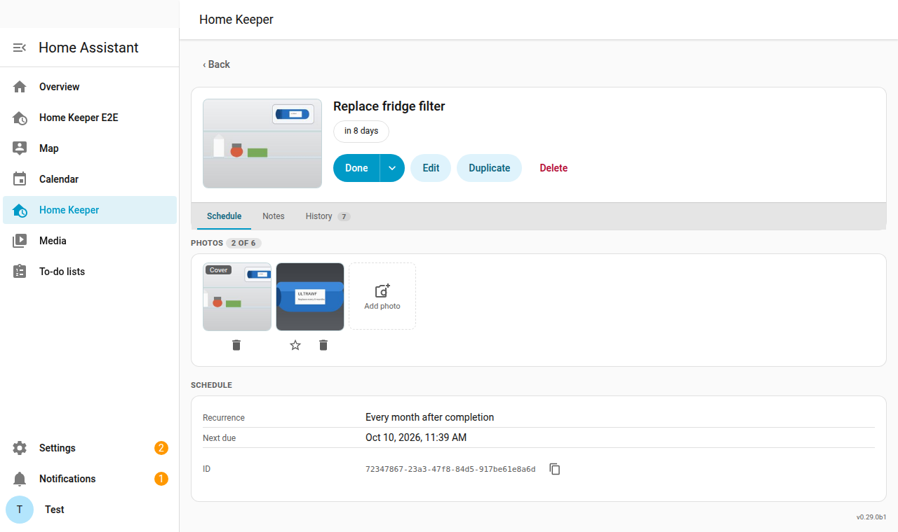

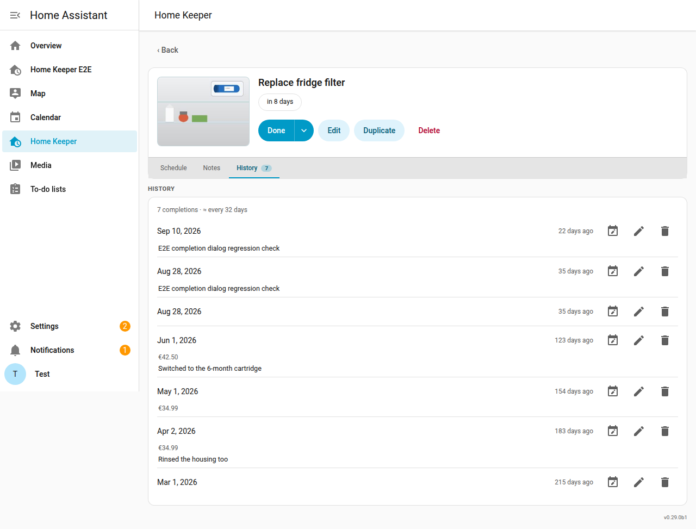

On the **Appliances** tab, select an appliance to open it. An appliance has the
sub-tabs **Parts**, **Tasks**, **Documents**, **Details**, **Related**, and
**History**. Each sub-tab has its own URL, such as
`/home-keeper/appliances/<id>/documents`. Press **Edit** to open the appliance form.

The same **Search** box narrows the appliance list. It matches the model and the serial
number as well as the name.

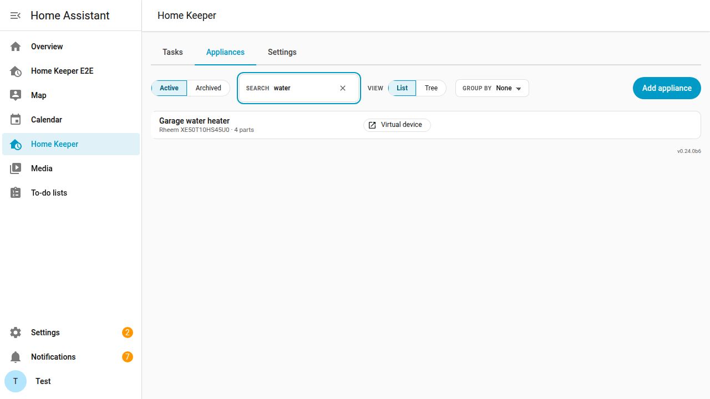

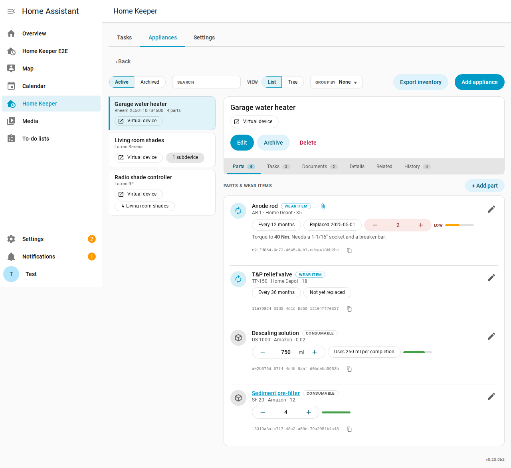

#### Duplicate a task

To create a task from a copy of another task, press **Duplicate** on the task's page.
The create form opens with the values of the original. Change the values and press
**Create**. Nothing is saved before **Create**.

The copy does not include:

- the completion history
- the starting reading of a meter task
- the NFC tag and the require-scan setting
- the required completion fields
- integration-provided chips and the integration source

A task that another owner manages cannot be duplicated. **Duplicate** is disabled for
these tasks and shows the owner when pressed. This applies to:

- a wear item from an appliance part
- a synced problem sensor
- a condition-driven task
- a task that another integration manages

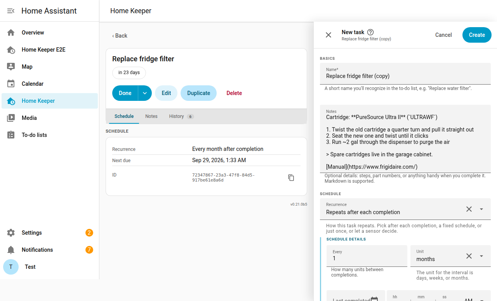
