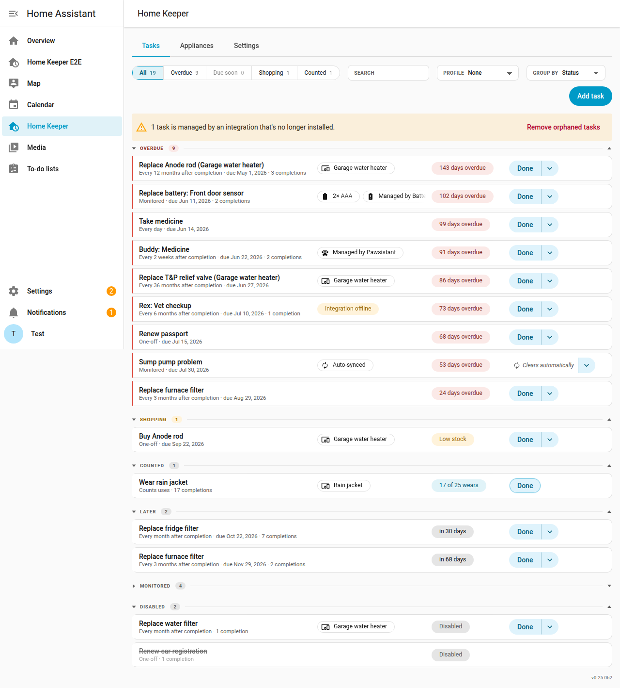
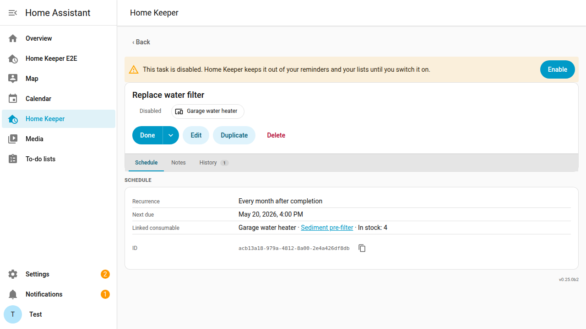

# Disabled tasks

A task can be disabled and enabled again later. A disabled task keeps everything
recorded on it. Home Keeper stops asking for it. Use this for work that belongs to
part of the year, where an [active season](../start/concepts.md#active-season) does
not fit, because the dates are different each year.

A pool is the example. It opens and closes when the weather says so, not on a date.
Many users already have an `input_boolean` helper that says whether the pool is
open, and it drives the pump and the dashboard. An automation can make it drive the
pool tasks too.

## What a disabled task does

A disabled task stays in Home Keeper with everything recorded on it. Home Keeper
takes it out of every place that asks for work:

- the to-do list and the calendar
- its buttons and sensors on the device page
- every [profile](../views/profiles.md), and so every notification
- the overdue and due-soon announcements
- the [dashboard card](../views/dashboard-card.md), unless the card sets
  `show_disabled`
- an [NFC tag](nfc-tags.md) scan, which cannot complete it

The due date does not move. A task disabled in October is as late in April as its
stored date says. The section below shows how to come back to a clean date.

## Disable a task from an automation

The panel has no control to disable a task. Use the
`home_keeper.update_task` action, with `enabled`. This automation follows a helper,
so 1 switch controls every pool task:

```yaml
alias: Pool tasks follow the pool
triggers:
  - trigger: state
    entity_id: input_boolean.pool_open
actions:
  - repeat:
      for_each:
        - backwash_the_filter
        - test_the_chemicals
        - skim_the_surface
      sequence:
        - action: home_keeper.update_task
          data:
            task_id: "{{ repeat.item }}"
            enabled: "{{ trigger.to_state.state == 'on' }}"
```

The task ids are on each task's page in the panel. A task name works too.

## Come back to a clean due date

With an active season, the due date moves forward to the start of the next window.
A disabled task keeps the date it had, so it comes back as late as it was left.

To get the same clean start, pair the enable with
[due today](snooze-and-skip.md). Add this to the automation above:

```yaml
        - if:
            - condition: template
              value_template: "{{ trigger.to_state.state == 'on' }}"
          then:
            - action: home_keeper.set_due_today
              data:
                task_id: "{{ repeat.item }}"
```

## Find a disabled task again

A disabled task is not counted on the **Overdue**, **Due soon**, **Shopping** or
**Counted** filters. It is on the **All** filter, under a **Disabled** section, with
a **Disabled** label in place of its due date.

Open it and select **Enable** to enable it again. This is the only control the panel
offers. A service call is what disables a task.




