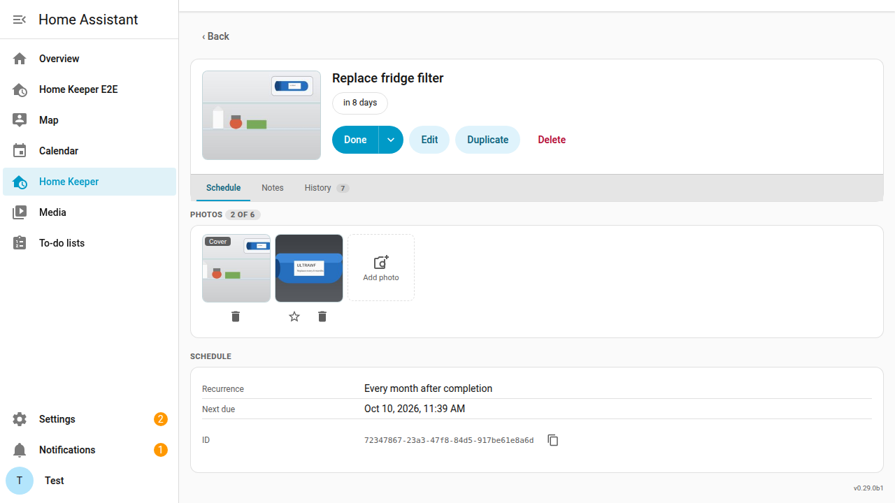
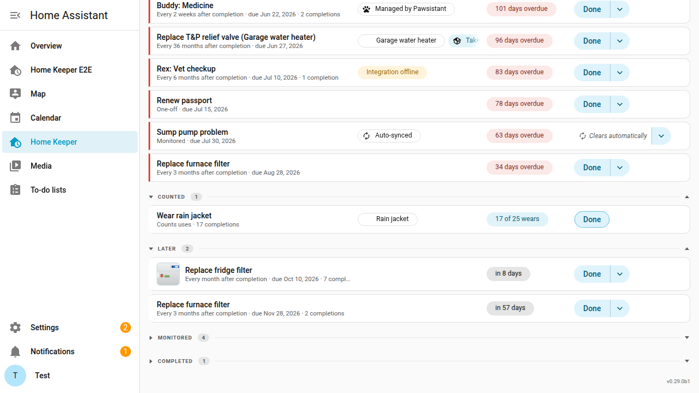

# Task photos

A task can have up to 6 photos. Use them to show what needs work and where it is.

Take a task "Repair damaged insulation above bedroom". A photo of the damaged area
shows the exact place months later.

Task photos are different from completion photos. A completion photo records the
work on one date. Task photos stay on the task across all of its completions.

## Add a photo

1. Open the task.
2. On the **Schedule** tab, select **Add photo** in the **Photos** section.
3. Select an image file. Home Keeper accepts PNG, JPEG, WebP and GIF files of up to
   25 MB.

On a phone, the file picker can also open the camera.

## The cover

The first photo is the cover. The cover shows in 3 places:

- Beside the task name at the top of the task page.
- On the task row in the task list.
- At the top of the dialog that logs a completion, when the task asks for
  completion details.

To make a different photo the cover, select the star on that photo.

## Open and remove a photo

Select a photo to open the full image in a new tab. To remove a photo, select the
delete button on the photo, then confirm. Home Keeper deletes the file.

## Where the files are

Home Keeper keeps the files in the `home_keeper/task_photos` folder of your Home
Assistant configuration. A Home Assistant backup includes them. Home Keeper also
keeps a small copy of each photo for the task list and the photo strip, so a page
with many photos loads quickly.

The original photo is not changed. A photo from a phone can hold the place where you
took it, and the original keeps that data. The small copy does not.

To keep the place out of a photo, turn off location in the camera first.

When you delete a task, Home Keeper deletes its photos. The history that a deleted
task leaves on its appliance does not keep them.

An [export](../automation/import-export.md) does not include task photos, because
the document is text. The export counts them, so you know how many to add again
after an import on a new system.

## Automations

Adding, removing or reordering photos fires `home_keeper_task_updated` with
`photos` in `changed_fields`. The `home_keeper.sign_task_photo_url` action gives a
short-lived URL for a photo. Use it to show the photo in a notification. The
`home_keeper.remove_task_photo` and `home_keeper.set_task_photo_cover` actions
change the photos without the panel.

An action cannot send a file, so you add a photo only in the panel.
