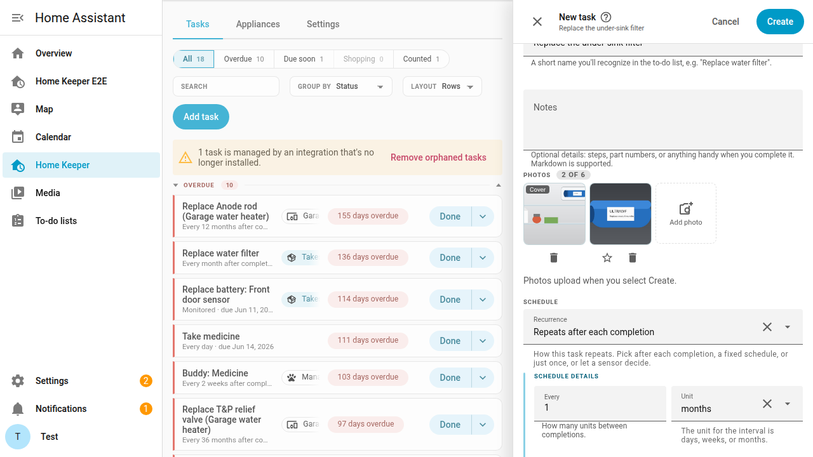
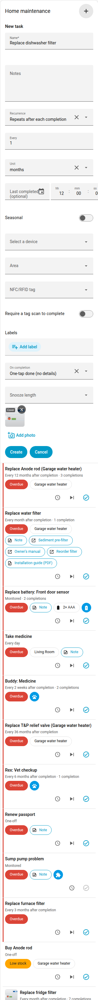
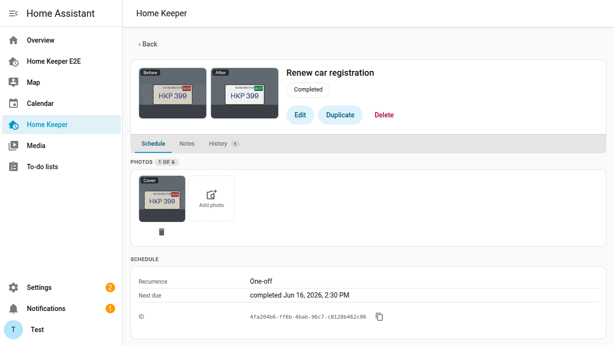
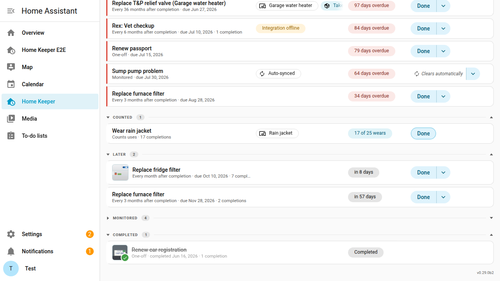

# Task photos

A task can have up to 6 photos. Use them to show what needs work and where it is.

Take a task "Repair damaged insulation above bedroom". A photo of the damaged area
shows the exact place months later.

Task photos are different from completion photos. A completion photo records the
work on one date. Task photos stay on the task across all of its completions.

## Add photos when you create a task

The **New task** form has a **Photos** section under the name and the notes.

1. Select **Add photo**, then select 1 or more images. On a phone, you can also take a
   photo with the camera.
2. To make a different photo the cover, select the star on that photo. To remove a
   photo, select its delete button.
3. Select **Create**. Home Keeper creates the task, then uploads the photos.

If a photo does not upload, Home Keeper keeps the task and opens the task page. A
message tells you how many photos did not upload. Add those photos again on the task page.

The **Edit task** form shows the same **Photos** section. There, each change applies
immediately, as on the task page.

### From the dashboard card

The **New task** form of the [dashboard card](../views/dashboard-card.md) has an
**Add photo** button under the fields. The first photo is the cover. The card shows the
cover on each task row. Select the cover to open the full image.

## Add a photo to a task

1. Open the task.
2. On the **Schedule** tab, select **Add photo** in the **Photos** section.
3. Select an image file. Home Keeper accepts PNG, JPEG, WebP and GIF files of up to
   25 MB.

On a phone, the file picker can also open the camera.

## The cover

The first photo is the cover. The cover shows in 3 places:

- Beside the task name at the top of the task page.
- On the task row in the task list and on the dashboard card.
- At the top of the dialog that logs a completion, when the task asks for
  completion details.

To make a different photo the cover, select the star on that photo.

## Open and remove a photo

Select a photo to open the full image in a new tab. To remove a photo, select the
delete button on the photo, then confirm. Home Keeper deletes the file.

## After photos

A completion can have its own photo. It shows the result of the work. Home Keeper
shows this after photo beside the task photo.

To add an after photo to a task that completes with one tap:

1. Select the arrow beside **Done**.
2. Select **Done with photo or note…**.
3. In the dialog, add the photo, then select **Mark done**.

A task that asks for completion details opens the same dialog from **Done**.

When the last completion has a photo, the task page shows it beside the cover:

- A one-off task shows the 2 photos as **Before** and **After**.
- A task that repeats shows them as **Cover** and **Last completion**.

A one-off task in the **Completed** group shows its after photo with a check mark,
in place of the cover.

## Who can add photos

A photo is part of the task. So any user who can create a task can also add, remove
and reorder its photos. A user who is not an admin does this from the dashboard card.
See [the security model](../../SECURITY.md) for the details.

## Where the files are

Home Keeper keeps the files in the `home_keeper/task_photos` folder of your Home
Assistant configuration. A Home Assistant backup includes them. Home Keeper also
keeps a small copy of each photo for the task list and the photo strip, so a page
with many photos loads quickly.

The original photo is not changed. A photo from a phone can hold the place where you
took it, and the original keeps that data. The small copy does not.

To keep the place out of a photo, turn off location in the camera first.

When you delete a task, Home Keeper deletes its photos. The history that a deleted
task leaves on its appliance does not keep them.

An [export](../automation/import-export.md) does not include task photos, because
the document is text. The export counts them, so you know how many to add again
after an import on a new system.

## Automations

Adding, removing or reordering photos fires `home_keeper_task_updated` with
`photos` in `changed_fields`. The `home_keeper.sign_task_photo_url` action gives a
short-lived URL for a photo. Use it to show the photo in a notification. The
`home_keeper.remove_task_photo` and `home_keeper.set_task_photo_cover` actions
change the photos without the panel.

An action cannot send a file, so you add a photo only in the panel or on the card.
