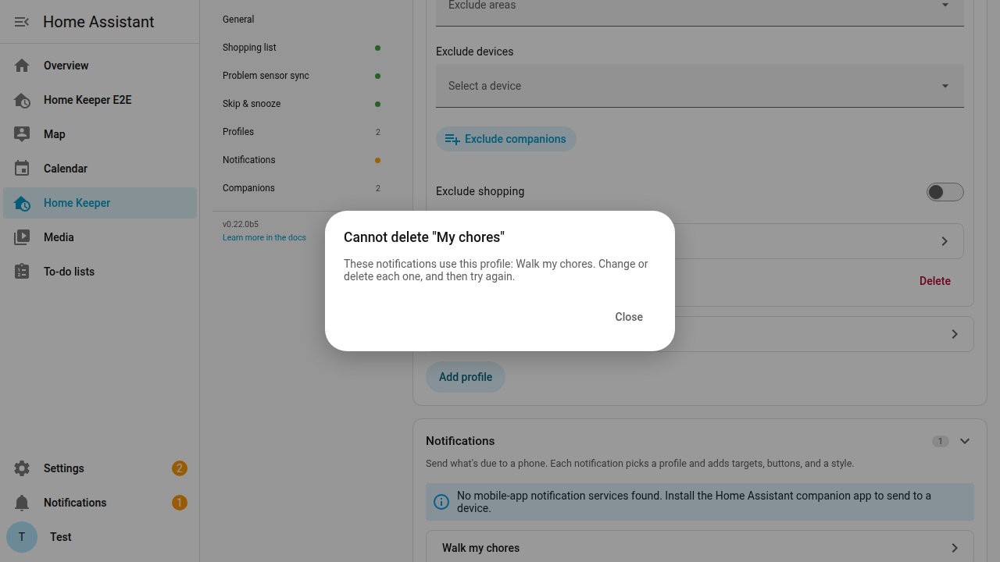
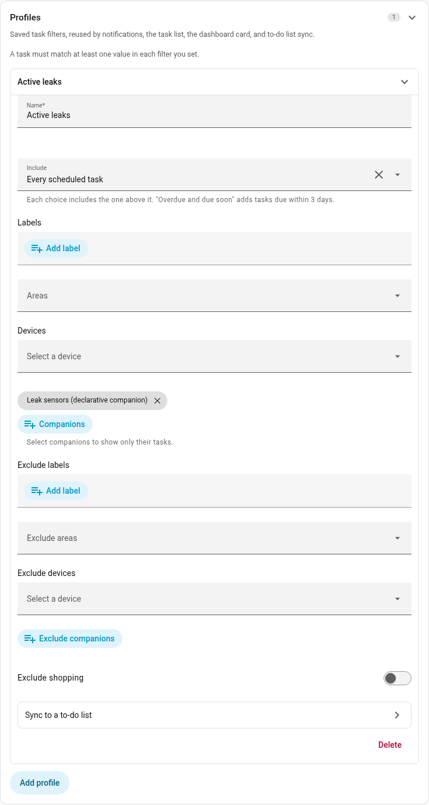
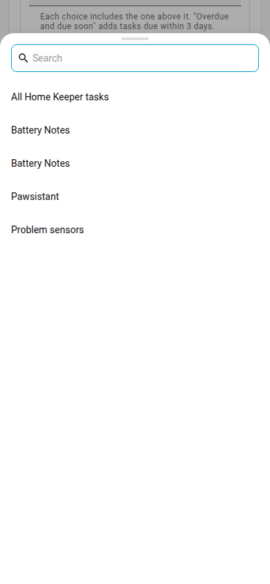

# Profiles (saved filters you reuse everywhere)

Home Keeper supports saving a filter as a **Profile**. A Profile has a status tier and
optional **label**, **area**, **device**, and **companion** filters. Create and edit
Profiles in **Settings → Profiles**.

A Profile is used in 4 places:

- A notification selects a Profile to designate which tasks are sent.
- A to-do list sync uses a Profile to designate which tasks are synchronized.
- The **Profile** dropdown on the **Tasks** tab filters the task list in the panel.
- The **Filter by profile** option in the card editor filters the dashboard card.

Home Keeper does not delete a Profile that a notification uses. Point those
notifications at a different Profile first. You can also delete them.

#### Status tiers

The **Include** setting has 3 tiers. Each tier includes the tiers before it:

- **Overdue only**: overdue tasks.
- **Overdue and due soon**: overdue tasks and tasks that are due in the next 3 days.
- **Every scheduled task**: all scheduled tasks.

#### How filters combine

A filter can hold more than one value, and Home Keeper matches a task with any one of
them. A **Labels** filter set to `urgent` and `safety` selects tasks with either label. A
Profile with values in more than one filter shows only the tasks that match every one of
them. Each filter you set makes the result smaller. It never makes the result larger.

> **A Profile with values in both Labels and Companions does not show both groups
> together.** It shows only the tasks that match both filters. To combine 2 groups of
> tasks, put both values in one filter. An example is 2 labels in **Labels**.

#### Filter by companion

A [companion](./settings.md#companions) is an integration that creates tasks in Home Keeper. The
Battery Notes glue is one example, and it raises a **Replace battery** task when a
battery gets low. Every task a companion creates records which integration owns it, and
the panel shows a **Managed by** chip on that task.

The **Companions** filter selects tasks by their owner. This makes one card per source
without any manual work:

- A card of only the battery tasks. Select **Battery Notes** in **Companions**.
- A card of only the printer tasks. Select the printer glue.
- Everything except one source. Put that companion in **Exclude companions**.

The picker lists each connected companion, and each integration that already owns a
task. A companion that is only a suggestion is not listed, because it owns no tasks.

Home Keeper makes some tasks itself, and the picker lists these sources too:

- Each [declarative companion](./settings.md#declarative-companions-config-driven-no-separate-integration),
  by its name. Select one to show only the tasks it makes, such as the tasks of a
  declarative companion that watches leak sensors.
- **Problem sensors**, for the tasks of
  [Problem sensor sync](../tasks/triggered-tasks.md#sync-problem-binary-sensors-as-tasks), when one exists.
- **All Home Keeper tasks**, for the tasks of every declarative companion and every
  synced problem sensor together.

A declarative companion that you delete stays in a saved Profile as **Deleted
declarative companion**. It then selects no task. Remove it from the list.

> **A task you create in the panel has no companion.** No integration owns it. A
> **Companions** filter does not select it and an **Exclude companions** filter does not
> remove it. Use a label filter for tasks you make yourself.

#### Exclusions

**Exclude labels**, **Exclude areas**, **Exclude devices**, and **Exclude companions**
remove tasks from the Profile. An exclusion takes precedence over the include filters. Nothing is removed
if the exclusion is empty. This is useful for a Profile of all tasks except the tasks with one
label, such as `professional`.

Exclusions apply to inherited labels and areas. A task that has the `professional`
label through its device or its area is also excluded.

**Exclude shopping** removes every auto-created
["Buy {part}"](../appliances/appliances.md#auto-create-a-buy-task-when-a-part-runs-low) task from the Profile. It
is a switch and not a picker. A buy task has only the label and the area of its
appliance, so a picker cannot select it. The switch is off by default, so an existing
Profile includes the buy tasks until you turn it on. Use it to limit a spoken
notification digest to the maintenance tasks.

#### Synced problem sensors

A task synced from a [`problem` binary sensor](../tasks/triggered-tasks.md#sync-problem-binary-sensors-as-tasks)
is included in a Profile while its sensor reports a problem. A notification for this
task shows **Snooze** instead of **Mark done** and **Skip**.
A [synced to-do list](./todo-sync.md#two-way-sync) shows the task, but a
completion on the list does not complete it.

## Task count sensors

Home Keeper gives each Profile a **count sensor**, and adds one more sensor for every
task it keeps. Use the sensor for a dashboard badge, a gauge card, or a numeric-state
trigger in an automation. You do not need a template.

The sensors are on the **Home Keeper** device in **Settings → Devices & services**.

- `sensor.home_keeper_tasks` counts every task. Its state is the number of overdue
  tasks.
- One sensor for each Profile. Its state is the number of tasks that Profile shows,
  which is set by the Profile's status tier: **Overdue only** counts the overdue
  tasks, **Overdue and due soon** counts both groups, and **Every scheduled task**
  counts them all.

The sensor keeps its entity id when you rename the Profile. Home Keeper removes the
sensor when you delete the Profile.

#### Attributes

Each sensor has these attributes. They are measured over the Profile's full scope, not
over its status tier, so `total` keeps its meaning and the next task is named even
when the state is 0.

| Attribute | What it is |
| --- | --- |
| `total` | Every enabled, scheduled task the Profile selects. |
| `overdue` | The tasks that are at or past their due date. |
| `due_soon` | The tasks that come due in the next 3 days, but are not yet overdue. |
| `due_today` | The tasks that come due today, on your local date. |
| `next_due` | The due date of the first task, as an ISO timestamp. |
| `next_task_name` | The name of that task. |
| `next_task_id` | The id of that task. |
| `most_overdue_days` | The days past due for the most overdue task. It is empty if no task is overdue. |

Because `due_soon` does not include the overdue tasks, an **Overdue and due soon**
Profile has a state of `overdue` plus `due_soon`.

The counts refresh every 5 minutes, the same as the per-task **Overdue** sensor. A
count can be a few minutes behind.

#### Put the overdue count on a badge

Add a badge to a dashboard and select `sensor.home_keeper_tasks`. To show the count of
one Profile, select that Profile's sensor.
