# Settings

The **Settings** tab in the panel edits the integration options. The form matches the
Home Assistant options flow and saves each change immediately. The same options are
available in the options flow under **Settings → Devices & services → Configure** and
through the `home_keeper.set_options` service.

The tab has 7 sections:

- **General** sets how long completed one-off tasks are kept.
- **Shopping list** selects the to-do list that
  [buy reminders are synced to](../appliances/appliances.md#send-buy-reminders-to-your-shopping-list).
- **Profiles** holds the saved filters. See
  [Profiles](./profiles.md).
- **Notifications** holds the notification configurations. See
  [Notifications](./notifications.md).
- **Problem sensor sync** has the sync switch and the exclusions for entities and
  devices and areas and labels. The exclusions apply only when the sync is on.
- **Companions** lists the integrations that work with Home Keeper.
- **Import and export** saves your data to a file and reads a file back. It also
  holds the [appliance report](../automation/import-export.md#appliance-report).
  See [Import and export](../automation/import-export.md).


#### Companions

A companion is an integration that works with Home Keeper. Examples are a pet-care
tracker that creates recurring tasks and a glue integration that turns a low battery
into a replacement task. The **Companions** section at the end of the Settings tab
lists them in 2 groups:

- **Connected** lists the companions that registered themselves with Home Keeper.
  Examples are [Pawsistant](https://github.com/prestomation/pawsistant) and the
  [Battery Notes glue integration](https://github.com/prestomation/ha-home-keeper-battery-notes).
  Each row has a **Configure** button that opens the companion's own page.
- **Suggested** lists popular integrations that Home Keeper detects from a catalog
  and that have no glue integration installed. An example is **Battery Notes**. Each
  row has an **Install** link and a **Dismiss** button.

To add a companion or a [glue integration](../../GLUE_INTEGRATIONS.md) to the catalog,
[open a GitHub issue](https://github.com/prestomation/ha-home-keeper/issues/new?title=Companion%20suggestion:%20).


##### Declarative companions (config-driven, no separate integration)

A **declarative companion** is a recipe. The recipe targets an integration, or it
matches entities through an entity id filter. The recipe sets a trigger mode: usage,
threshold, state, availability, or template. The recipe also sets a Jinja template for
the task name and the task notes.

Home Keeper opens one managed task for each entity that matches the recipe. The task
clears when the condition recovers. A task that a recipe made has an **Edit recipe**
button on its detail page. The button opens the recipe that made the task.

Each task that a recipe makes is a sensor-based task, so it has no due date until
its condition is true. A task with no due date shows as **Monitored** and stays off
the to-do list and the calendar. When the condition becomes true, Home Keeper sets
the due date to that moment, so the task is due now and then overdue. The age of an
overdue task shows how long the condition has been true. In the **Firmware update
available** preset, a device with an update pending shows an overdue task, and a
device with no update pending shows **Monitored**. All bundled presets complete the
task automatically when the condition recovers, so those tasks offer no Done button.

The *Add from preset* picker offers 3 presets.

- **Device Pulse** targets the per-device ping sensors from
  [studiobts/home-assistant-device-pulse](https://github.com/studiobts/home-assistant-device-pulse).
  The Device Pulse integration must be installed.
- **Firmware update available** matches every `update.*` entity that reports `on`.
  This covers UniFi, ESPHome, HACS, Reolink, and Bambu Lab.
- **Device stopped reporting** matches every `sensor.*_last_seen` entity. It opens a
  task for each device that has not reported for 24 hours. This finds the Zigbee or
  Z-Wave devices that dropped off the mesh. It needs no other integration.

A preset writes the task name and notes in the Home Assistant language. A later change
of the language changes the tasks to the new language. When a recipe has your own name
or notes, Home Keeper uses your text.

Low batteries have no preset. The [Battery Notes glue
integration](../../GLUE_INTEGRATIONS.md) already opens a task for each battery and
also supplies the battery type and the count. Write a recipe for a low-battery
`binary_sensor` if you do not use that glue integration.

The *Add companion* dialog shows a live preview of the matches before you save. A
warning shows above 50 matches. A recipe cannot match more than 500 entities. See
[INTEGRATING.md](../../INTEGRATING.md) for the service reference.

The *Which entities?* section of the dialog has the integration and the entity domain.
Click **More filters** to see the other filters. Set a device class there, or write an
entity id regex. You can also limit the recipe to some areas or to some labels. An
entity that has no area of its own uses the area of its device. When **More filters**
is closed, its row shows how many filters and exclusions are set.

The **Exclusions** block under the filters removes entities from the recipe. Select
the entities, devices, areas or labels to exclude. Home Keeper then makes no task for
an entity that matches one of them. This is the same as the exclusions of Problem
sensor sync.

Each row in the preview has an **Exclude** button. Click it to exclude that entity.
The entity then shows under the matches with an **Include** button, which adds it
back. The preview shows 10 matches at most. To exclude an entity that is not in the
preview, select it in the excluded entities list.

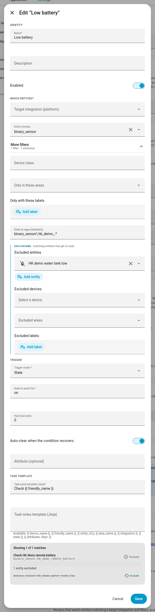

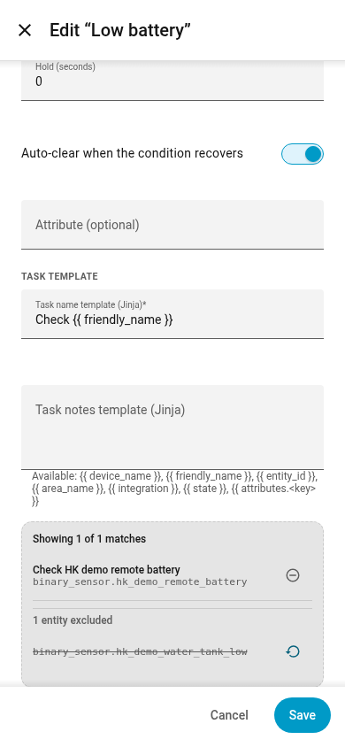

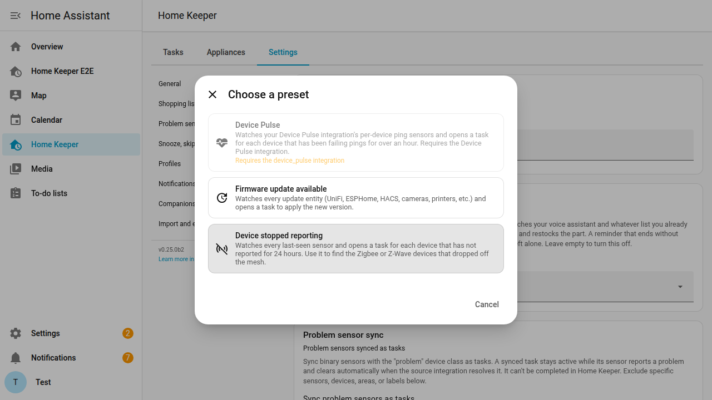

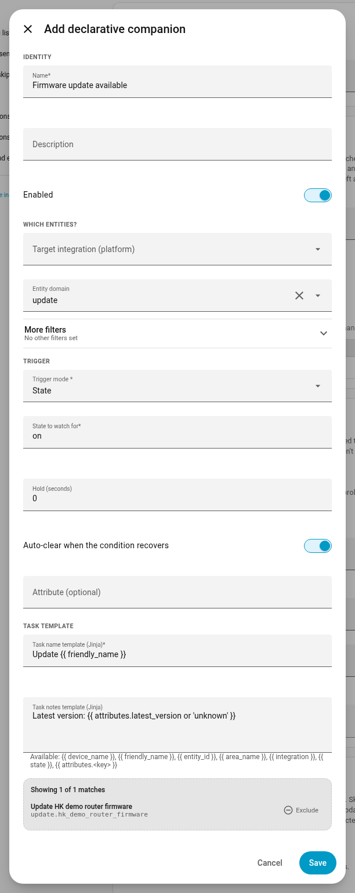

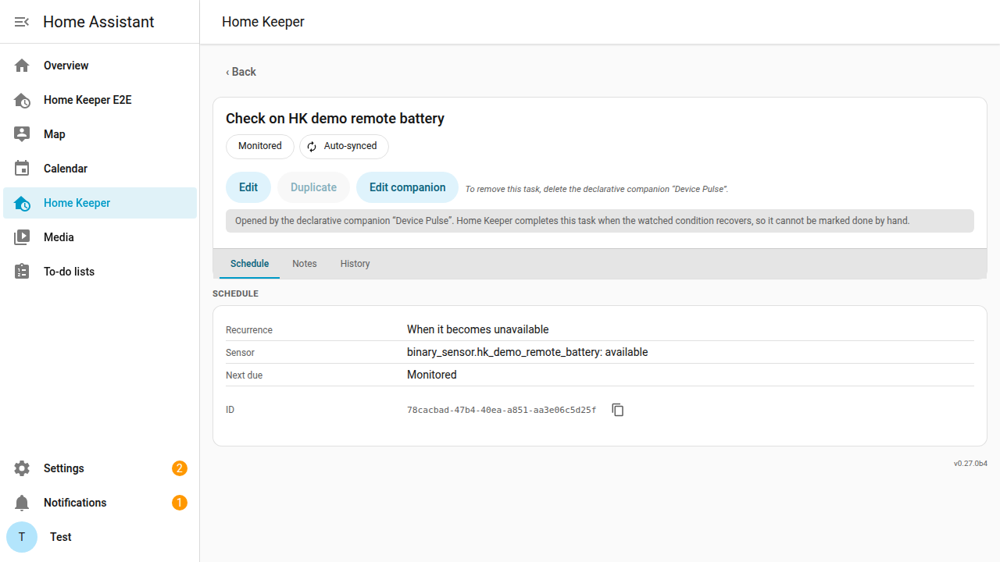

A recipe you switch off keeps the tasks it made. The tasks stop until you switch the
recipe on again. Their history stays with them. Delete the recipe to remove its
tasks.

Each recipe gets a row under **Settings → Companions** with an Edit button and a
Delete button. On a phone the row stacks, and the buttons take a line of their own.

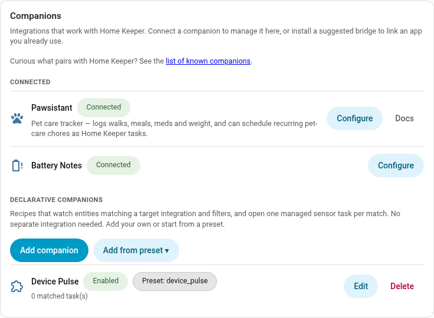

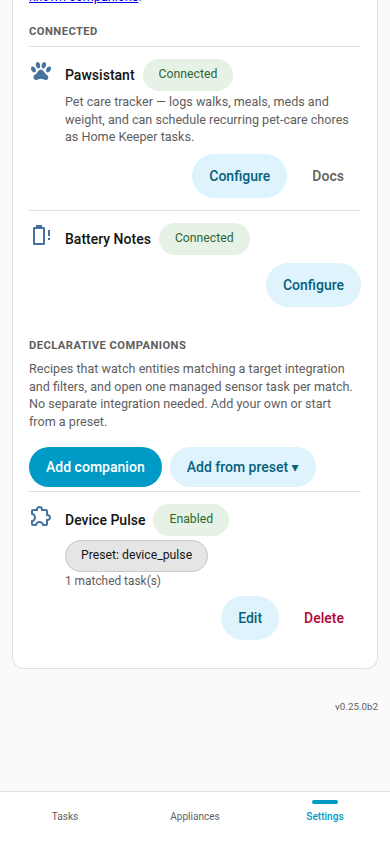

##### Template triggers

The other 4 trigger modes each ask 1 plain question. State compares 1 string.
Threshold compares 1 number. Neither can do arithmetic on a date.

The **template** mode takes a Jinja template instead. The task is due while the
template renders true. This example opens a task for a sensor that has not reported
for a day:

```jinja
{{ (now() - as_datetime(state)) >= timedelta(hours=24) }}
```

When the sensor is `unavailable` or `unknown`, `as_datetime` cannot read the state and
the template does not render. Then the template decides nothing, and a task that is
open stays open. Do not add a check such as `state not in ['unavailable']`. That check
makes the template render false, and with **Auto-clear** a false result completes the
task.

The template reads the same values as the task name template and the task notes
template: `state`, `attributes.<key>`, `friendly_name`, `entity_id`, `device_name`,
`area_name`, and `integration`. Home Assistant template functions are also available.

A template must render **true or false**. Home Keeper accepts a true or false result,
and the words `on`, `off`, `yes` and `no`. Anything else is an error.

A number is an error, `1` and `0` included. So `{{ state }}` on a sensor that reports a
number does not work, and `{{ 1 if state | float(0) >= 500 else 0 }}` does not work
either. Write the comparison on its own: `{{ state | float(0) >= 500 }}`. Home Keeper
reads a number as an error on purpose, because many sensors report `0` or `1`, and a
template that gives back the reading must not look like an answer.

An attribute that is not on the entity is also an error. Write
`{{ attributes.get('battery') }}` or `{{ attributes.battery | default(0) }}` when the
attribute can be missing.

A template that does not render decides nothing. Home Keeper opens no task and closes
no task, and it writes the error to the log once. A typo cannot complete the tasks that
a recipe already opened.

Home Keeper reads a name it does not know as an error. A misspelled `{{ stat == 'on' }}`
gives you the same red message as any other broken template. A template that reads
false closes the tasks it opened when you set **Auto-clear**, so a typo must never look
like a condition that went away.

Home Keeper renders the template when the bound entity changes state, and again on
each 5-minute pass. So a template that reads the clock, such as the example above, can
take up to 5 minutes to open its task.

The Add dialog renders the template against your own entities. Each row in the preview
says **Due now** or **Monitored**, and the line above them says how many of the shown
rows are due. The preview lists the matched entities before you write the template, so
you can see what the recipe covers first.

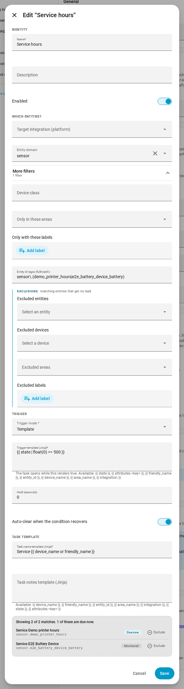

A template that cannot render shows the Jinja error instead, so you can correct it
before you save. Such a template opens no task and closes no task.

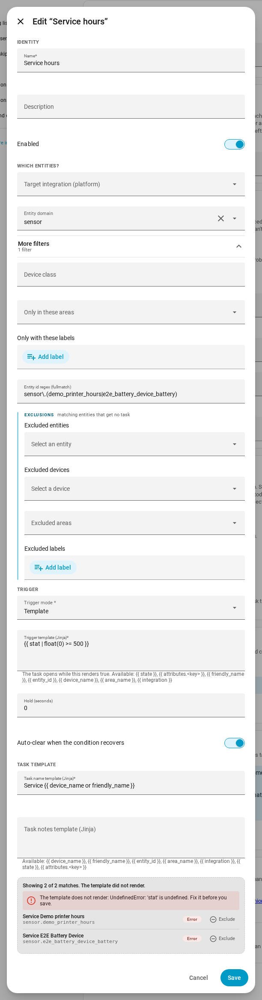

An empty box is not an error. The preview lists the matched entities and tells you to
write a template.

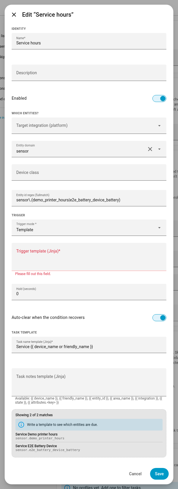

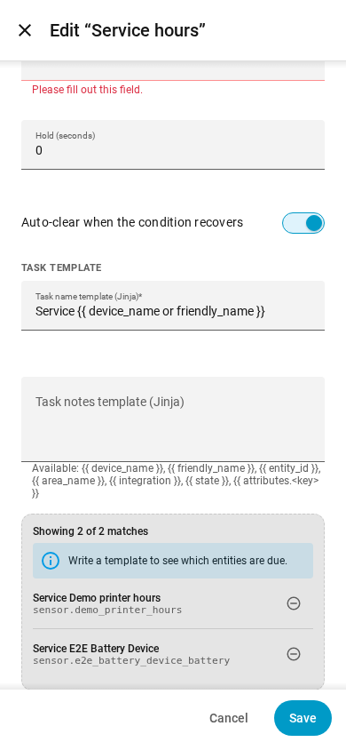

On a phone the chip keeps its own column, and the task name wraps under itself.

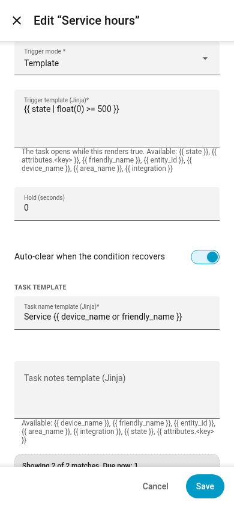

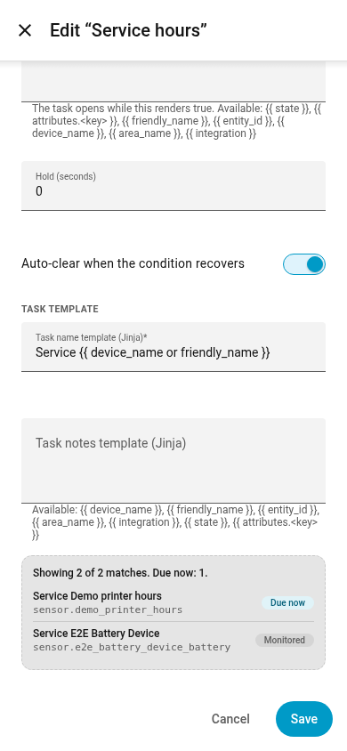

The template mode is also on a single sensor task. Open **Add task**, set the schedule
to Sensor, and pick Template as the trigger mode. Only an admin can set a template on a
task, because a template reads registry data that other users cannot list.

The task page shows the template and the current value of the entity. A template task
waits for its condition, so it shows **Monitored** and it has no Done button.

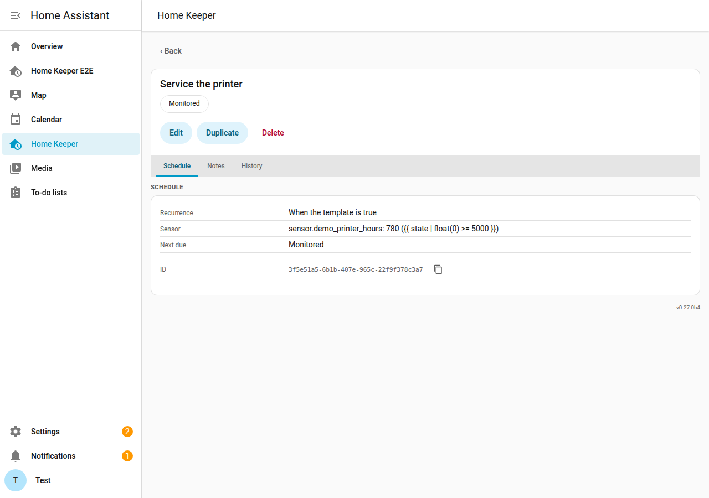

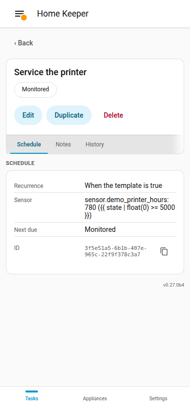
