# Settings

The **Settings** tab in the panel edits the integration options. The form matches the
Home Assistant options flow and saves each change immediately. The same options are
available in the options flow under **Settings → Devices & services → Configure** and
through the `home_keeper.set_options` service.

The tab has 7 sections:

- **General** sets how long completed one-off tasks are kept. This number saves
  when you leave the box or press Enter.
- **Shopping list** selects the to-do list that
  [buy reminders are synced to](../appliances/appliances.md#send-buy-reminders-to-your-shopping-list).
- **Profiles** holds the saved filters. See
  [Profiles](./profiles.md).
- **Notifications** holds the notification configurations. See
  [Notifications](./notifications.md).
- **Problem sensor sync** has the sync switch and the exclusions for entities and
  devices and areas and labels. The exclusions apply only when the sync is on.
- **Companions** lists the integrations that work with Home Keeper.
- **Import and export** saves your data to a file and reads a file back. It also
  holds the [appliance report](../automation/import-export.md#appliance-report).
  See [Import and export](../automation/import-export.md).

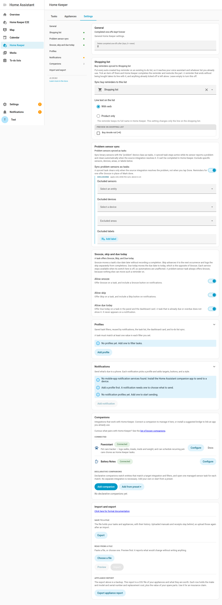

#### Companions

A companion is an integration that works with Home Keeper. Examples are a pet-care
tracker that creates recurring tasks and a glue integration that turns a low battery
into a replacement task. The **Companions** section at the end of the Settings tab
lists them in 2 groups:

- **Connected** lists the companions that registered themselves with Home Keeper.
  Examples are [Pawsistant](https://github.com/prestomation/pawsistant) and the
  [Battery Notes glue integration](https://github.com/prestomation/ha-home-keeper-battery-notes).
  Each row has a **Configure** button that opens the companion's own page.
- **Suggested** lists popular integrations that Home Keeper detects from a catalog
  and that have no glue integration installed. An example is **Battery Notes**. Each
  row has an **Install** link and a **Dismiss** button.

To add a companion or a [glue integration](../../GLUE_INTEGRATIONS.md) to the catalog,
[open a GitHub issue](https://github.com/prestomation/ha-home-keeper/issues/new?title=Companion%20suggestion:%20).

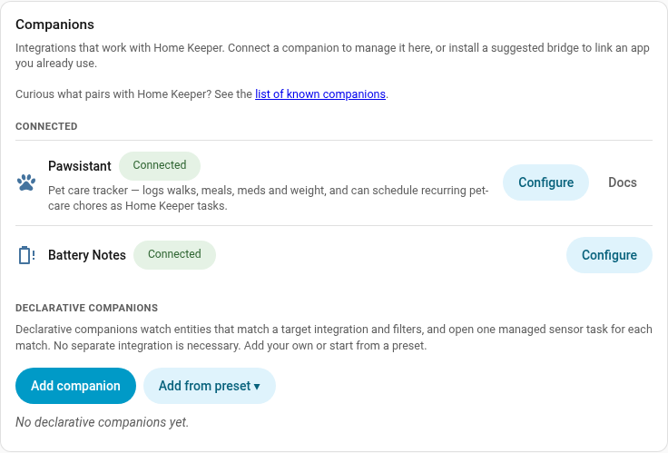

##### Declarative companions (config-driven, no separate integration)

A **declarative companion** targets an integration, or it matches entities through an
entity id filter. It sets a trigger mode: usage, threshold, state, availability, or
template. It also sets a Jinja template for the task name and the task notes, and the
labels to put on each task.

Home Keeper opens one managed task for each entity that matches the declarative
companion. The task clears when the condition recovers. A task that a declarative
companion made has an **Edit companion** button on its detail page. The button opens
the declarative companion that made the task.

Each task that a declarative companion makes is a sensor-based task, so it has no due date until
its condition is true. A task with no due date shows as **Monitored**, and neither
the to-do list nor the calendar shows it. When the condition becomes true, Home Keeper sets
the due date to that moment, so the task is due now and then overdue. The age of an
overdue task shows how long the condition has been true. In the **Firmware update
available** preset, a device with an update pending shows an overdue task, and a
device with no update pending shows **Monitored**. All bundled presets complete the
task automatically when the condition recovers, so those tasks offer no Done button.

A task on a device also gets entities on the device page. Their names start with the
name of the declarative companion, then Next due, Overdue or Mark done. When the
declarative companion completes its tasks itself, the device page has no **Mark done** button for them. Home Keeper also refuses
a completion or a skip by hand from a service call or an automation. Home Assistant sets the
entity ID when the entity is first made and does not change it later. To get a
shorter entity ID for an older entity, rename it in Home Assistant.

The *Add from preset* picker offers 3 general presets, and the integration presets
that [Integration presets](#integration-presets) describes.

- **Device Pulse** watches the ping status of each device in
  [studiobts/home-assistant-device-pulse](https://github.com/studiobts/home-assistant-device-pulse).
  It opens a task when a device is offline for 1 hour. Home Keeper completes the
  task when the device replies again. The Device Pulse integration must be installed.
- **Firmware update available** matches every `update.*` entity that reports `on`.
  This covers UniFi, ESPHome, HACS, Reolink, and Bambu Lab.
- **Device stopped reporting** matches every `sensor.*_last_seen` timestamp sensor. It
  opens a task for each device that has not reported for 48 hours. This finds the
  Zigbee or Z-Wave devices that dropped off the mesh. It needs no other integration.

A declarative companion keeps the settings it was saved with. A Device Pulse companion
from before version 0.28.0b14 watches the total count of failed pings. That count never
goes down, so Home Keeper never completes its tasks. Delete that companion and add the
preset again.

When a preset matches entities in your home, the Tasks tab suggests it. See
[Presets for your home](../start/panel.md#presets-for-your-home).

A preset writes the task name and notes in the Home Assistant language. A later change
of the language changes the tasks to the new language. When a declarative companion has
your own name or notes, Home Keeper uses your text.

Low batteries have no preset. The [Battery Notes glue
integration](../../GLUE_INTEGRATIONS.md) already opens a task for each battery and
also supplies the battery type and the count. Write a declarative companion for a
low-battery `binary_sensor` if you do not use that glue integration.

The *Add companion* dialog shows a live preview of the matches before you save. A
warning shows above 50 matches. A declarative companion cannot match more than 500
entities. See
[INTEGRATING.md](../../INTEGRATING.md) for the service reference.

The *Which entities?* section of the dialog has the integration and the entity domain.
Click **More filters** to see the other filters. Set a device class there, or write an
entity id regex. The device, area and label filters keep only the entities in them.
An
entity that has no area of its own uses the area of its device. When **More filters**
is closed, its row shows how many filters and exclusions are set.

The **Exclusions** block under the filters removes entities from the declarative
companion. Select
the entities, devices, areas or labels to exclude. Home Keeper then makes no task for
an entity that matches one of them. This is the same as the exclusions of Problem
sensor sync.

Each row in the preview has an **Exclude** button. Click it to exclude that entity.
The entity then shows under the matches with an **Include** button, which adds it
back. The preview shows 10 matches at most. To exclude an entity that is not in the
preview, select it in the excluded entities list.

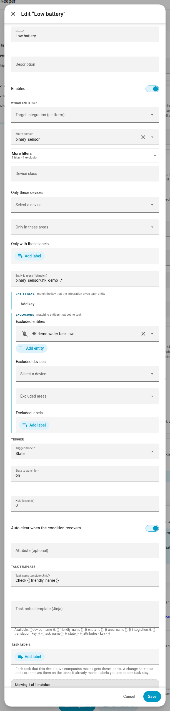

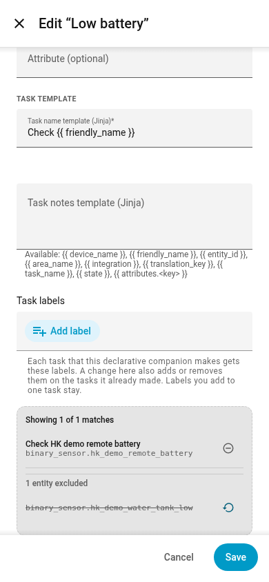

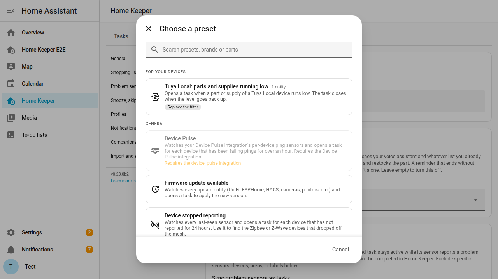

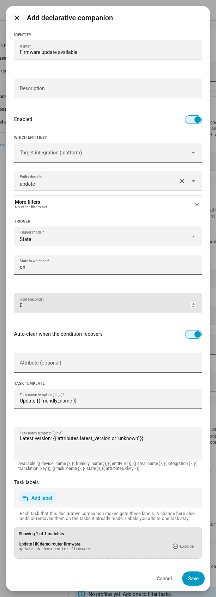

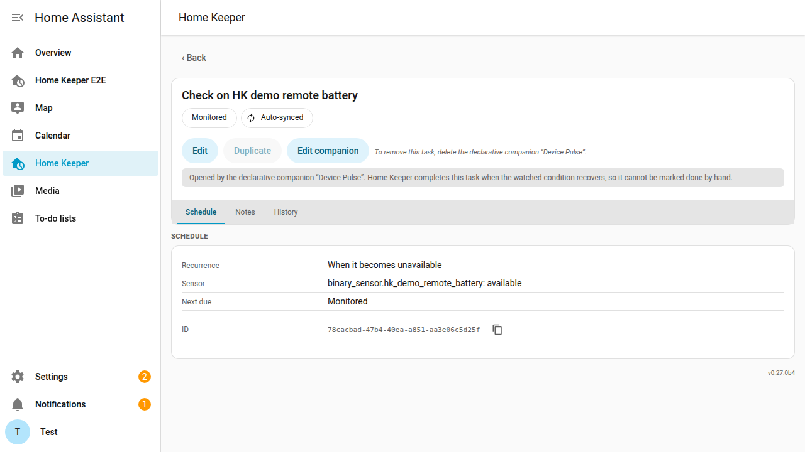

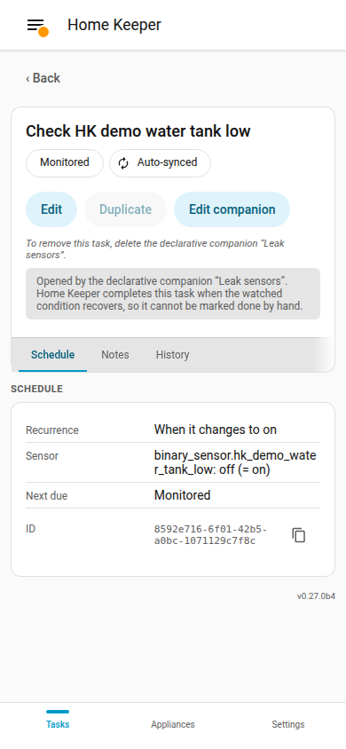

A declarative companion you switch off keeps the tasks it made. The tasks stop until
you switch it on again. Their history stays with them. Delete the declarative
companion to remove its tasks.

A disabled entity also keeps its task. The task stops while the entity is
disabled. This also applies when you disable the device or the integration of the
entity. When you enable the entity again, the same task starts again with its
history.

Each declarative companion gets a row under **Settings → Companions** with an Edit
button and a Delete button. On a phone the row stacks, and the buttons take a line of
their own.

The row shows where the companion comes from:

- **Logo.** The logo of the integration that the companion watches. If Home Assistant
  has no logo for it, the row shows a generic logo or the preset icon.
- **Badge.** A small icon on the logo shows what the companion looks for, such as
  supplies that run low or parts near the end of their life. Hold the pointer on it to
  see its name.
- **Line under the name.** The integration, the entity platform, the limit and the
  number of tasks. The limit shows only while the trigger is the same as in the preset.
- **Custom chip.** You made the companion yourself, and no preset made it.

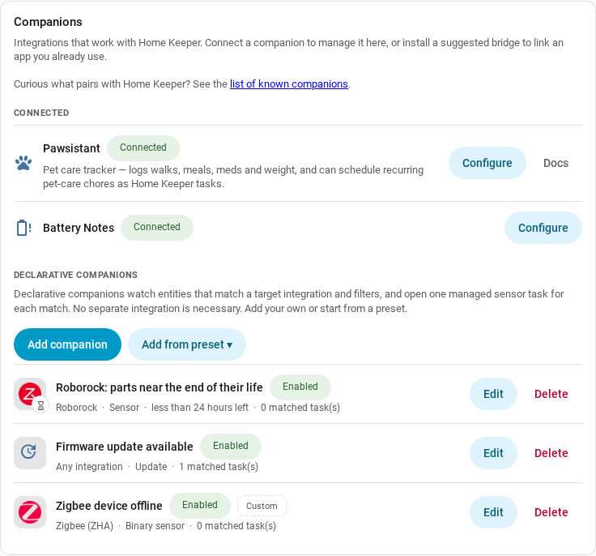

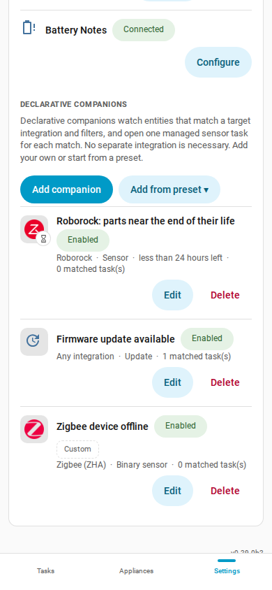

##### Entity keys and task names

The **Entity keys** block under **More filters** matches the key that an integration
gives each of its entities in its own code, such as `filter_time_left` for the filter
sensor of a Roborock. A rename of the entity or a change of the Home Assistant
language leaves the key as it is. An entity id regex breaks in both cases. Home Keeper
then makes a task only for an entity with one of the keys.

Home Assistant does not show these keys on its own screens. So when the declarative
companion has a target integration, Home Keeper lists the keys of that integration's
entities under the block. Each key in the list shows one example entity and how many
entities have the key. Click a key to add it, and click it again to take it out. Each
device with the key gets its own task. To type a key that is not in the list,
click **Add key**. Each row of the preview shows the key of its entity.

Each key can also have a task name, such as *Replace filter*. The task name template
reads it as `{{ task_name }}`, so one declarative companion can give each part its own
task: `{{ task_name }}: {{ device_name }}`. A key with no task name uses the entity
name. The key of the entity is also available as `{{ translation_key }}`.

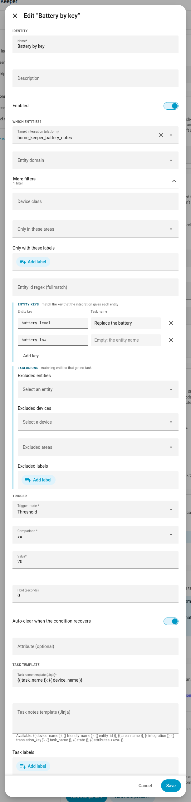

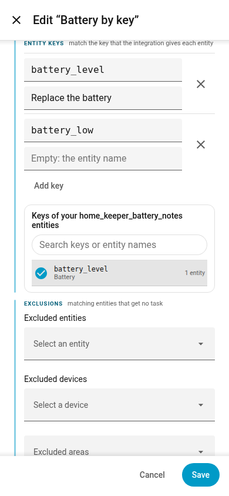

##### What a preset does

When you add a declarative companion from a preset, a box at the top of the dialog
says what the preset does. It also names the tasks that the preset makes. An
integration preset also gives its limit. A time limit shows in days when it is 2 days
or more. The limit of a reading such as a water pressure is in the unit of the sensor.

The box names each section that you change. The text in the box always describes the
preset and not your changes. Click **Reset to preset** to put those sections back.
Your name, description and exclusions do not change.

Each row in the preview shows what the entity reads now. When a preset opens a task
above a limit, a bar shows how near the reading is to that limit.

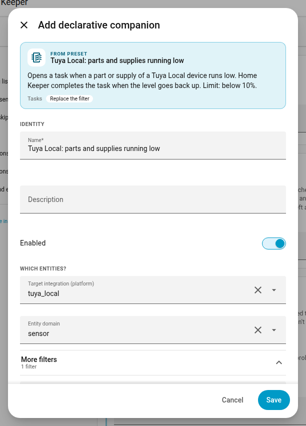

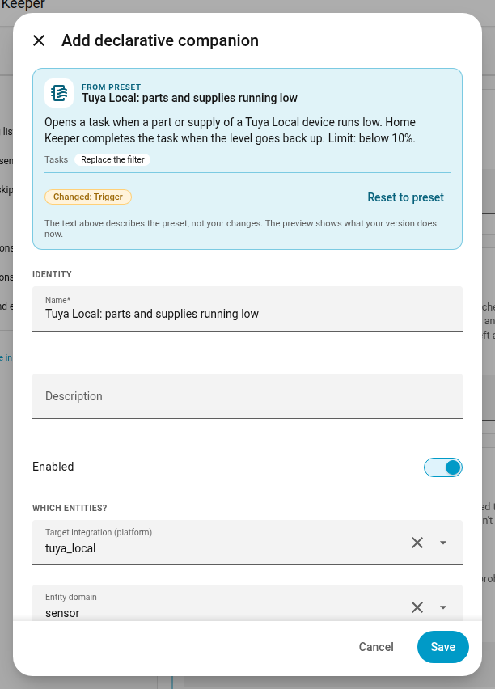

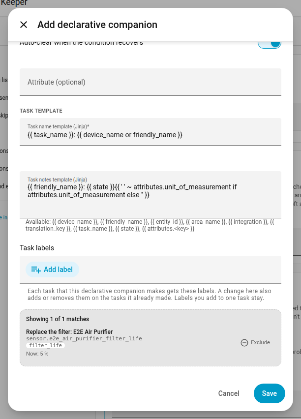

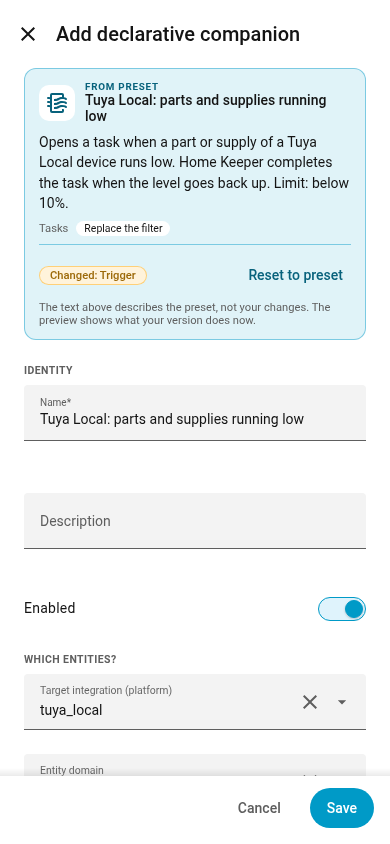

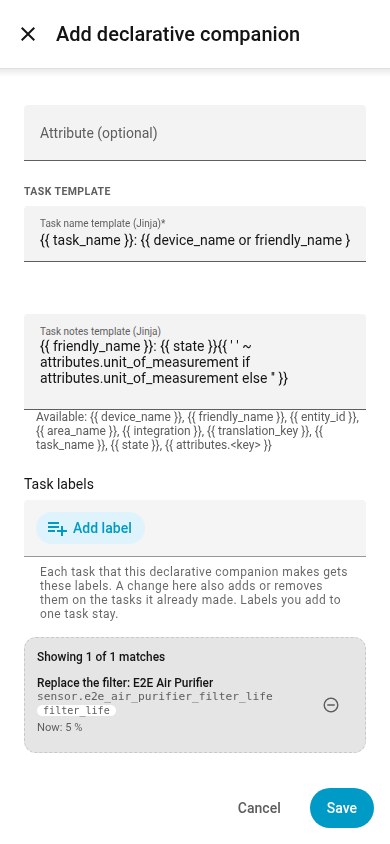

##### Integration presets

Many devices report the wear of their parts, such as the hours left on the filter of a
robot vacuum or the toner level of a printer. An integration preset turns these
readings into tasks for one integration.
Each preset selects the entities by their [entity keys](#entity-keys-and-task-names)
and gives each key its own task name, such as *Replace the main brush*.

The picker shows first the presets that match entities you have, with the number of
entities each one matches. An installed integration is not enough. A Tuya light has
no filter or brush, so the Tuya preset for vacuum parts is not in that group. Then the picker
shows the general presets. Click **Show more presets** to see the other presets, or
type in the search box to find a brand or a part. Each preset card lists the tasks
that it makes.

Each integration can have up to 6 presets, one for each type of reading:

- **Parts and supplies running low**: a percentage falls below 10%.
- **Parts near the end of their life**: the time left on a part falls below a limit.
  The preset reads the time in any unit, from seconds to weeks.
- **Wear counters**: a counter that the device resets passes a service limit.
- **Readings too low** and **readings too high**: a measurement, such as the water
  pressure of a boiler, passes its service level.
- **Service alerts**: the device reports that it needs service.

Home Keeper completes each task when the reading recovers. To complete it, reset the
part on the device or refill the salt.

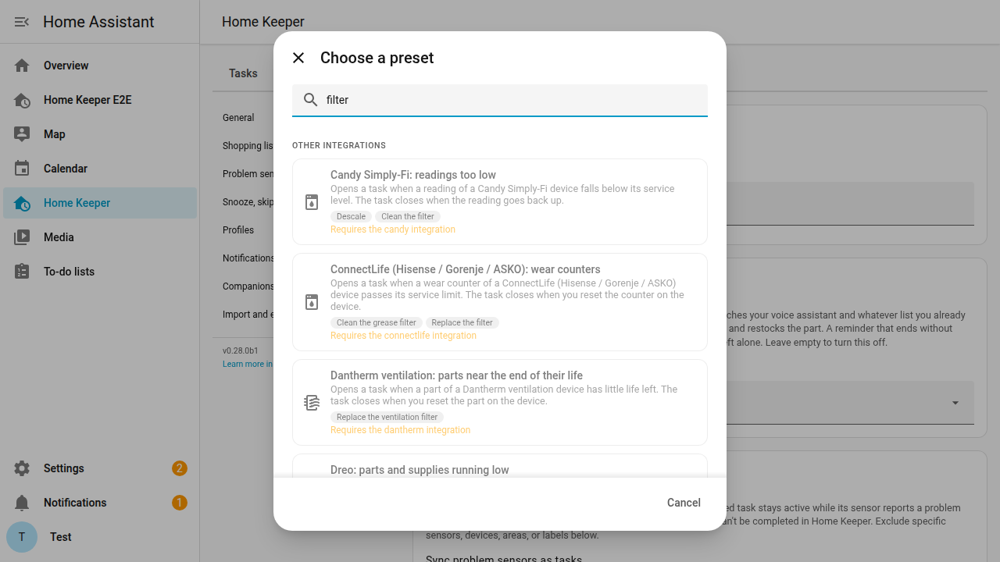

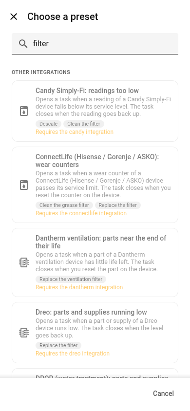

These integrations have presets:

| Type of device | Integrations |
|---|---|
| Air and ventilation | Actron Air, CoolMasterNet, Dantherm ventilation, Dreo, Duco ventilation, Duux, Dyson, Flexit (Modbus), Fjäråskupan, Flexit Nordic, Genvex Connect / Nilan gateway, Govee (purifiers), homee, IKEA Trådfri (STARKVIND), IntelliClima, Matter, Nest (legacy API), Nilan (CTS602 Modbus), Philips AirPurifier (CoAP), Pluggit ventilation, Pura fragrance diffusers, Renson Endura Delta, Samsung (Local Things), Sensibo, Tuya Local, Venstar thermostat, VeSync (Levoit), Winix, Zehnder ComfoConnect Pro (Modbus), Zigbee (ZHA) |
| Cars | Bosch eBike (Smart System & eBike System 2), FordConnect Query, Porsche Connect, Smart #1 / #3 (Hello Smart), Stellantis (Peugeot/Citroën/DS/Opel/Fiat…), Škoda (MySkoda) |
| Garden and pool | Hot Spring spas, Husqvarna Automower, Mammotion (Luba), Ondilo ICO, Pentair ScreenLogic, Robonect (Husqvarna/Gardena/Flymo), Sunseeker mowers, Worx Landroid, Worx Landroid Vision |
| Heating and water | AquaCell softener, BWT AQA Perla (BLE), BWT Perla, DROP (water treatment), Fumis (pellet stoves), iQua softener, OpenTherm Gateway, Plugwise (Anna/Adam), Rehlko / Kohler generators, Salt Sentry, Stiebel Eltron ISG (LWZ), SYR Connect (softeners), Unique Waterontharder, Victron GX (generator), Viessmann ViCare |
| Kitchen and laundry | Candy Simply-Fi, ConnectLife (Hisense / Gorenje / ASKO), Electrolux (OCP API), Haier hOn (Haier/Candy/Hoover), Home Connect, Home Connect Local, HomeWhiz (Beko / Grundig / Arçelik), LG ThinQ, Midea (core), Miele, Whirlpool |
| Personal care | Philips shaver, Philips Sonicare (BLE) |
| Pets | EHEIM Digital (aquarium), Litter-Robot, PetKit, PETLIBRO |
| Printers | Brother printer, HP printer, Samsung SyncThru printer |
| Robot vacuums | Ecovacs, iRobot Roomba, Maytronics Dolphin, Roborock, Roomba+ (local MQTT), SmartThings, TP-Link Tapo vacuum, Tuya, Xiaomi Miio, Xiaomi Vacuum (cloud) |
| Storage (NAS) | MOS NAS, QNAP NAS, Synology NAS, UniFi UNAS (REST), Unraid, Unraid API, Unraid Management Agent |

For an integration that is not in the list, write a declarative companion with the
keys of its entities. The key of an entity is in the translation file of its
integration.

##### Task labels and notes

Use **Task labels** to find the tasks of one declarative companion. Set them in the
**Task template** section of the dialog. Each task that the declarative companion makes
gets these labels, and a Profile can then filter on them. Put a *Leak* label on the
tasks of a declarative companion that watches leak sensors. A Profile with the *Leak*
label and the Overdue status then shows only the leaks to fix now.

When you save a change to the task labels, Home Keeper changes the tasks that exist too.
It adds each label you added and removes each label you removed. Other labels on a task
stay.

You can also change one task. Click **Edit** on the task page. The form shows only the
fields that the declarative companion does not set: the labels, the NFC tag, the
completion detail, and the notes. Add a label there to put it on that task only. A
label that you add to one task stays when the declarative companion changes, unless the
declarative companion later adds and then removes a label with the same name.

The notes belong to the declarative companion only when it has a notes template. Then
Home Keeper writes the notes again on each change, and the task form does not show
them. When the notes template is empty, the notes are yours. Write them on each task,
and Home Keeper keeps them.

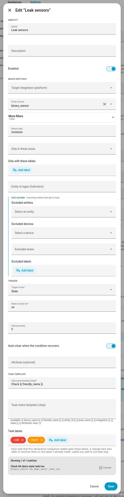

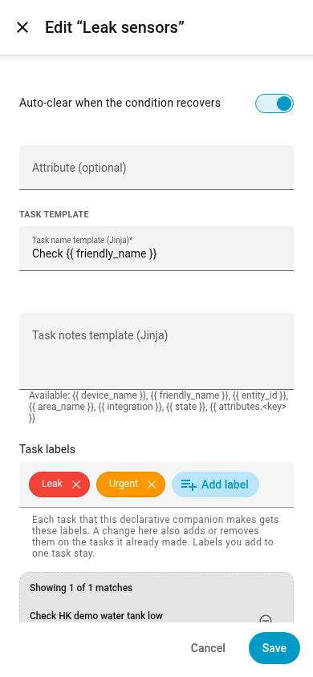

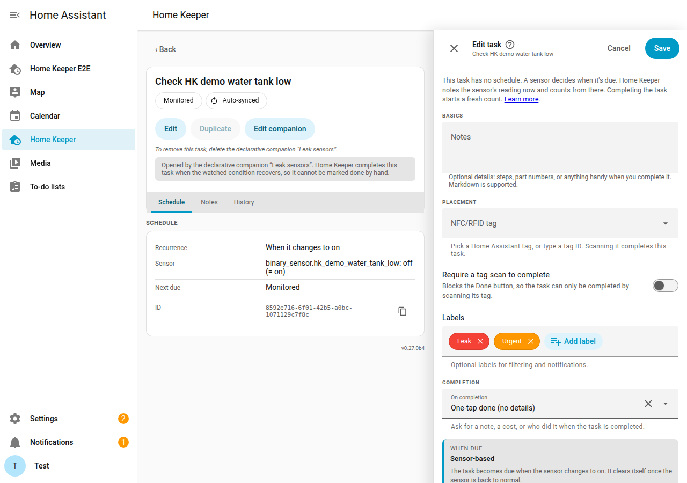

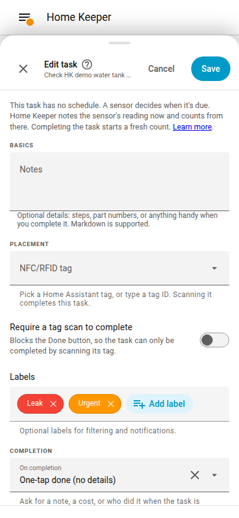

##### Template triggers

The other 4 trigger modes each ask 1 plain question. State compares 1 string.
Threshold compares 1 number. Neither can do arithmetic on a date.

The **template** mode takes a Jinja template instead. The task is due while the
template renders true. This example opens a task for a sensor that has not reported
for a day:

```jinja
{{ (now() - as_datetime(state)) >= timedelta(hours=24) }}
```

When the sensor is `unavailable` or `unknown`, `as_datetime` cannot read the state and
the template does not render. Then the template decides nothing, and a task that is
open stays open. Do not add a check such as `state not in ['unavailable']`. That check
makes the template render false, and with **Auto-clear** a false result completes the
task.

The template reads the same values as the task name template and the task notes
template: `state`, `attributes.<key>`, `friendly_name`, `entity_id`, `device_name`,
`area_name`, `integration` and `translation_key`. Only the task name and notes
templates can read `task_name`. Home Assistant template functions are also available.

A template must render **true or false**. Home Keeper accepts a true or false result,
and the words `on`, `off`, `yes` and `no`. Anything else is an error.

A number is an error, `1` and `0` included. So `{{ state }}` on a sensor that reports a
number does not work, and `{{ 1 if state | float(0) >= 500 else 0 }}` does not work
either. Write the comparison on its own: `{{ state | float(0) >= 500 }}`. Home Keeper
reads a number as an error on purpose, because many sensors report `0` or `1`, and a
template that gives back the reading must not look like an answer.

An attribute that is not on the entity is also an error. Write
`{{ attributes.get('battery') }}` or `{{ attributes.battery | default(0) }}` when the
attribute can be missing.

A template that does not render decides nothing. Home Keeper opens no task and closes
no task, and it writes the error to the log once. A typo cannot complete the tasks that
a declarative companion already opened.

Home Keeper reads a name it does not know as an error. A misspelled `{{ stat == 'on' }}`
gives you the same red message as any other broken template. A template that reads
false closes the tasks it opened when you set **Auto-clear**, so a typo must never look
like a condition that went away.

Home Keeper renders the template when the bound entity changes state, and again on
each 5-minute pass. So a template that reads the clock, such as the example above, can
take up to 5 minutes to open its task.

The Add dialog renders the template against your own entities. Each row in the preview
says **Due now** or **Monitored**, and the line above them says how many of the shown
rows are due. The preview lists the matched entities before you write the template, so
you can see what the declarative companion covers first.

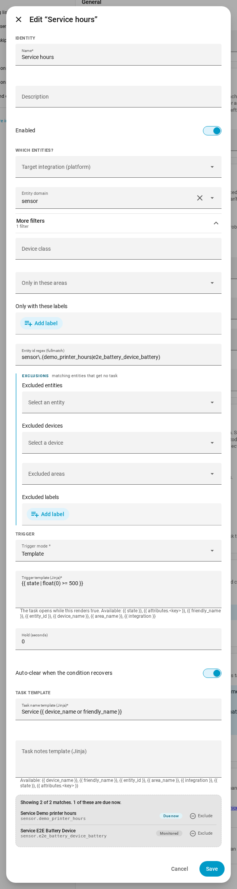

A template that cannot render shows the Jinja error instead, so you can correct it
before you save. Such a template opens no task and closes no task.

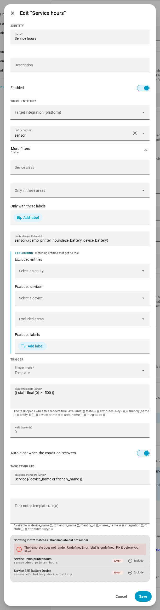

An empty box is not an error. The preview lists the matched entities and tells you to
write a template.

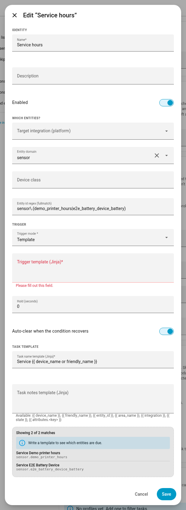

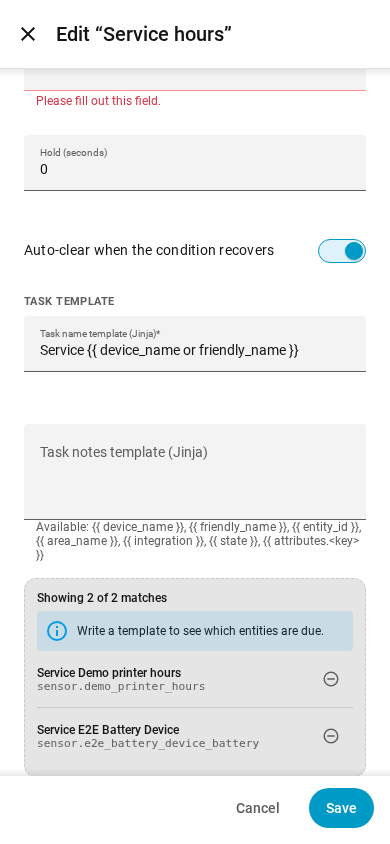

On a phone the chip keeps its own column, and the task name wraps under itself.

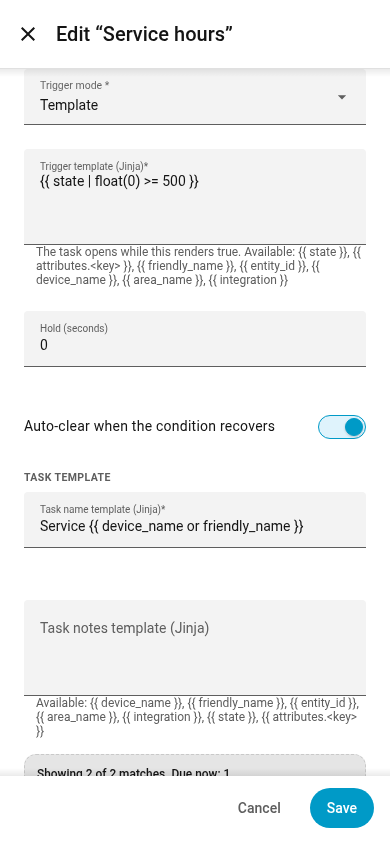

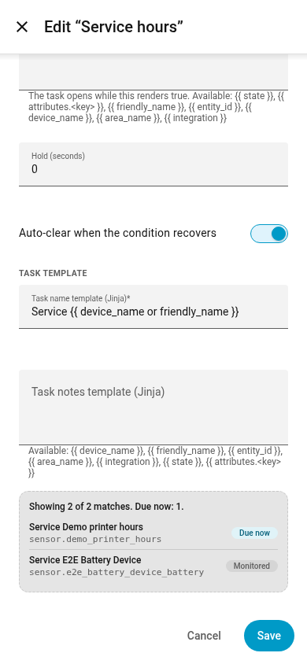

The template mode is also on a single sensor task. Open **Add task**, set the schedule
to Sensor, and pick Template as the trigger mode. Only an admin can set a template on a
task, because a template reads registry data that other users cannot list.

The task page shows the template and the current value of the entity. A template task
waits for its condition, so it shows **Monitored** and it has no Done button.

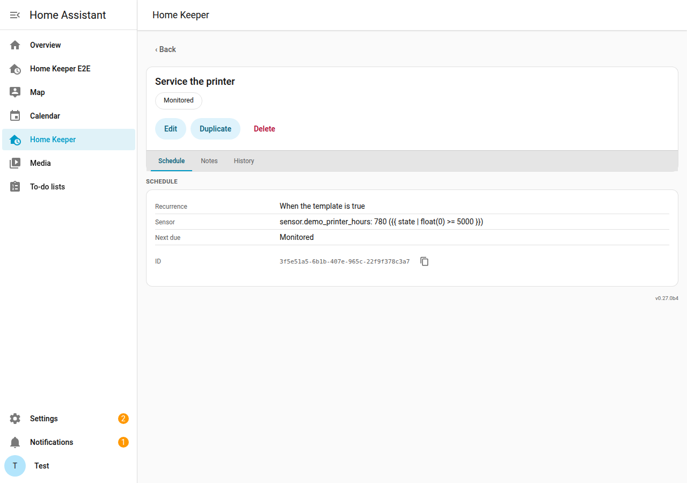

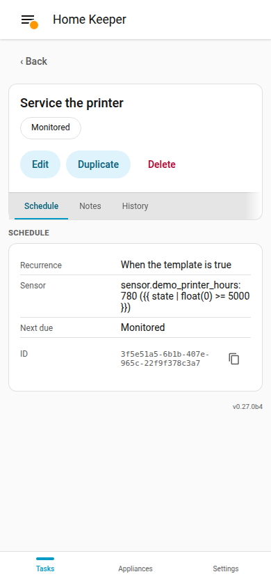
