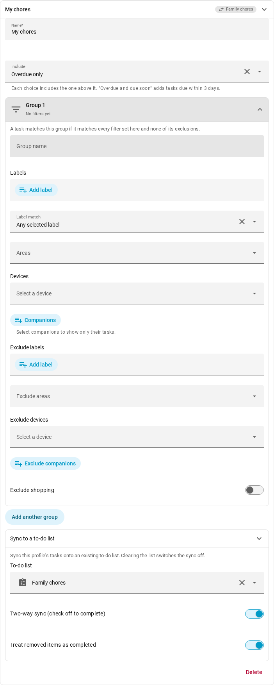
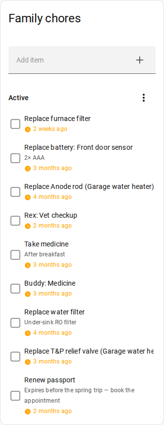

# Send tasks to your to-do lists

Home Keeper supports synchronizing the tasks from a
[Profile](./profiles.md) to any `todo` entity. This
is useful for tracking these tasks in an external to-do system that is separately
integrated into your Home Assistant setup, such as Google Tasks, Todoist, or CalDAV.

#### Configuration

Open **Settings → Profiles** and expand the profile. In the **Sync to a to-do list**
group, select a list in the **To-do list** picker. The profile's tasks are then added
to that list. Clear the picker to stop the sync. Home Keeper then removes the
profile's open items from the list.

The profile designates which tasks are synchronized to the configured to-do list.
The profile's filters select the tasks. The profile's **Include** tier sets when a
task is added to the list:

- **Overdue only**: when the task becomes due.
- **Overdue and due soon**: 3 days before the task becomes due.
- **Every scheduled task**: as soon as the task is scheduled.

One profile synchronizes to one list. Configure a profile per list, such as a
profile per child with a different list in each.

#### Two-way sync

Synchronization works in both directions:

- If an item is marked complete on the to-do list, Home Keeper completes the task
  and records the completion in the task's history. A recurring task is rescheduled
  and a new item is added when the task next becomes due. The completed item
  remains on the list.
- If a task is completed in Home Keeper, the item is marked complete on the list.
- If a task no longer matches the profile or is rescheduled or disabled, Home
  Keeper removes its open item from the list.
- If 2 profiles sync the same task and the task is marked complete on both lists,
  Home Keeper completes the task one time.
- A due date that is changed on the list moves the task to that date. This works as
  a snooze does: the task keeps its time of day and its schedule. A task moved out of
  the profile's **Include** tier is removed from the list until it is due again.
  A cleared date gets the task's date back.

Items include the task's due date and notes if the list supports these fields.
The due date is the date in the Home Assistant time zone.
Home Keeper modifies only the items it added and does not modify an item that is
already complete. Home Keeper keeps the name that you give an item on the list and
still syncs the other fields of that item. This works on a list that gives each item
an ID.

Items that a user adds to the list are not imported into Home Keeper. Only the
completion state and the due date are read back from the list. The due date is read
back only from a list that gives each item an ID.

Tasks that require an NFC or RFID tag scan are synchronized, but a completion on the
to-do list does not complete the task. The item is re-added on the next sync.

Tasks that clear only when a sensor recovers are synchronized the same way. These are
[synced problem sensors](../tasks/triggered-tasks.md#sync-problem-binary-sensors-as-tasks)
and tasks from a [declarative companion](./settings.md#declarative-companions-config-driven-no-separate-integration)
that clears on recovery. The item shows what to fix. A completion on the to-do list
does not complete the task, and the item is re-added on the next sync. When the
sensor recovers, Home Keeper clears the task and the item is no longer open.

#### Options

2 switches are under the picker. Both are on by default.

- **Two-way sync**: turn this off for a display-only list. Completions and due
  date changes on the list are then ignored, and Home Keeper puts its own due date
  back.
- **Treat removed items as completed**: some providers such as Todoist hide
  completed items from Home Assistant. With this switch on a removed item is treated
  as complete. Turn it off if the list reports completions correctly. A `local_todo`
  list does. A removed item is then re-added on the next sync.

#### CalDAV and Nextcloud

CalDAV lists such as Nextcloud, Baikal, and Radicale are supported. Home Assistant
polls a CalDAV server every 15 minutes, so a completion on the server can take up to
15 minutes to reach Home Keeper.

In Nextcloud, select a task list. The default **Personal** calendar contains only
events and is not exposed as a `todo` entity.

